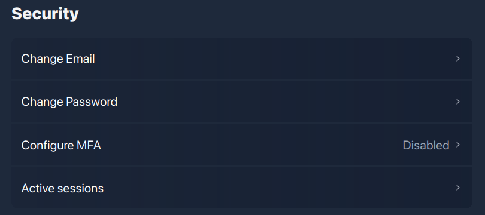
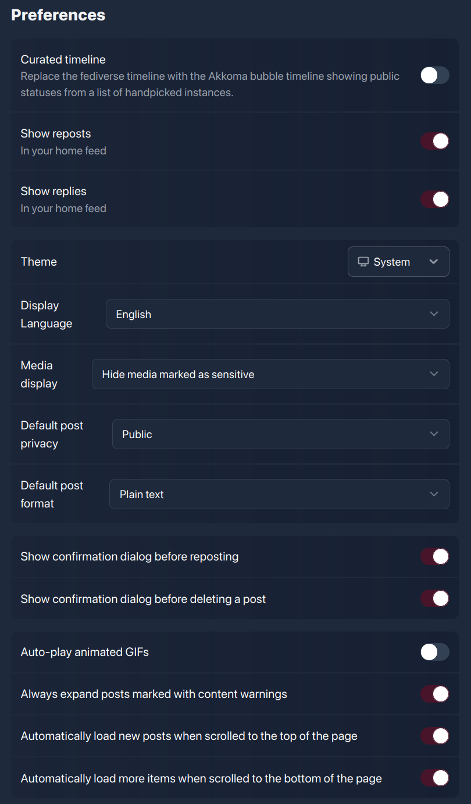
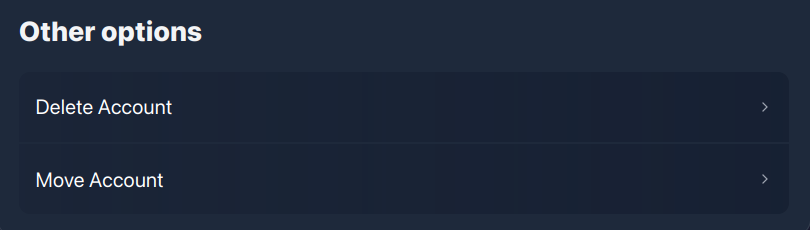

# FEDisroot: Settings
In the previous chapter we had a general approach to FEDisroot's interface, now we will learn how to configure and customize it.

## Profile
The profile is a set of information that we may or may not share when we interact in the Fediverse, our way of introducing ourselves to other people.

As we already saw, we can access to our profile settings from the **Profile** menu at the top right and from the **Settings** options in the **More** button at the left panel.

Here we can set:

- our **Display name**, the name we want to show next to our profile picture (or avatar), useful for other users to find us easily;
- our **Bio** information, where we can write whatever we want to share;
- the **Background Picture** for our profile;
- our **Profile Picture**, the image we want others to see when interacting in the Fediverse;
- **Lock account**, by enabling this option, we restrict our account to approved followers only, this means that when people wants to follow us, we have to approve or deny their follow requests. This is useful when we want to have more control over who can see the content and information we share;
- **Hide network** allows us to hide the information about who follow us and whom we follow in our profile;
- **This is a bot account**, a bot is a software that can run a lot of different automated tasks. Switching this option on will show a "tag" or "badge" on the profile, so others can be aware of it;
- **Block notifications from strangers** is a self-explanatory option: by enabling it we will be notified only about the interactions with people we follow;
- **Allow account discovery**, we can enable it to make our account visible in the profile directory and allow indexing by external services;
- the **Profile fields** where we can add custom fields to show on our profile.

Our profile should look far more better once we have changed few things here.

## Content

Here we can see/verify which users we have blocked or muted, which domains are blocked (if any) and also see and configure our filters.

- **Blocks** displays the users we have blocked;
- **Mutes** displays those users we have muted;

!!! It should be noted that these actions do not do the same thing. While **blocking** users removes their posts from our timelines and notifications (also preventing them from being able to follow us), **muting** them only collapses them (we still have an option to see their posts if we want to).

- **Domain blocks** displays the blocked domains;
- **Filters** access and management of the words filter. This is useful when we want to prevent certain words from appearing in our timelines and notifications

This option allows us to have a fine-grained control over the content we want to read or be notified of.

A filter can be a word or a phrase that we would like to "mute". Posts containing any of these filters will not be displayed on our timelines or notifications but hidden under a filtered content message.

## Security

!! ### THESE OPTIONS SHOULD NOT BE USED/MODIFIED UNDER ANY CIRCUMSTANCE. 
!! #### Our Disroot credentials must only be modified from the [**User Self Service Center**](https://user.disroot.org), doing it here may cause account access problems later. 
!! ##### This is a software issue about which the developers have already been informed.

## Preferences
These are our content and appeareance settings.

- **Curated timeline**: instead of the federated timeline, it shows public content from other instances similar to ours.
- **Show reposts**: enables/disables the display on our local timeline of our posts when they are shared by other people.
- **Show replies**: enables/disables the display on our local timeline of the replies to our posts.
- **Theme**: we can change the appeareance of the interface from light to dark or to match our system color scheme.
- **Display language**: to change the interface language.
- **Media display**: to choose what and how multimedia content should be displayed in our timelines.
    * **Hide media marked as sensitive**: to prevent any multimedia content that has been marked (or tagged) as sensitive for some reason from being displayed in our home timeline.
    * **Always hide media**: to hide all multimedia content with no exceptions.
    * **Always show media**: to always show multimedia content regardless if it is marked or not as sensitive.
- **Default post privacy**: to control who can see what we share.
    * **Public**: anyone can see what we publish and share. This is the default setting.
    * **Unlisted**: only people from our instance can see what we post.
    * **Followers-only**: only the people who explicitly follow us can see our posts.
- **Default post format**: we can choose the text format in which we want our posts to be published. By default, it is set to _Plain text_, but we can change it to _Markdown_ (a text formatting language).
- **Show confirmation dialog before resposting**: enable/disable a confirmation request before sharing a post or content already posted.
- **Show confirmation dialog before deleting a post**: enable/disable a confirmation request before deleting a post.
- **Auto-play animated GIFs**: enable/disable posted GIFs images to play automatically.
- **Always expand posts marked with content warnings**: enable/disable posts/content marked as sensitive to be displayed automatically in our timelines.
- **Automatically load new posts when scrolled to the top of the page**: when this option is enabled, all new posts will appear automatically at the top of the timeline. If it is disable, we will not see the timeline updates but a message (like the one below) informing us of new posts.

    

- **Automatically load more items when scrolled to the bottom of the page**: when enabled, posts will be displayed automatically as we scroll down. When disabled, a message will appear when we reach the bottom of the page and we will have to manually load the posts.

## Other options

### Delete Account

!! ### THIS OPTION SHOULD NOT BE USED UNDER ANY CIRCUMSTANCE. 
!! #### Any modification on our Disroot account must only be done from the [**User Self Service Center**](https://user.disroot.org), doing it here may cause unexpected issues later. 
!! ##### This is a software issue about which the developers have already been informed.

### Move Account

This option allows us to "move" our followers to a different account, for example, in another Akkoma, Pleroma or Mastodon instance.

---

OK. Now that we have a better perspective of the different options and settings of FEDisroot, we can move forward to the fun part: create content, share and interact with others.