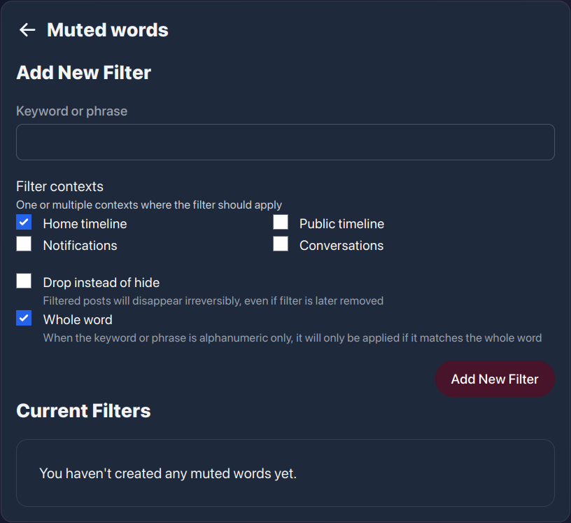

# FEDisroot: Configuraciones
En el capítulo previo tuvimos una aproximación general a la interfaz de FEDisroot, ahora aprenderemos cómo configurarla y personalizarla.

## Perfil
El perfil es un conjunto de información que podemos o no compartir cuando interactuamos en el Fediverso, nuestra manera de presentarnos a otras personas.

Como ya vimos, podemos acceder a las configuraciones de nuestro perfil desde el menú del **Perfil**, arriba a la derecha, y desde las opciones de **Configuración (Settings)** en el botón **Más (More)** del panel izquierdo.

Aquí podemos establecer:

- nuestro **Nombre en pantalla (Display name)**, el nombre que queremos mostrar al lado de nuestra imagen de perfil (o avatar), útil para que otras personas puedan encontrarnos fácilmente;
- nuestra **Bio**, donde podemos escribir lo que queramos compartir;
- la **imagen de fondo (Header)** de nuestro perfil;
- nuestra **imagen de perfil (Avatar)**, la imagen que queremos que otras personas vean cuando interactuamos en el Fediverso;
- habilitar la opción **bloqueo de cuenta (Lock account)**, al hacerlo restringimos nuestra cuenta a seguidores aprobados solamente, esto significa que cuando la gente quiere seguirnos, tenemos que aprobar o denegar su solicitud. Esto es útil cuando queremos tener más control sobre quiénes pueden el ver contenido y la información que compartimos;
- **Ocultar la red (Hide network)**, que nos permite ocultar la información en nuestro perfil acerca de quienes nos siguen y a quiénes seguimos;
- si **Esta es cuenta de bot (This is a bot account)**, un bot es un programa que puede ejecutar un montón de tareas automatizadas distintas. Al activar esta opción aparecerá una "etiqueta" o "distintivo" en el perfil así otras personas pueden estar al tanto de ello;
- si **Bloquear las notificaciones de extraños (Block notifications from strangers)**, esta opción se explica sola: al habilitarla se nos notificará solo de las interacciones con personas que seguimos;
- si **Permitir el descubrimiento de cuenta (Allow account discovery)**. Podemos habilitarlo para hacer nuestra cuenta visible en el directorio de perfiles y permitir su indexado por servicios externos;
- **Campos del perfil (Profile fields)**, donde podemos agregar campos personalizados para mostrar en nuestro perfil.

Nuestro perfil debería verse bastante mejor una vez que hayamos cambiado algunas cosas aquí.

## Contenido

Aquí podemos ver/revisar qué cuentas hemos bloqueado o silenciado, qué dominios están bloqueados (si los hubiera) y también ver y configurar nuestros filtros.

- **Usuarios bloqueados** muestra las cuentas que hemos bloqueado;
- **Usuarios silenciados** muestra aquellas cuentas que hemos silenciado;

!!! _Cabe notar que estas acciones no hacen lo mismo. Mientras que **bloquear** cuentas elimina sus publicaciones de nuestra línea temporal y notificaciones (previniendo también que puedan seguirnos), **silenciarlas** solo las contrae (todavía tenemos una opción para ver sus posts si queremos)_.

- **Dominios ocultos** muestra los dominios que hayan sido bloqueados;
- **Palabras silenciadas** acceso y gestión del filtro de palabras. Esto es útil cuando queremos prevenir que ciertas palabras aparezcan en nuestras líneas temporales y notificaciones.

Esta opción nos permite tener un control más fino sobre el contenido que queremos leer o que se nos notifique.

Un filtro puede ser una palabra o frase que quisiéramos "silenciar". Las publicaciones que contengan cualquiera de estos filtros no serán mostradas en nuestras líneas temporales o notificaciones sino que estarán ocultas bajo un mensaje de contenido filtrado.

## Seguridad

!! ### ESTAS OPCIONES NO DEBEN SER UTILIZADAS/MODIFICADAS BAJO NINGUNA CIRCUNSTANCIA. 
!! #### Nuestras credenciales de Disroot solo deben ser modificadas desde el [**Centro de Autoservicio**](https://user.disroot.org), hacerlo aquí podría causar problemas de acceso a la cuenta luego. 
!! ##### Este un problema del programa sobre el que ya han sido notificadas las personas que lo desarrollan.

## Preferencias
Estas son nuestras configuraciones de contenido y apariencia.

- **Línea temporal curada (Curated timeline)**: en lugar de la línea federada, muestra el contenido público de otras instancias similares a las nuestras previamente seleccionadas por nuestros administradores.
- **Mostrar retoots**: habilita/deshabilita la visualización en nuestra línea temporal local de nuestras publicaciones cuando son compartidas por otras personas.
- **Mostrar respuestas**: habilita/deshabilita la visualización en nuestra línea temporal local de las respuestas a nuestras publicaciones.
- **Tema (Theme)**: podemos cambiar el aspecto de la interfaz de claro a oscuro o para que coincida con el esquema de color de nuestro sistema.
- **Idioma (Language)**: para cambiar el idioma de la interfaz.
- **Mostrar contenido (Media display)**: para elegir qué contenido multimedia, y cómo, debería mostrarse en nuestras líneas temporales.
    * **Ocultar contenido marcado como sensible (Hide media marked as sensitive)**: para prevenir que cualquier contenido marcado (o etiquetado) como sensible por alguna razón sea mostrado en nuestra línea de tiempo local.
    * **Siempre ocultar contenido (Always hide media)**: para ocultar todo el contenido multimedia sin excepciones.
    * **Siempre mostrar contenido (Always show media)**: para mostrar siempre contenido multimedia independientemente de si está marcado como sensible o no.
- **Privacidad por defecto de las entradas (Default post privacy)**: para controlar quiénes pueden ver lo que compartimos.
    * **Público (Public)**: cualquiera puede ver lo que publicamos y compartimos. Esta es la configuración por defecto.
    * **No listado (Unlisted)**: solo las personas de nuestra instancia pueden ver la publicación.
    * **Solo seguidores (Followers-only)**: solo las personas que explícitamente nos siguen pueden ver nuestras publicaciones.
- **Formato por defecto de las entradas (Default post format)**: podemos elegir el formato de texto con el cual queremos que nuestras publicaciones se hagan. Por defecto, está establecido en _Texto plano (Plain text)_, pero podemos cambiarlo a _Markdown_ (un lenguaje de formato de texto).
- **Mostrar confirmación antes de reenviar (Show confirmation dialog before resposting)**: habilita/deshabilita la solicitud de confirmación antes de compartir una publicación o contenido previamente publicado.
- **Mostrar confirmación antes de eliminar una publicación (Show confirmation dialog before deleting a post)**: habilita/deshabilita la solicitud de confirmación antes de eliminar una publicación.
- **Reproducción automática de GIFs animados (Auto-play animated GIFs)**: habilita/deshabilita la reproducción automática de imágenes GIF.
- **Siempre mostrar las publicaciones marcadas con avisos de contenido (Always expand posts marked with content warnings)**: habilita/deshabilita que las publicaciones o contenido marcados como sensibles se muestren automáticamente en nuestras líneas de tiempo.
- **Cargar automáticamente entradas nuevas al desplazarse hacia la parte superior de la página (Automatically load new posts when scrolled to the top of the page)**: cuando esta opción está habilitada, todas las publicaciones nuevas aparecerán automáticamente en la parte superior de la línea temporal. Si está deshabilitada, no veremos las actualizaciones de la línea de tiempo sino un mensaje (como el de abajo) que nos informa de ellas.

    

- **Cargar automáticamente más elementos cuando se desplaza al final de la página (Automatically load more items when scrolled to the bottom of the page)**: cuando está habilitada, las entradas se mostrarán automáticamente a medida que nos desplazamos hacia abajo. Si está deshabilitada, aparecerá un mensaje cuando alcancemos el final de la página y tendremos que cargar las publicaciones manualmente.

## Otras opciones

### Borrar Cuenta (Delete Account)

!! ### ESTA OPCIÓN NO DEBE UTILIZARSE BAJO NINGUNA CIRCUNSTANCIA. 
!! #### Cualquier modificación en nuestra cuenta de Disroot solo debe realizarse desde el [**Centro de Auto-servicio**](https://user.disroot.org), hacerlo aquí podría causar problemas inesperados luego. 
!! ##### Este un problema del programa sobre el que ya han sido notificadas las personas que lo desarrollan.

### Mudar la Cuenta (Move Account)

Esta opción nos permite "mudar" las cuentas que nos siguen a una cuenta diferente, por ejemplo, en otra instancia de Akkoma, Pleroma o Mastodon.

---

Muy bien. Ahora que tenemos una perspectiva mejor de las diferentes opciones y configuraciones de FEDisroot, podemos avanzar a la parte divertida: crear contenido, compartir e interactuar con otras personas.