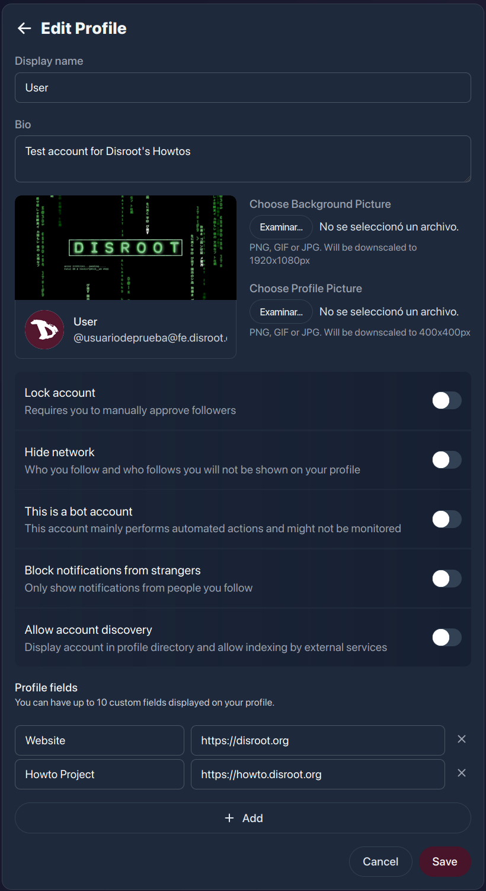
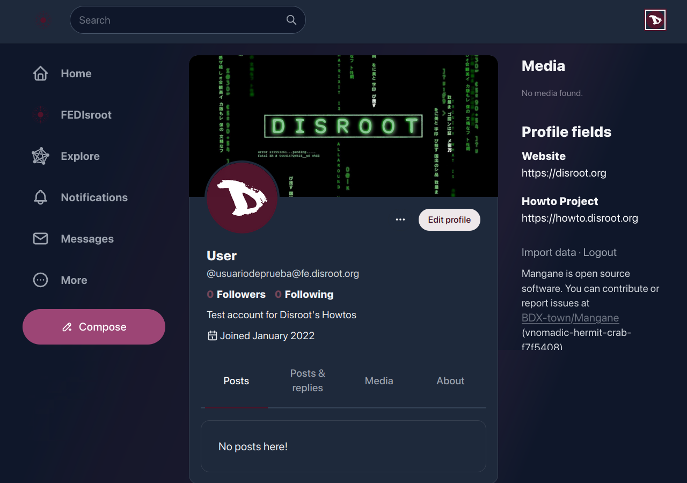
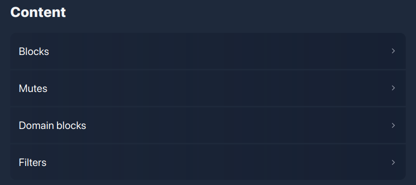
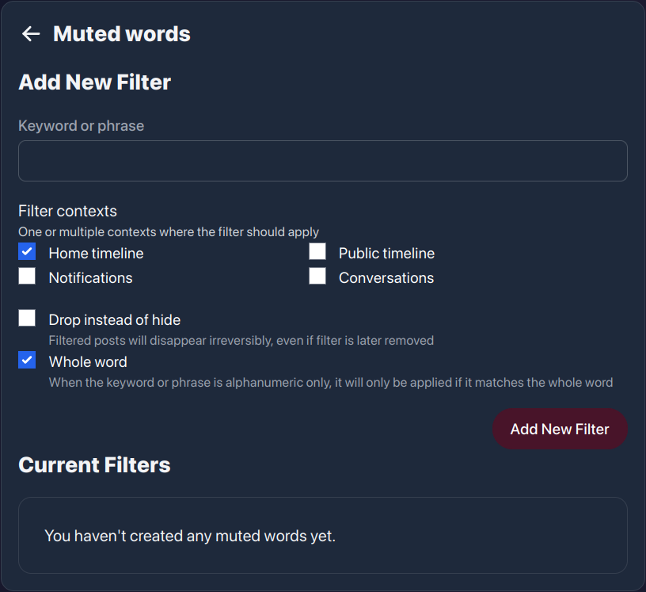
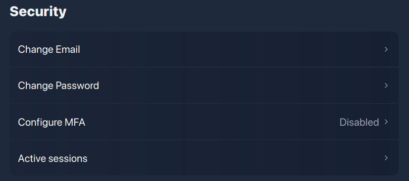
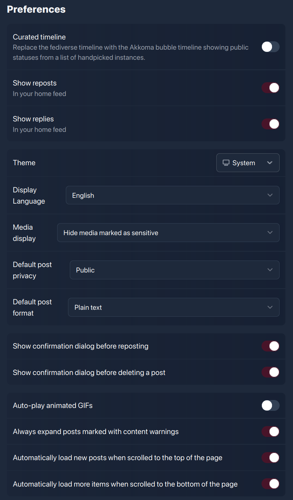
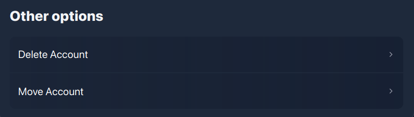
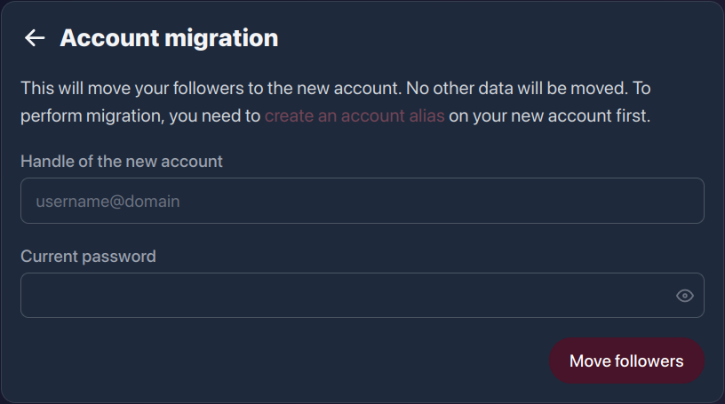

# FEDisroot: Paramètres
Dans le chapitre précédent, nous avons eu une approche générale de l'interface de FEDisroot, nous allons maintenant apprendre à la configurer et à la personnaliser.

## Profil
Le profil est un ensemble d'informations que nous pouvons ou non partager lorsque nous interagissons dans le Fediverse, notre façon de nous présenter aux autres personnes.

Comme nous l'avons déjà vu, nous pouvons accéder aux paramètres de notre profil à partir du menu **Profil** en haut à droite et des options **Réglages** du bouton **Plus** dans le panneau de gauche.

Ici, nous pouvons régler :

- notre **Nom d'affichage**, le nom que nous voulons afficher à côté de notre photo de profil (ou avatar), utile pour que les autres utilisateurs nous trouvent facilement ;
- notre **Bio**, où nous pouvons écrire ce que nous voulons partager ;
- la **Photo d'arrière-plan** de notre profil ;
- notre **Photo de profil**, l'image que nous voulons que les autres voient lorsqu'ils interagissent dans le Fediverse ;
- **Verrouillage du compte**, en activant cette option, nous limitons notre compte aux suiveurs approuvés uniquement, ce qui signifie que lorsque des personnes veulent nous suivre, nous devons approuver ou refuser leurs demandes de suivi. Ceci est utile lorsque nous voulons avoir plus de contrôle sur qui peut voir le contenu et les informations que nous partageons ;
- **Masquer le réseau** permet de masquer les informations sur ceux qui nous suivent et ceux que nous suivons dans notre profil ;
- **C'est un compte bot**, un bot est un logiciel qui peut exécuter un grand nombre de tâches automatisées différentes. En activant cette option, un "tag" ou un "badge" apparaîtra sur le profil, afin que les autres puissent en être informés ;
- **Bloquer les notifications des inconnus** est une option qui se passe d'explication : en l'activant, nous ne serons informés que des interactions avec les personnes que nous suivons ;
- **Autoriser la découverte du compte**, nous pouvons l'activer pour rendre notre compte visible dans l'annuaire du profil et permettre son indexation par des services externes ;
- les **Champs de profil**, où nous pouvons ajouter des champs personnalisés à afficher sur notre profil.

Notre profil devrait paraître bien plus intéressant une fois que nous aurons modifié quelques éléments ici.

## Contenu

Ici, nous pouvons voir/vérifier quels utilisateurs nous avons bloqués ou mis en sourdine, quels domaines sont bloqués (le cas échéant) et également voir et configurer nos filtres.

- **Blocage** affiche les utilisateurs que nous avons bloqués ;
- **Muet** affiche les utilisateurs que nous avons mis en sourdine ;

!!! Il convient de noter que ces actions ne font pas la même chose. Alors que le **blocage** des utilisateurs supprime leurs messages de nos lignes de temps et de nos notifications (ce qui les empêche également de nous suivre), la **mutation** des utilisateurs les réduit seulement à néant (nous avons toujours la possibilité de voir leurs messages si nous le souhaitons).

- **Blocage de domaines** affiche les domaines bloqués ;
- **Filtres** accès et gestion du filtre de mots. Ceci est utile lorsque nous voulons empêcher certains mots d'apparaître dans nos chronologies et notifications.

Cette option nous permet d'exercer un contrôle fin sur le contenu que nous voulons lire ou dont nous voulons être informés.

Un filtre peut être un mot ou une phrase que nous souhaitons "mettre en sourdine". Les messages contenant l'un de ces filtres ne s'afficheront pas sur notre ligne de temps ou dans nos notifications, mais seront cachés sous un message de contenu filtré.

## Sécurité

!! ### CES OPTIONS NE DOIVENT ÊTRE UTILISÉES/MODIFIÉES EN AUCUNE CIRCONSTANCE. 
!! #### Nos informations d'identification Disroot ne doivent être modifiées qu'à partir du [**Centre de libre-service pour les utilisateurs**](https://user.disroot.org). Si vous le faites ici, vous risquez de rencontrer des problèmes d'accès au compte par la suite. 
!! ##### Il s'agit d'un problème logiciel dont les développeurs ont déjà été informés.

## Préférences
Il s'agit de nos paramètres de contenu et d'apparence.

- **Chronologie personnalisée** : au lieu de la chronologie fédérée, elle affiche le contenu public d'autres instances similaires à la nôtre.
- **Montrer les rediffusions** : active/désactive l'affichage sur notre chronologie locale de nos messages lorsqu'ils sont partagés par d'autres personnes.
- **Montrer les réponses** : active/désactive l'affichage sur notre chronologie locale des réponses à nos messages.
- Thème** : nous pouvons changer l'apparence de l'interface de clair à foncé ou pour correspondre à la palette de couleurs de notre système.
- **Langue d'affichage** : pour changer la langue de l'interface.
- **Affichage des médias** : pour choisir quel contenu multimédia doit être affiché dans nos chronologies et comment.
    * **Masquer les médias marqués comme sensibles** : pour empêcher tout contenu multimédia qui a été marqué (ou étiqueté) comme sensible pour une raison quelconque d'être affiché dans notre chronologie personnelle.
   * **Cacher toujours les médias** : pour cacher tout le contenu multimédia sans exception.
   * **Toujours afficher les médias** : pour toujours afficher le contenu multimédia, qu'il soit marqué ou non comme sensible.
- **Confidentialité par défaut des messages** : pour contrôler qui peut voir ce que nous partageons.
    **Public** : tout le monde peut voir ce que nous publions et partageons. C'est le paramètre par défaut.
    * **Unlisted** : seules les personnes de notre instance peuvent voir ce que nous publions.
    * **Followers-only** : seules les personnes qui nous suivent explicitement peuvent voir nos publications.
- **Format par défaut des messages** : nous pouvons choisir le format de texte dans lequel nous voulons que nos messages soient publiés. Par défaut, il s'agit de _Texte brut_, mais nous pouvons le changer en _Markdown_ (un langage de formatage de texte).
- **Afficher la boîte de dialogue de confirmation avant de resoumettre** : activer/désactiver une demande de confirmation avant de partager un article ou un contenu déjà publié.
- **Afficher le dialogue de confirmation avant de supprimer un message** : activer/désactiver une demande de confirmation avant de supprimer un message.
- **Lecture automatique des GIFs animés** : activez/désactivez la lecture automatique des images GIFs publiées.
- **Toujours afficher les messages marqués avec des avertissements de contenu** : activer/désactiver l'affichage automatique des messages/contenus marqués comme sensibles dans nos chronologies.
- **Charger automatiquement les nouveaux messages lorsqu'on les fait défiler jusqu'en haut de la page** : lorsque cette option est activée, tous les nouveaux messages apparaissent automatiquement en haut de la chronologie. Si elle est désactivée, nous ne verrons pas les mises à jour de la chronologie mais un message (comme celui ci-dessous) nous informant des nouveaux messages.

    

- **Chargez automatiquement plus d'articles lorsque vous faites défiler la page vers le bas** : lorsque cette option est activée, les articles s'affichent automatiquement lorsque nous faisons défiler la page vers le bas. Lorsqu'elle est désactivée, un message apparaîtra lorsque nous atteindrons le bas de la page et nous devrons charger manuellement les articles.

## Autres options

### Supprimer le compte

!! ### CES OPTIONS NE DOIVENT ÊTRE UTILISÉES/MODIFIÉES EN AUCUNE CIRCONSTANCE. 
!! #### Nos informations d'identification Disroot ne doivent être modifiées qu'à partir du [**Centre de libre-service pour les utilisateurs**](https://user.disroot.org). Si vous le faites ici, vous risquez de rencontrer des problèmes d'accès au compte par la suite. 
!! ##### Il s'agit d'un problème logiciel dont les développeurs ont déjà été informés.

### Déplacement du compte

Cette option nous permet de "déplacer" nos followers vers un autre compte, par exemple dans une autre instance Akkoma, Pleroma ou Mastodon.

---

OK. Maintenant que nous avons une meilleure perspective des différentes options et paramètres de FEDisroot, nous pouvons passer à la partie amusante : créer du contenu, partager et interagir avec les autres.