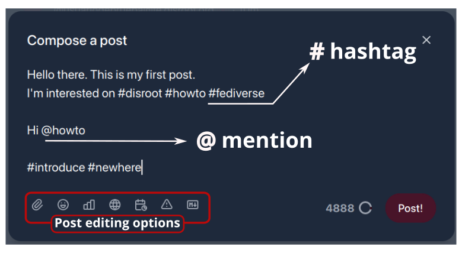
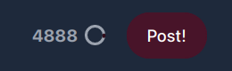
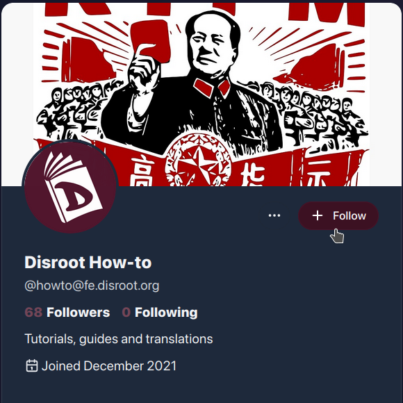
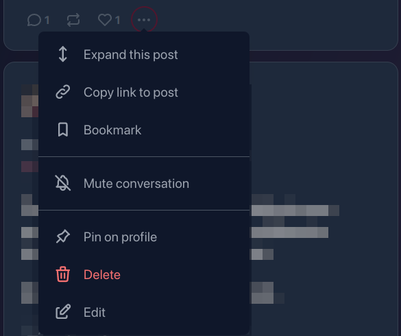
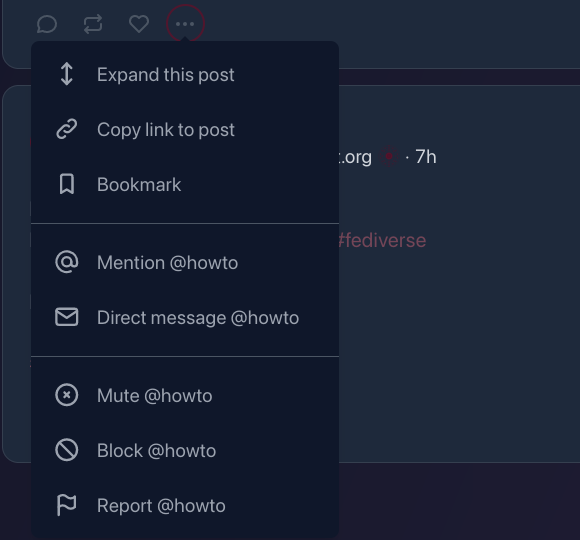
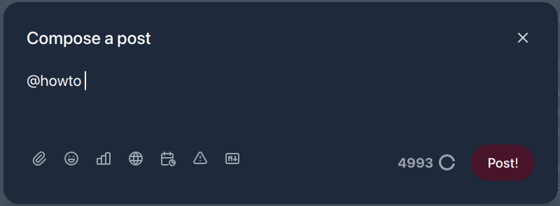
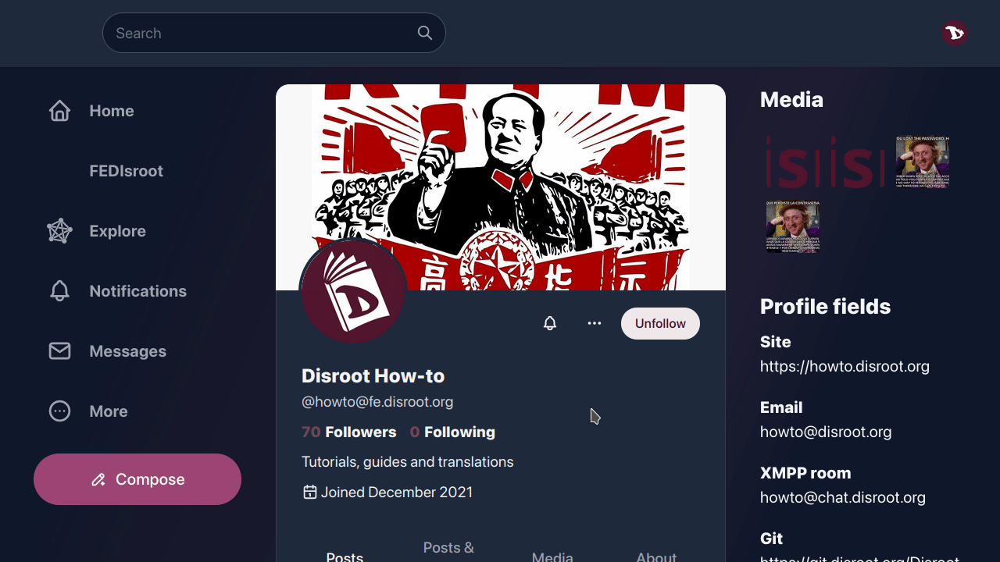
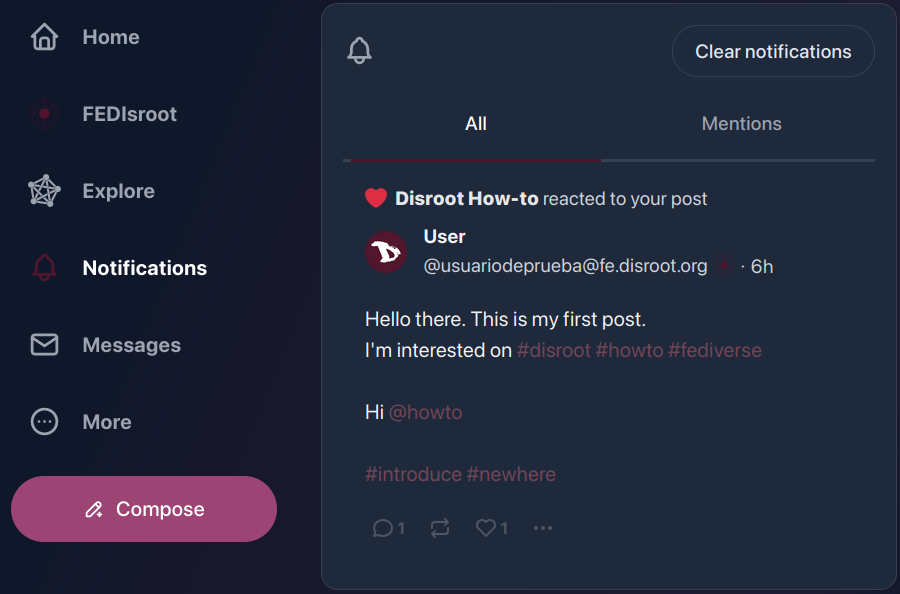

# FEDisroot: Interacting

# First steps

1. [Posting](#posting): composing and publishing.
2. [Following](#following): follow people to keep up to date with their activities.
3. [Interacting options](#options): reply, share, react, moderate and save posts.

---

# Posting
A post is something we write and/or share, it can be just a few lines long or something more elaborated with images or polls.

The first thing we can do is to briefly introduce ourselves and share our interests by writing our first post to let others know of our arrival to the Fediverse (it is also a common practice in most of the instances).

To compose a post just click on the **Compose** button in the left panel.

A post can contain

- **hashtags**, useful to group content about a particular topic, making it easy for people to find content they are interested on; and/or
- **mentions**. We can mention one or more people by writing `@user` or `@user@instance.domain`. The mention will become a link to the user's profile and those who are mentioned will get a notification about the post.

At the bottom of the post editor we have the "editing options". They are:

- **Attachments**: to attach (or upload) a file. _FEDisroot's file size limit is 128MB._
- **Emojis**: to insert [emojis](https://en.wikipedia.org/wiki/Emoji) in our post.
- **Polls**: to embed a poll in our post. Its use is very simple: we write the choices, set the duration and publish it.
- **Visibility scope** (or privacy options): to control who will be able to view our posts. We can choose our posts to be:
    - **Public**: this is the default mode. Public posts can be viewed by anyone and they appear in the public timelines.
    - **Unlisted**: posts marked with this option will not appear in the public timelines, although they still can be viewed by anyone who comes accross them (for example, via our profile or by direct linking). These posts will also appear in public searches.
    - **Followers only**: to make our post visible only for those who follow us.
    - **Direct**: to send a post or message only to the people explicitly mentioned in it.
- **Schedule**: to schedule when we want our post to be published (for example, we can write a post today and set it to be published on a different specific date).
- **Subject** (or Content Warning): to add a header to our post and/or to warn others about its content. If it is used as a header, the content below will be visible. If it is used as CW, the content below will be hide under a warning message.

  

- **Markdown**: to enable/disable Markdown format. When enabled we can use Markdown, BBCode or HTML code to visually improve our text (for example, to add typographic styles -bold, italic-, custom links, lists, etc) otherwise posts are published in plaintext format by default.

At the right of these options are the characters counter (_the limit is set to 5000 characters_) and the **Post** button.

Once our post is published, it will appear in our home timeline with some interaction options at the bottom (_we will see them below_).

[**Back to the top**](#top)

# Following
Now, let's suppose we search (and find) a particular person, or we like content posted by someone and we want their posts to appear in our timelines, and/or be notified when they do, then we should "**follow**" people to keep up with their public activities.

To start following someone, we can do it by simply clicking the **Follow** button that can be found in the "profile preview" when mouse over a username, in the user profile or at the right of a user name when we search them.

We can "unfollow" someone the same way.
## Lists
We can create customized lists of people or accounts as a way to categorize o filter the content we want to see. For example, we can create a list with the users we follow and publish content on a particular topic (software, books, news) and in this way when we select it, we will see in the timeline only the posts of those who are part of that list.

The procedure to create a list is simple:
   * click on the **More** button in the left panel and select **Lists** from the menu.
   * We enter the name of the list and then click on the **Create** button.
   * Now we can see the list in the **Your lists** section. To add people, we click on the button to edit the list (pencil icon).

   * In the **Edit list** section we can change the list name and add people through the **Add to list** option.
   * In the search field we type the name of the people to add and then click on the **Search** button. The names will appear below and to the right the **+** icon to add them. 

Once created, we can access to the list from the **Lists** option of the **More** menu.

[**Back to the top**](#top)

# Interacting options

- **Reply**: to reply or leave a comment on a post. On our own posts we can use it to add a comment or more content, for example, to update on something we wrote or when we create a "thread" on some topic;
- **Repost**: to repeat or share content;
- **Like**: to react to a post. This option allows us to show our "reaction/affection" regarding a post.
- the **···** three dots menu (or **More** menu) contain some additional options.

- **Expand this post**: to see a complete post with its interactions (if any) or the context of a reply or comment;
- **Copy link to post**: to copy to the clipboard the URL of a post or reply;
- **Bookmark**: to save the post in our Bookmarks (we can access our Bookmarks by clicking the **More** menu in the left panel);
- **Mute conversation**: with this option we turn off the notifications on the post, so we do not get any updates about interactions related to it.
- **Pin on profile**: we can also choose to have a post "pinned" to our profile, so that when someone accesses it this post will be the first to be displayed.
- **Delete**: we can delete a post by using this option. There are, however, some important issues to note about this. When we delete a post, it is effectively deleted from our instance, but given the federated nature of the service, we cannot be completely sure that it is also deleted from other instances. They are sent a deletion notice when we delete a post but we cannot know for sure if they do. Additionally, for a number of reasons, this deletion notice may not reach all instances. If this happens, those who try to interact with our post will probably receive an error message.
* **Edit**: to edit a post that has been already published.

In other people's posts, these options vary slightly.

In addition to the first three we have already seen, some new communication and moderation options have been added.

- **Mention**: this option opens directly the post editor with the mention already added.

   

- **Direct message**: to send a private message to the user;

    

- **Mute**: if we don't want to read or see posts made by a particular person, we can use this option, it will hide all their posts and notifications. We can also "unmute" them at any time we want.
- **Block**: this option will remove the user, their posts and notifications from our timelines, unfollow them (if we were doing it) and prevent them from following us.
- **Report**: we also have the possibility to report the post. That is, through this option we will notify the instance administrators that someone has **behaviors or expressions that contradict or violate [Disroot's Terms of service](https://disroot.org/en/tos).**

Additionally, there are a few more options in the three-dots menu in other's people profile.

In addition to some of those already mentioned, we also have the options:

   * **Hide reposts from**, so that the content repeated by the user we follow does not appear on our timeline.
   * **Add or remove from lists**.
   * **Feature on profile**, to show in our profile a highlighted link to the user we follow.
   * **Search from** function to search something from that particular user.

We can check our blocked and muted users/accounts list at any moment through the [**Content**](../02.settings/docs.en.md#content) option in the **More** menu.

Finally, when other people react, comment, reply or share our posts, we will be notified through the **Notifications** button on the left panel...

... and clicking on this button, we can see the detail of the interactions.

That is it basically. Now we know the basics of **FEDisroot** and we can start to interact with other people.

[**Back to the top**](#top)