# FEDisroot: Interactuando

# Primeros pasos

1. [Publicar](#posting): redactar y publicar.
2. [Seguir](#following): seguir gente para estar al día con sus actividades.
3. [Opciones de interacción](#options): responder, compartir, reaccionar, moderar y guardar publicaciones.

---

# Publicar
Una publicación o entrada es algo que escribimos y/o compartimos, puede ser de unas pocas líneas de longitud o algo más elaborado con imágenes y encuestas.

Lo primero que podemos hacer es presentarnos brevemente y compartir nuestros intereses escribiendo nuestra primera entrada para que otras personas sepan de nuestra llegada al Fediverso (es, también, una práctica común en la mayoría de las instancias).

Para redactar una entrada simplemente hacemos clic en el botón **Compose (Redactar)** del panel izquierdo.

Una entrada puede contener

- **etiquetas**, útiles para agrupar contenido acerca de un tópico particular, facilitando a la gente la búsqueda de contenido en el que esté interesada; y/o
- **menciones**. Podemos mencionar a una o más personas escribiendo `@usuarie` o `@usuarie@instancia.dominio`. La mención se convertirá en un enlace al perfil de la persona mencionada y a quienes se menciona les llegará una notificación sobre la publicación.

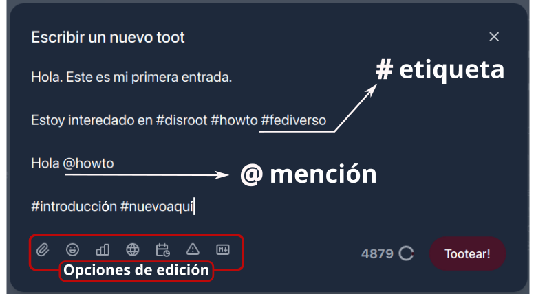

En la parte inferior del editor de entradas tenemos las "opciones de edición". Estas son:

- **Adjuntos**: para adjuntar (o subir) un archivo. _El tamaño máximo de archivos de FEDisroot es 128MB._
- **Emojis**: para insertar [emojis](https://es.wikipedia.org/wiki/Emoji) en nuestra entrada.
- **Encuestas**: para incrustar una encuesta en nuestra publicación. Su uso es muy simple: escribimos las opciones, establecemos la duración y la publicamos.
- **Ajustes de privacidad**: para controlar quiénes podrán ver nuestras publicaciones. Podemos elegir que nuestra entrada sea:
    - **Pública**: este es el modo por defecto. Las entradas públicas pueden ser vistas por cualquiera y aparecen en la línea temporal pública.
    - **No listado**: las publicaciones marcadas con esta opción no aparecerán en las líneas temporales públicas, aunque todavía pueden ser vistas por cualquiera que se encuentre con ellas (por ejemplo, a través de nuestro perfil o de un vínculo directo). Estas entradas también aparecerán en las búsquedas públicas.
    - **Privado**: para hacer que nuestra entrada sea visible solo para quienes nos siguen.
    - **Directo**: para enviar una entrada o mensaje solo a la persona explícitamente mencionada en ella.
- **Programar (Schedule)**: para programar cuándo queremos que una entrada sea publicada (por ejemplo, podemos escribirla hoy y establecer que se publique en una fecha específica diferente).
- **Texto oculto** (o Aviso de Contenido): para agregar una cabecera a nuestra publicación y/o advertir a otras personas acerca de su contenido. Si se usa como cabecera, el contenido debajo será visible. Si se utiliza como Aviso, el contenido estará oculto bajo un mensaje de advertencia.

    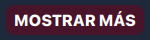 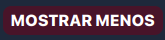 

- **Markdown**: para habilitar/deshabilitar el formato Markdown. Cuando está habilitado podemos usar Markdown, código BBCode o HTML para mejorar visualmente nuestro texto (por ejemplo, para agregar estilos tipográficos -negrita, cursiva-, enlaces personalizados, listas, etc) de lo contrario las entradas son publicadas en formato de texto plano por defecto.

A la derecha de estas opciones están el contador de caracteres (_el límite está establecido en 5000_) y el botón **Tootear!**.

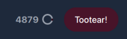

Una vez publicada nuestra entrada, aparecerá en nuestra línea de tiempo local con algunas opciones de interacción en la parte inferior (_las veremos más abajo_).

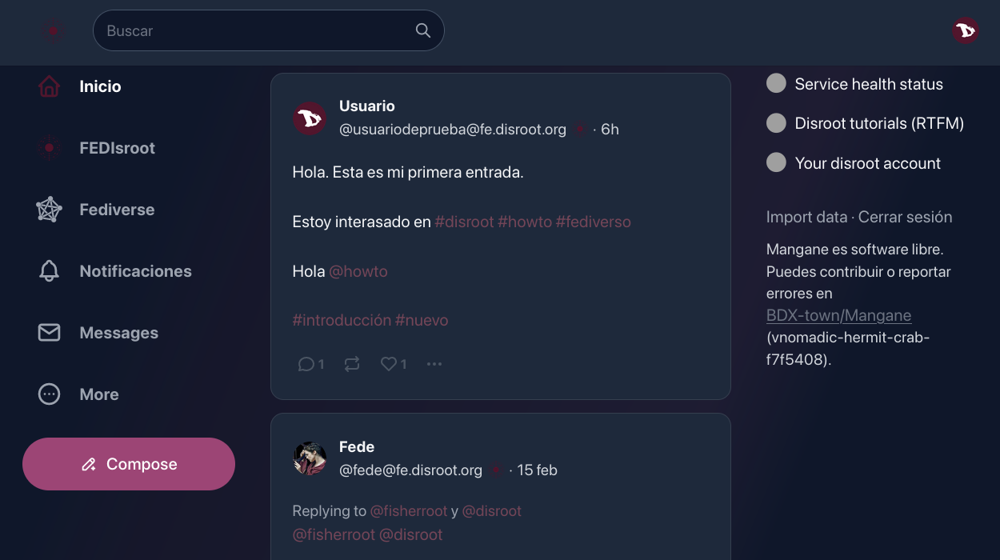

[**Volver al inicio**](#top)

# Seguir
Supongamos que buscamos (y encontramos) a una persona en particular, o nos gusta el contenido publicado por alguien y queremos que sus publicaciones aparezcan en nuestras líneas temporales, y/o que se nos notifique cuando lo hacen, entonces debemos "**seguir**" a las personas para estar al tanto de sus actividades públicas.

Para comenzar a seguir a alguien, podemos hacerlo de manera sencilla haciendo clic en el botón **Seguir** que puede encontrarse en la "vista previa del perfil" cuando pasamos el ratón sobre el nombre de la persona, en su perfil o a la derecha de sus nombres cuando las buscamos.

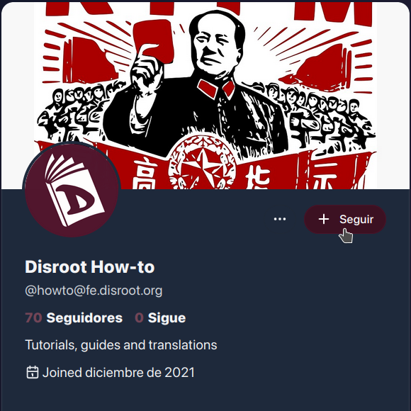

Podemos "Dejar de seguir" a alguien de la misma manera.

## Listas
Podemos crear listas personalizadas de personas o cuentas como una forma de categorizar o filtrar el contenido que queremos ver. Por ejemplo, podemos crear una lista con las personas que seguimos y publican contenido sobre un tema particular (programas, libros, noticias) y de esta manera al seleccionarla, veremos en la línea de tiempo solo las entradas de quienes integren esa lista.

El procedimiento para crear una lista es sencillo:
   * hacemos clic en el botón **Más (More)** que está en el panel izquierdo y seleccionamos **Listas** del menú.
   * Ingresamos el nombre de la lista y luego clic en el botón **Crear (Create)**
   * Ahora podemos ver la lista en la sección **Tus listas**. Para añadir personas, hacemos clic en el botón para editar la lista (ícono de lápiz).

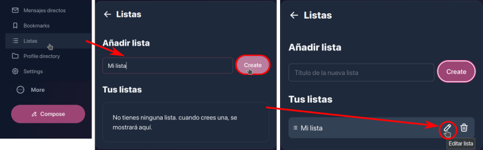

   * En la sección **Editar lista** podemos cambiar el nombre de la lista y agregar personas a través de la opción **Añadir a lista**
   * En el campo de búsqueda escribimos el nombre las personas a añadir y luego clic en el botón **Buscar**. Debajo aparecerán los nombres y a la derecha el ícono **+** para añadirlas. 

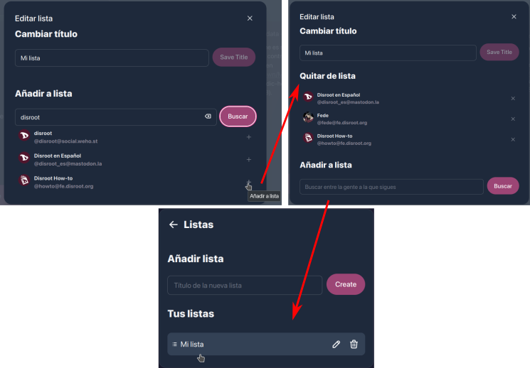

Una vez creada, podemos acceder a la lista desde la opción **Listas** del menú **Más**.

[**Volver al inicio**](#top)

# Opciones de interacción

- **Responder**: para responder o dejar un comentario en una publicación. En nuestras propias entradas podemos utilizarlas para agregar un comentario o más contenido, por ejemplo, para actualizar algo que escribimos o cuando creamos un "hilo" sobre algún tópico;
- **Retootear**: para repetir o compartir contenido;
- **Favorito**: para reacionar a una publicación. Esta opción nos permite mostrar nuestra "reacción/afecto" respecto a un estado o publicación.
- el menú de tres puntos **···** (o menú **Más**) contiene algunas opciones adicionales.

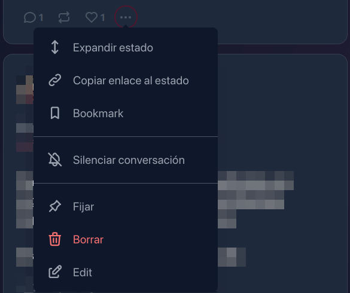

- **Expandir estado**: para ver una entrada completa con sus interacciones (si las hubiera) o el contexto de una respuesta o comentario.
- **Copiar enlace al estado**: para copiar al portapapeles la dirección URL de una publicación o respuesta.
- **Bookmark (Marcador)**: para guardar/quitar una entrada en nuestros Marcadores (podemos acceder a ellos desde el menú **Más (More)** en el panel izquierdo).
- **Silenciar conversación**: con esta opción deshabilitamos las notificaciones de la entrada, así no recibimos ninguna actualización sobre las interacciones vinculadas a ella.
- **Fijar**: podemos también elegir tener una entrada "fijada" en nuestro perfil así, cuando alguien accede a él, esta publicación será la primera en ser visualizada.
- **Borrar**: podemos borrar una entrada utilizando esta opción. Hay, sin embargo, algunas cuestiones importantes para notar al respecto. Cuando borramos una publicación, es efectivamente eliminada de nuestra instancia, pero dada la naturaleza federada del servicio, no podemos tener completa seguridad de que también haya sido borrada de otras instancias. Se les envía una notificación de borrado, pero no podemos saber si ciertamente lo hacen. Adicionalmente, por una cantidad de razones, este aviso de borrado podría no llegar a todas las instancias. Si esto sucede, quienes intenten interactuar con nuestra publicación probablemente recibirán un mensaje de error.
- **Editar**: para editar una publicación que ya ha sido publicada.

En las publicaciones de otras personas, estas opciones varían levemente.

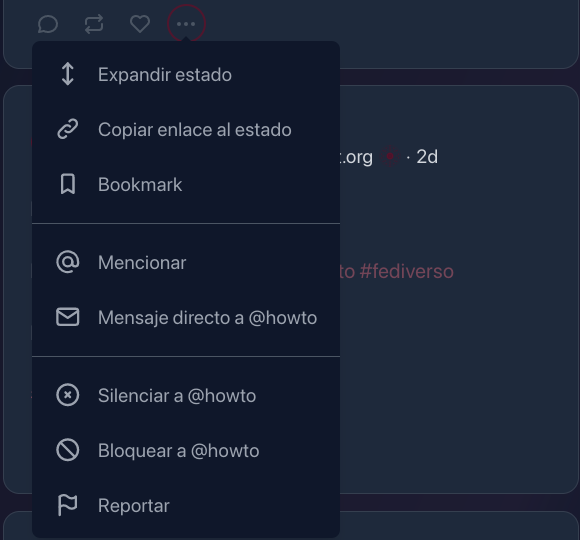

Además de las tres primeras que ya vimos, se agregan algunas nuevas opciones de comunicación y moderación.

- **Mencionar**: esta opción abre directamente el editor de entradas con la mención ya agregada.

   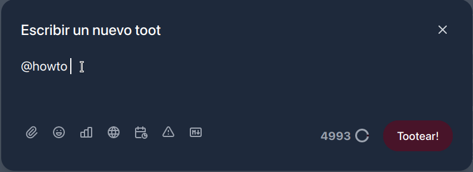

- **Mensaje directo a**: para enviar un mensaje privado a la persona;

    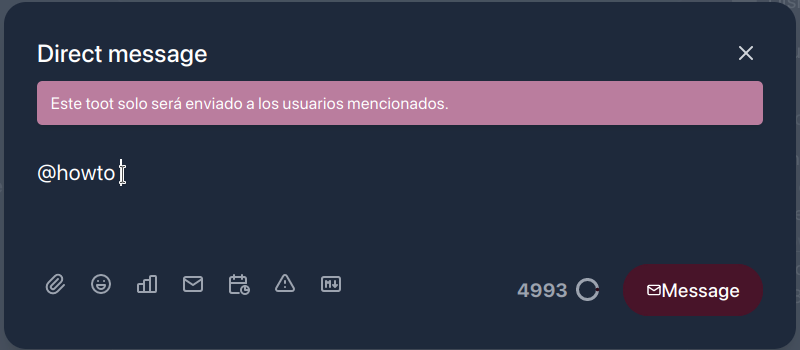

- **Silenciar**: si no queremos leer o ver los estados de otra persona, podemos usar esta opción que ocultará todos sus estados y notificaciones. También podemos "Dejar de silenciarla" en cualquier momento que queramos;
- **Bloquear**: esta opción quitará a la persona, sus publicaciones y notificaciones de nuestras líneas temporales, dejaremos de seguirla (si lo estamos haciendo) y evitará que pueda seguirnos; y
- **Reportar**: también tenemos la posibilidad de reportar una entrada. Es decir, a través de esta opción, notificaremos a los administradores de la instancia que alguien tiene **comportamientos o expresiones que contradigan o violen nuestras [Condiciones de servicios de Disroot](https://disroot.org/es/tos).**

Adicionalmente, hay algunas opciones más en el menú de tres puntos en el perfil de otras personas.

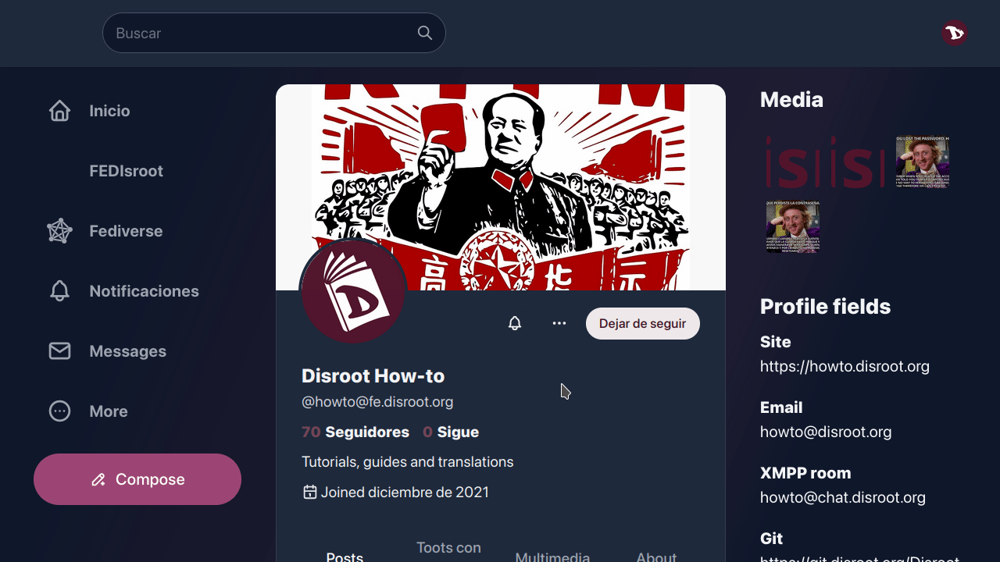

Además de algunas de las que ya mencionamos, también tenemos las opciones:

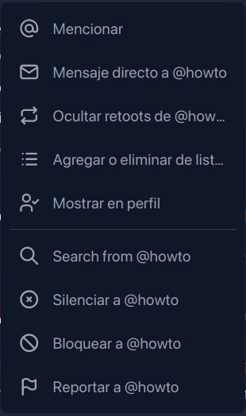

  * **Ocultar retoots de** para que no aparezcan en nuestra línea de tiempo el contenido repetido por la persona que seguimos.
  * **Agregar o eliminar de las listas**.
  * **Mostrar en perfil**, para mostrar en nuestro perfil un enlace destacado al de la persona que seguimos.
  * **Buscar de (Search from)**, esta función nos permite buscar algo en el contenido publicado por esa persona en particular.

Podemos revisar nuestra lista de personas/cuentas bloqueadas o silenciadas en cualquier momento a través de la opción [**Contenido (Content)**](../02.settings/docs.es.md#content) en el menú **Más (More)**.

Finalmente, cuando otras personas reaccionan, comentan, responden o comparten nuestras publicaciones, se nos notificará a través del botón **Notificaciones** en el panel izquierdo...

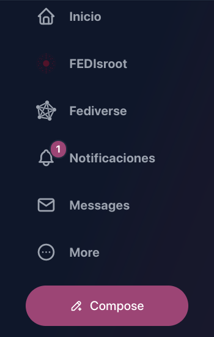

... y haciendo clic en este botón, podemos ver el detalle de las interacciones.

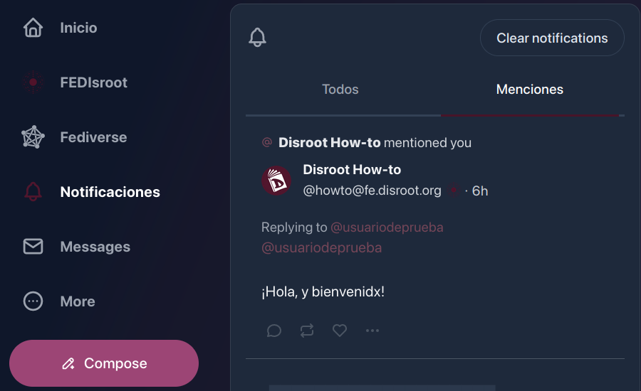

Básicamente, eso es todo. Ahora sabemos lo básico de **FEDisroot** y podemos comenzar a interactuar con otras personas.

[**Volver al inicio**](#top)