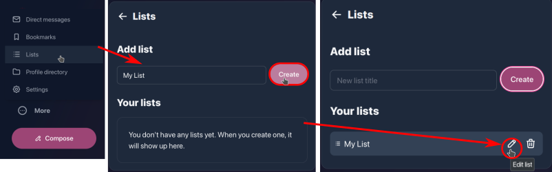
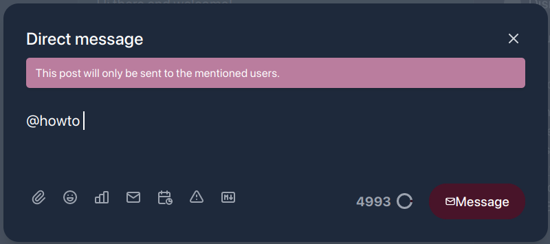
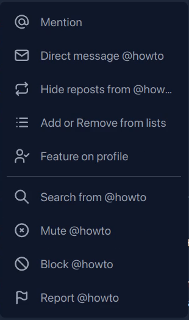
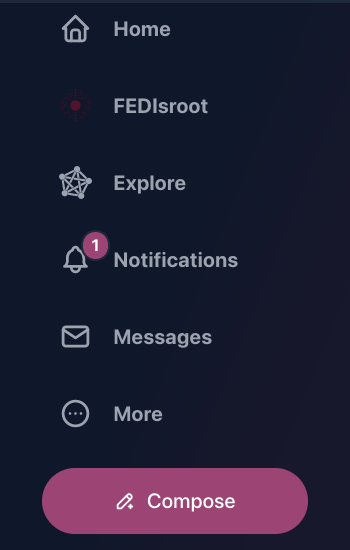

# FEDisroot: Interagir

# Premières étapes

1. [Publier](#posting) : composer et publier.
2. [Suivre](#following) : suivre des personnes pour se tenir au courant de leurs activités.
3. [Options d'interaction](#options) : répondre, partager, réagir, modérer et sauvegarder des messages.

---

# Publier
Un message est quelque chose que nous écrivons et/ou partageons, il peut s'agir de quelques lignes seulement ou de quelque chose de plus élaboré avec des images ou des sondages.

La première chose que nous pouvons faire est de nous présenter brièvement et de partager nos intérêts en écrivant notre premier message pour informer les autres de notre arrivée sur le Fediverse (c'est également une pratique courante dans la plupart des cas).

Pour rédiger un message, il suffit de cliquer sur le bouton **Composer** dans le panneau de gauche.

Un article peut contenir

- des **hashtags**, utiles pour regrouper le contenu sur un sujet particulier, ce qui permet aux gens de trouver facilement le contenu qui les intéresse ; et/ou
- des **mentions**. On peut mentionner une ou plusieurs personnes en écrivant `@user` ou `@user@instance.domain`. La mention deviendra un lien vers le profil de l'utilisateur et les personnes mentionnées recevront une notification à propos du message.

En bas de l'éditeur d'articles, nous avons les "options d'édition". Ce sont les suivantes :

- **Pièces jointes** : pour joindre (ou télécharger) un fichier. La taille limite des fichiers sur Fedisroot est de 128 Mo.
- **Emojis** : pour insérer des [emojis](https://en.wikipedia.org/wiki/Emoji) dans votre message.
- **Sondage** : pour intégrer un sondage dans notre message. Son utilisation est très simple : on écrit les choix, on fixe la durée et on le publie.
- **Champ de visibilité** (ou options de confidentialité) : pour contrôler qui pourra voir nos messages. Nous pouvons choisir que nos messages soient :
    - **Public** : il s'agit du mode par défaut. Les messages publics peuvent être vus par tout le monde et ils apparaissent dans les chronologies publiques.
    - **Non listés** : les messages marqués de cette option n'apparaîtront pas dans la chronologie publique, mais ils pourront être consultés par toute personne qui en prendra connaissance (par exemple, via notre profil ou par lien direct). Ces messages apparaîtront également dans les recherches publiques.
    - **Seulement les Followers** : pour rendre notre message visible uniquement pour ceux qui nous suivent.
    - **Direct** : pour envoyer un message uniquement aux personnes qui y sont explicitement mentionnées.
- **Programmation** : pour programmer le moment où nous voulons que notre message soit publié (par exemple, nous pouvons écrire un message aujourd'hui et le programmer pour qu'il soit publié à une autre date spécifique).
- **Sujet** (ou Avertissement de contenu/CW) : pour ajouter un en-tête à notre message et/ou pour avertir les autres de son contenu. S'il est utilisé comme un en-tête, le contenu ci-dessous sera visible. S'il est utilisé comme CW, le contenu ci-dessous sera caché sous un message d'avertissement.

  

- **Markdown** : pour activer/désactiver le format Markdown. Lorsque cette option est activée, nous pouvons utiliser le format Markdown, le BBCode ou le code HTML pour améliorer visuellement notre texte (par exemple, pour ajouter des styles typographiques -gras, italique-, des liens personnalisés, des listes, etc), sinon les messages sont publiés au format texte brut par défaut.

À droite de ces options se trouvent le compteur de caractères (_la limite est fixée à 5000 caractères_) et le bouton **Publier**.

Une fois notre message publié, il apparaîtra dans notre chronologie d'accueil avec quelques options d'interaction en bas (_nous les verrons ci-dessous_).

[**Retour en haut**](#top)

# Suivre
Supposons maintenant que nous recherchions (et trouvions) une personne en particulier, ou que nous aimions le contenu publié par quelqu'un et que nous voulions que ses messages apparaissent dans nos chronologies, et/ou que nous soyons avertis lorsqu'ils le font, alors nous devrions "**suivre**" les personnes pour rester au courant de leurs activités publiques.

Pour commencer à suivre quelqu'un, il suffit de cliquer sur le bouton **suivre** qui se trouve dans l'"aperçu du profil" lorsque l'on passe la souris sur un nom d'utilisateur, dans le profil de l'utilisateur ou à droite du nom d'un utilisateur lorsque l'on effectue une recherche.

On peut " dé-suivre " quelqu'un de la même manière.
## Listes
Nous pouvons créer des listes personnalisées de personnes ou de comptes afin de catégoriser ou de filtrer le contenu que nous voulons voir. Par exemple, nous pouvons créer une liste avec les utilisateurs que nous suivons et qui publient du contenu sur un sujet particulier (logiciels, livres, actualités) et de cette façon, lorsque nous la sélectionnons, nous verrons dans la chronologie uniquement les messages de ceux qui font partie de cette liste.

La procédure pour créer une liste est simple :
* on clique sur le bouton **Plus** dans le panneau de gauche et on sélectionne **Listes** dans le menu.
   * On entre le nom de la liste et on clique sur le bouton **Créer**.
   * Maintenant, nous pouvons voir la liste dans la section **Vos listes**. Pour ajouter des personnes, on clique sur le bouton pour éditer la liste (icône crayon).

   * Dans la section **Modifier la liste**, nous pouvons modifier le nom de la liste et ajouter des personnes grâce à l'option **Ajouter à la liste**.
   * Dans le champ de recherche, tapez le nom des personnes à ajouter, puis cliquez sur le bouton **Recherche**. Les noms apparaîtront en dessous et à droite de l'icône **+** pour les ajouter.

Une fois créée, nous pouvons accéder à la liste depuis l'option **Listes** du menu **Plus**.

[**Retour en haut**](#top)

# Option d'interaction

- **Répondre** : répondre ou laisser un commentaire sur un message. Sur nos propres messages, nous pouvons l'utiliser pour ajouter un commentaire ou plus de contenu, par exemple, pour mettre à jour quelque chose que nous avons écrit ou lorsque nous créons un "fil" sur un sujet ;
- **Republier** : pour répéter ou partager du contenu ;
- **J'aime** : pour réagir à un message. Cette option nous permet de montrer notre "réaction/affection" à un message.
- Le menu **...** à trois points (ou menu **Plus**) contient quelques options supplémentaires.

- **Développer ce message** : pour voir un message complet avec ses interactions (le cas échéant) ou le contexte d'une réponse ou d'un commentaire ;
- **Copier le lien vers le message** : pour copier dans le presse-papiers l'URL d'un message ou d'une réponse ;
- **Signet** : pour enregistrer le message dans nos signets (nous pouvons accéder à nos signets en cliquant sur le menu **More** dans le panneau de gauche) ;
- **Mettre la conversation en sourdine** : avec cette option, nous désactivons les notifications sur le message, de sorte que nous ne recevons pas de mises à jour sur les interactions liées à celui-ci.
- **Epingler sur le profil** : nous pouvons également choisir d'avoir un message "épinglé" sur notre profil, de sorte que lorsque quelqu'un y accède, ce message sera le premier à être affiché.
- **Supprimer** : nous pouvons supprimer un message en utilisant cette option. Il y a cependant quelques points importants à noter à ce sujet. Lorsque nous supprimons un message, il est effectivement supprimé de notre instance, mais étant donné la nature fédérée du service, nous ne pouvons pas être totalement sûrs qu'il est également supprimé des autres instances. Celles-ci reçoivent un avis de suppression lorsque nous supprimons un message, mais nous ne pouvons pas savoir avec certitude si elles le font. En outre, pour un certain nombre de raisons, cet avis de suppression peut ne pas atteindre toutes les instances. Dans ce cas, les personnes qui tentent d'interagir avec notre message recevront probablement un message d'erreur.
* **Editer** : pour modifier un message qui a déjà été publié.

Dans les messages d'autres personnes, ces options varient légèrement.

En plus des trois premières que nous avons déjà vues, quelques nouvelles options de communication et de modération ont été ajoutées.

- **Mention** : cette option ouvre directement l'éditeur de message avec la mention déjà ajoutée.

   

- **Message direct** : pour envoyer un message privé à l'utilisateur ;

    

- **Muter** : si nous ne voulons pas lire ou voir les messages d'une personne en particulier, nous pouvons utiliser cette option, qui masquera tous ses messages et notifications. Nous pouvons également les rétablir à tout moment.
- **Bloquer** : cette option supprimera l'utilisateur, ses messages et ses notifications de nos chronologies, le désuivra (si nous le faisions) et l'empêchera de nous suivre.
- **Rapport** : nous avons également la possibilité de signaler le message. En d'autres termes, cette option nous permet d'informer les administrateurs de l'instance que quelqu'un a **des comportements ou des expressions qui contredisent ou violent les [Conditions d'utilisation de Disroot](https://disroot.org/fr/tos).**.

En outre, il existe quelques options supplémentaires dans le menu à trois points du profil des autres personnes.

En plus de certains de ceux déjà mentionnés, nous avons aussi les options :

   * **Cacher les republications de**, afin que le contenu répété par l'utilisateur que nous suivons n'apparaisse pas sur notre chronologie.
   * **Ajouter ou supprimer des listes**.
   * **Fonctionnalité sur le profil**, pour afficher dans notre profil un lien mis en évidence vers l'utilisateur que nous suivons.
   * **Recherche à partir de** pour rechercher quelque chose de cet utilisateur particulier.

Nous pouvons vérifier notre liste d'utilisateurs/comptes bloqués et muets à tout moment grâce à l'option [**Contenu**](../02.settings/docs.en.md#content) dans le menu **Plus**.

Enfin, lorsque d'autres personnes réagissent, commentent, répondent ou partagent nos messages, nous en sommes informés par le bouton **Notifications** du panneau de gauche...

... et en cliquant sur ce bouton, nous pouvons voir le détail des interactions.

C'est tout, en gros. Maintenant nous connaissons les bases de **FEDisroot** et nous pouvons commencer à interagir avec d'autres personnes.

[**Retour en haut**](#top)