# FEDisroot: Interazione

# Primi passi

1. [Pubblicazione](#posting): composizione e pubblicazione.
2. [Seguire](#following): segui persone per rimanere aggiornato sulle loro attività.
3. [Opzioni di interazione](#options): rispondi, condividi, reagisci, modera e salva post.

---

# Pubblicazione
Un post è qualcosa che scriviamo e/o condividiamo, può essere solo di poche righe o qualcosa di più elaborato con immagini o sondaggi.

La prima cosa che possiamo fare è presentarci brevemente e condividere i nostri interessi scrivendo il nostro primo post per far sapere agli altri del nostro arrivo nel Fediverse (è anche una pratica comune nella maggior parte delle istanze).

Per comporre un post, basta fare clic sul pulsante **Componi** nel pannello di sinistra.

Un post può contenere

- **hashtag**, utili per raggruppare contenuti su un particolare argomento, facilitando alle persone la ricerca di contenuti di loro interesse; e/o
- **menzioni**. Possiamo menzionare una o più persone scrivendo `@utente` o `@utente@istanza.dominio`. La menzione diventerà un link al profilo dell'utente e coloro che sono menzionati riceveranno una notifica riguardo al post.

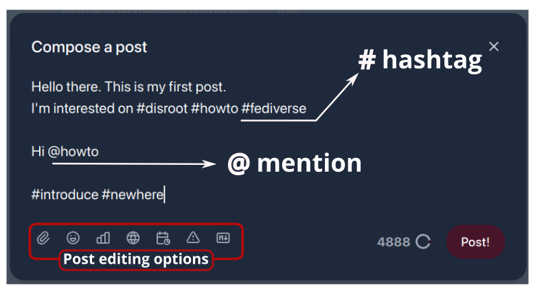

Nella parte inferiore dell'editor del post abbiamo le "opzioni di modifica". Esse sono:

- **Allegati**: per allegare (o caricare) un file. _Il limite di dimensione del file per FEDisroot è di 128 MB._
- **Emoji**: per inserire [emoji](https://en.wikipedia.org/wiki/Emoji) nel nostro post.
- **Sondaggi**: per incorporare un sondaggio nel nostro post. Il suo utilizzo è molto semplice: scriviamo le opzioni, impostiamo la durata e pubblichiamo.
- **Ambito di visibilità** (o opzioni di privacy): per controllare chi potrà visualizzare i nostri post. Possiamo scegliere che i nostri post siano:
    - **Pubblici**: questa è la modalità predefinita. I post pubblici possono essere visualizzati da chiunque e appaiono nelle timeline pubbliche.
    - **Non elencati**: i post contrassegnati con questa opzione non appariranno nelle timeline pubbliche, anche se possono ancora essere visualizzati da chiunque li trovi (ad esempio, tramite il nostro profilo o tramite collegamento diretto). Questi post appariranno anche nelle ricerche pubbliche.
    - **Solo seguaci**: per rendere il nostro post visibile solo a coloro che ci seguono.
    - **Diretto**: per inviare un post o messaggio solo alle persone esplicitamente menzionate in esso.
- **Programma**: per pianificare quando vogliamo che il nostro post sia pubblicato (ad esempio, possiamo scrivere un post oggi e impostarlo per essere pubblicato in una data specifica diversa).
- **Oggetto** (o Avviso di contenuto): per aggiungere un'intestazione al nostro post e/o avvertire gli altri sul suo contenuto. Se viene utilizzato come intestazione, il contenuto sottostante sarà visibile. Se viene utilizzato come avviso di contenuto, il contenuto sottostante sarà nascosto sotto un messaggio di avviso.

  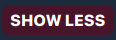

- **Markdown**: per abilitare/disabilitare il formato Markdown. Quando è abilitato, possiamo utilizzare Markdown, BBCode o codice HTML per migliorare visivamente il nostro testo (ad esempio, per aggiungere stili tipografici -grassetto, corsivo-, link personalizzati, elenchi, ecc.), altrimenti i post vengono pubblicati in formato testo normale per impostazione predefinita.

A destra di queste opzioni ci sono il contatore di caratteri (_il limite è impostato a 5000 caratteri_) e il pulsante **Pubblica**.

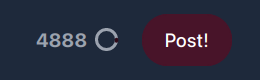

Una volta che il nostro post è pubblicato, comparirà nella nostra cronologia principale con alcune opzioni di interazione nella parte inferiore (_le vedremo di seguito_).

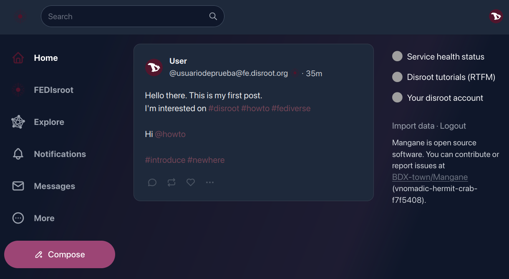

[**Torna all'inizio**](#top)

# Seguire
Ora, supponiamo che cerchiamo (e troviamo) una persona in particolare, oppure ci piace il contenuto pubblicato da qualcuno e vogliamo che i loro post appaiano nelle nostre cronologie e/o essere notificati quando lo fanno, allora dovremmo "**seguire**" le persone per rimanere aggiornati sulle loro attività pubbliche.

Per iniziare a seguire qualcuno, possiamo farlo semplicemente cliccando il pulsante **Segui** che si trova nella "anteprima del profilo" quando passiamo il mouse su un nome utente, nel profilo utente o a destra del nome utente quando li cerchiamo.

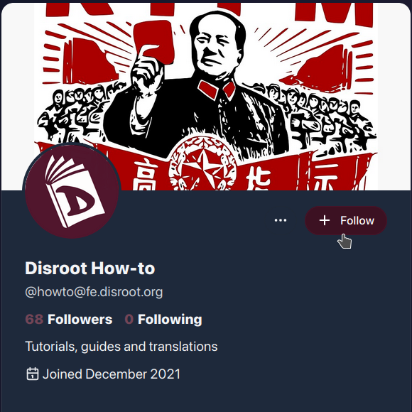

Possiamo "smettere di seguire" qualcuno allo stesso modo.
## Liste
Possiamo creare liste personalizzate di persone o account come modo per categorizzare o filtrare i contenuti che vogliamo vedere. Ad esempio, possiamo creare una lista con gli utenti che seguiamo e che pubblicano contenuti su un particolare argomento (software, libri, notizie) e in questo modo, quando la selezioniamo, vedremo nella cronologia solo i post di coloro che fanno parte di quella lista.

La procedura per creare una lista è semplice:
   * clicchiamo sul pulsante **Altro** nel pannello di sinistra e selezioniamo **Liste** dal menu.
   * inseriamo il nome della lista e poi clicchiamo sul pulsante **Crea**.
   * Ora possiamo vedere la lista nella sezione **Le tue liste**. Per aggiungere persone, clicchiamo sul pulsante per modificare la lista (icona matita).

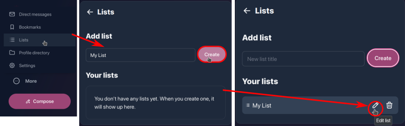

   * Nella sezione **Modifica lista** possiamo cambiare il nome della lista e aggiungere persone tramite l'opzione **Aggiungi alla lista**.
   * Nel campo di ricerca digitiamo il nome delle persone da aggiungere e poi clicchiamo sul pulsante **Cerca**. I nomi appariranno sotto e a destra dell'icona **+** per aggiungerli.

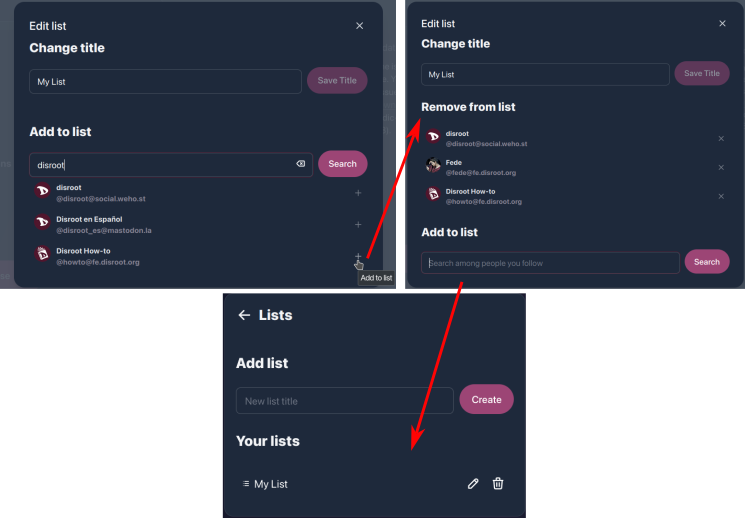

Una volta creata, possiamo accedere alla lista dall'opzione **Liste** del menu **Altro**.

[**Torna all'inizio**](#top)

# Opzioni di interazione

- **Rispondi**: per rispondere o lasciare un commento su un post. Nei nostri stessi post possiamo usarlo per aggiungere un commento o ulteriore contenuto, ad esempio, per fare un aggiornamento su qualcosa che abbiamo scritto o quando creiamo un "thread" su un argomento;
- **Reposta**: per ripetere o condividere contenuti;
- **Mi piace**: per reagire a un post. Questa opzione ci consente di mostrare la nostra "reazione/affetto" riguardo a un post.
- Il menu dei tre punti **···** (o menu **Altro**) contiene alcune opzioni aggiuntive.

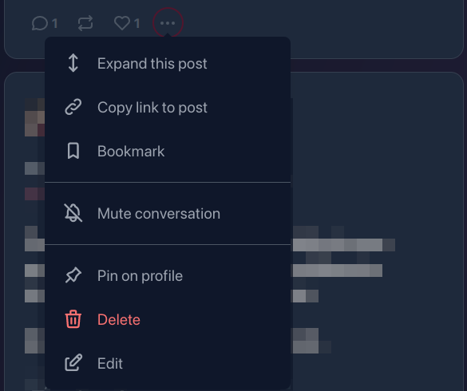

- **Espandi questo post**: per vedere un post completo con le sue interazioni (se presenti) o il contesto di una risposta o commento;
- **Copia link al post**: per copiare negli appunti l'URL di un post o di una risposta;
- **Segnalibro**: per salvare il post nei nostri Segnalibri (possiamo accedere ai nostri Segnalibri cliccando sul menu **Altro** nel pannello di sinistra);
- **Silenzia la conversazione**: con questa opzione disattiviamo le notifiche sul post, quindi non riceveremo alcun aggiornamento riguardo alle interazioni ad esso correlate.
- **Piazza sul profilo**: possiamo anche scegliere di avere un post "pinnato" sul nostro profilo, in modo che quando qualcuno vi accede questo post sarà il primo a essere visualizzato.
- **Elimina**: possiamo eliminare un post utilizzando questa opzione. Tuttavia, ci sono alcune questioni importanti da notare a riguardo. Quando eliminiamo un post, viene effettivamente cancellato dalla nostra istanza, ma data la natura federata del servizio, non possiamo essere completamente certi che sia eliminato anche da altre istanze. Viene inviato un avviso di cancellazione quando eliminiamo un post, ma non possiamo sapere con certezza se raggiungono tutte le istanze. Inoltre, per diverse ragioni, questo avviso di cancellazione potrebbe non raggiungere tutte le istanze. Se ciò accade, coloro che cercano di interagire con il nostro post probabilmente riceveranno un messaggio di errore.
* **Modifica**: per modificare un post già pubblicato.

Nei post di altre persone, queste opzioni variano leggermente.

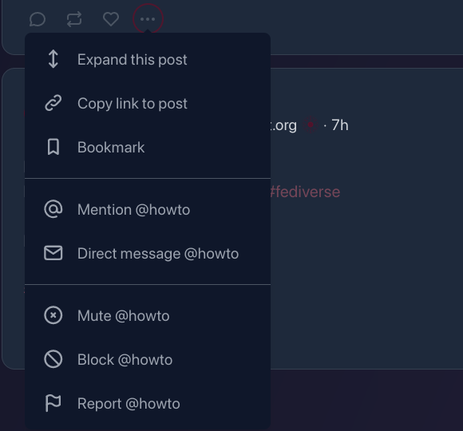

Oltre alle prime tre che abbiamo già visto, sono state aggiunte alcune nuove opzioni di comunicazione e moderazione.

- **Menzione**: questa opzione apre direttamente l'editor del post con la menzione già aggiunta.

   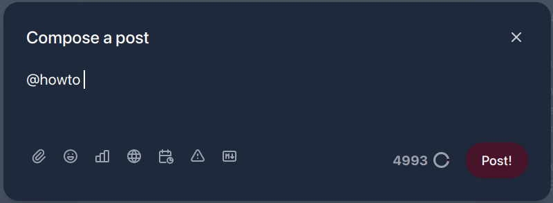

- **Messaggio diretto**: per inviare un messaggio privato all'utente;

    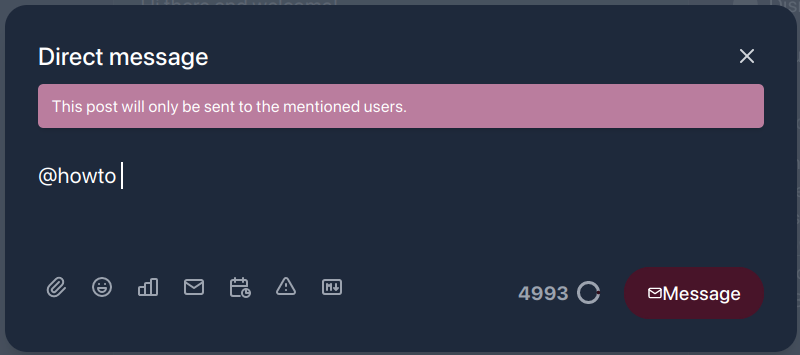

- **Silenzia**: se non vogliamo leggere o vedere i post di una persona in particolare, possiamo utilizzare questa opzione, che nasconderà tutti i loro post e le notifiche. Possiamo anche "disattivare il silenzio" in qualsiasi momento.
- **Blocca**: questa opzione rimuoverà l'utente, i suoi post e le notifiche dalle nostre cronologie, smetteremo di seguirli (se lo stavamo facendo) e impediremo loro di seguirci.
- **Segnala**: abbiamo anche la possibilità di segnalare il post. Cioè, tramite questa opzione notificheremo agli amministratori dell'istanza che qualcuno ha **comportamenti o espressioni che contravvengono o violano [Termini di servizio di Disroot](https://disroot.org/en/tos).**

Inoltre, ci sono alcune opzioni in più nel menu a tre punti nel profilo di altre persone.

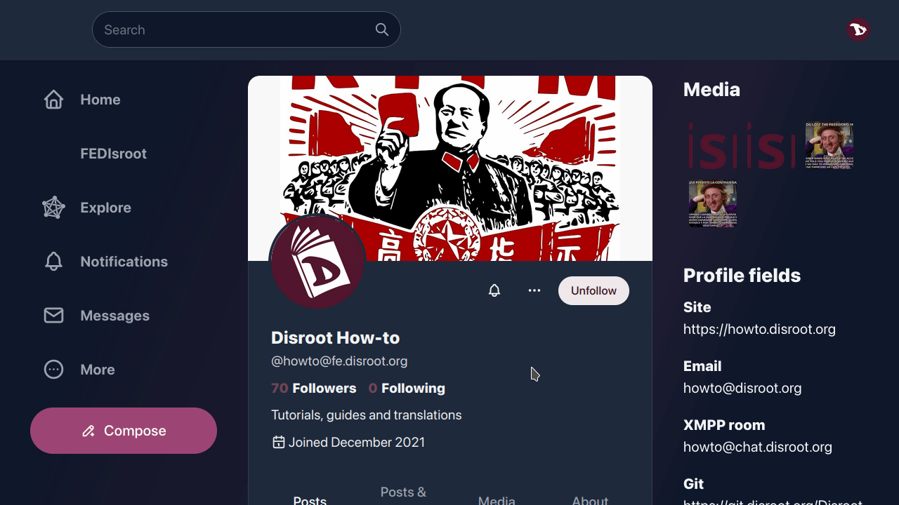

Oltre a alcune di quelle già menzionate, abbiamo anche le opzioni:

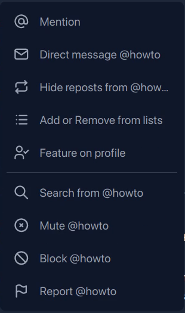

   * **Nascondi repost da**, in modo che i contenuti ripetuti dall'utente che segui non appaiano nella nostra cronologia.
   * **Aggiungi o rimuovi dalle liste**.
   * **In evidenza sul profilo**, per mostrare nel nostro profilo un collegamento in evidenza all'utente che segui.
   * Funzione **Ricerca da** per cercare qualcosa da quell'utente in particolare.

Possiamo verificare la nostra lista di utenti/account bloccati e silenziati in qualsiasi momento tramite l'opzione [**Contenuto**](../02.settings/docs.en.md#content) nel menu **Altro**.

Infine, quando altre persone reagiscono, commentano, rispondono o condividono i nostri post, riceveremo una notifica tramite il pulsante **Notifiche** nel pannello di sinistra...

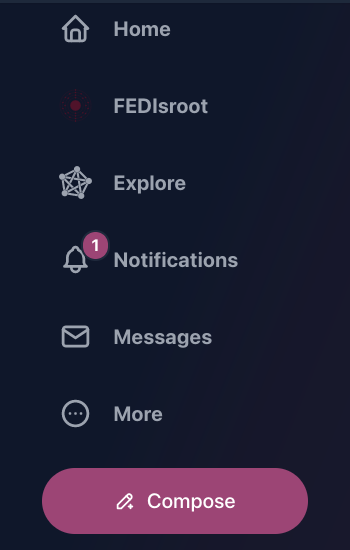

... e cliccando su questo pulsante, possiamo vedere i dettagli delle interazioni.

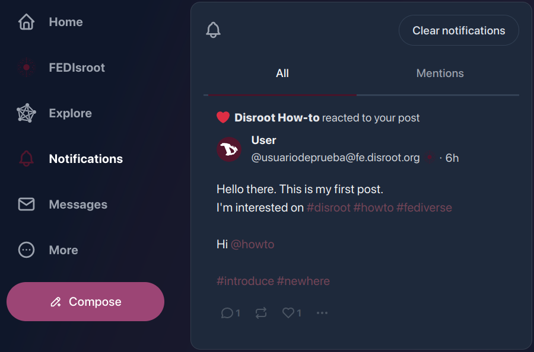

In sostanza, è tutto. Ora conosciamo le basi di **FEDisroot** e possiamo iniziare a interagire con altre persone.

[**Torna all'inizio**](#top)
