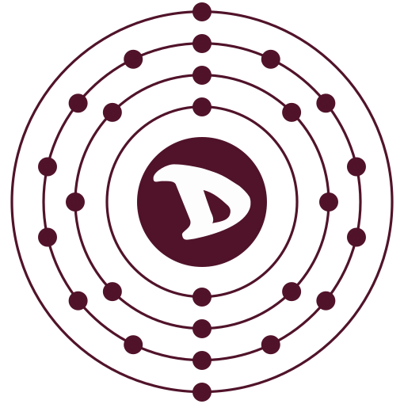

# FEDisroot: L'istanza Akkoma di Disroot

**Akkoma** è un servizio di microblogging federato. Federato significa che può comunicare con altri servizi e server che supportano gli stessi standard aperti come, ad esempio, **Mastodon**, **Pleroma**, **GNU Social**, **Hubzilla**, **Misskey**, **PeerTube** o **Friendica**.

In questo modo, non importa quale di questi servizi si stia utilizzando, si può interagire con chiunque nel Fedverso.

Akkoma di Disroot è piuttosto intuitivo da usare. Nei capitoli che seguono ne scopriremo il funzionamento in ogni suo aspetto.

---

# Sommario
1. [Interfaccia](interface)

2. [Impostazioni](settings)

3. [Interazione](interacting)
