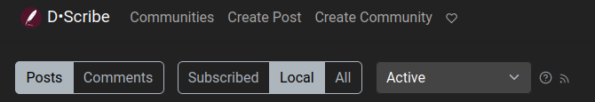
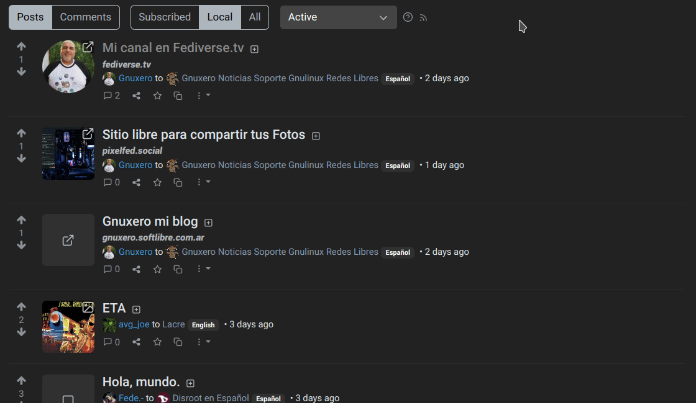
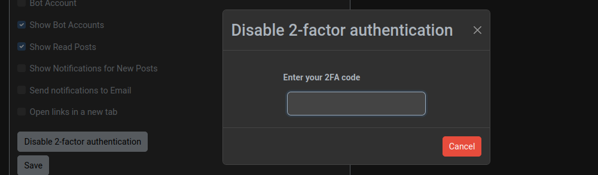
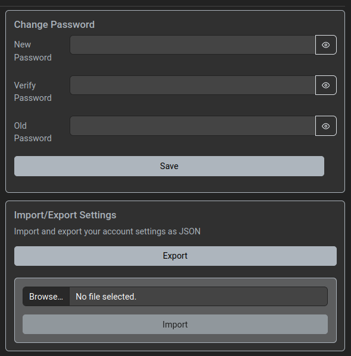

# D·Scribe: Getting started

## Registering
As we already mentioned in the introduction, there are many **Lemmy** instances we can choose to register. And although we are going to focus on **Disroot**'s one, called **D·Scribe**, these next chapters should serve as a guide for moving into any other.

So, first step is to register a **D·Scribe** account.

We go to [https://scribe.disroot.org](https://scribe.disroot.org), click **Sign up** in the top right of the page and fill in the following fields:

- **Username**: this name can not be changed and is unique within an instance. Later we can set a displayname that we can changed freely. If the username we want to use is taken, we need to choose a different one or consider to change to another instance where it is still available.

- **Email**: our email address. This is only used for password reset and notifications (if enabled). This is optional at **D·Scribe**, but there are instances where it is mandatory and we will have to wait for a confirmation mail and click the link after completing this form. Now, if we want to receive the confirmation of our account activation from **Disroot** team, we have to consider entering an email address. We can remove it later if we want.

- **Password**: our logging in password.

- **Verify password**: we have to repeat the same password from above to ensure that it was entered correctly.

- **Answer**: this is used to prevent spam bots, although not all instances have implemented this measure.

- **Enter Code**: we just need to enter the letters and numbers that we see in the text box, ignoring uppercase or lowercase. If for some reason we are not enable to read it we can refresh the captcha or use the play button to get an audio version of it.

- **Show NSFW content**: here we can choose if content that is "not safe for work" (or adult-only) should be shown.

Finally, we click on the **Sign Up** button. Once **Disroot**'s admins have reviewed and approved our registration we will receive a welcome email and we will be able to log in with the username and password we registered.

## First login and profile setup
The first time we log in we will see something like this:

We can see there are two groups of buttons: the Post/Comments and the Subscribed/Local/All ones.

Through them we can view and check the comments and posts of the local communities, those that federate with our instance and those to which we are subscribed.

Let's setup our profile before start posting or following communities.

We open the top-right menu and select "Settings".

Here we can add some information for our public profile and set some preferences.

- **Display name**: we can set an alternative different name from our username. This can be changed at any time.

- **Bio**: we can also add a description of ourselves, formatted with Markdown.

- **Email**: modify our email. Once saved the modification, an email will be sent to the new address to verify it.

- **Matrix User**: add our Matrix chat username.

- **Avatar**: we can upload an image to use as the profile picture that is shown next to all our posts.

- **Banner**: we can also upload an image to set it as header image for our profile page.

- **Interface language**: to set the language of our user interface.

- **Languages**: we can select those that we speak to see only content in these languages. Since this is a new feature, there are still many posts that do not specify a language, so we need to be sure to select "Undetermined" to see them.

- **Theme**: to choose between different color themes for our user interface.

- **Type**: here we can choose which timeline we want to see by default on the frontpage: only posts from communities that we are subscribed, posts in local communities, or all posts including federated.

- **Sort type**: set how posts and comments should be sorted by default (we will see the voting and ranking system later on).

- **Show NSFW content**: to choose whether or not we want to see content that is "not safe for work" (or adult-only).

- **Blur NSFW content**: we can choose to blur the NSFW instead of not showing it at all.

- **Auto expand media**: when enabled, media content will be automatically shown instead of being collapsed.

- **Show Scores**: to choose whether the number of upvotes and downvotes should be visible.

- **Show Avatars**: to choose whether profile pictures of other users should be shown.

- **Bot Account**: we can enable this option if we are using a script or program to create posts automatically.

- **Show Bot Accounts**: we can also enable/disable the option to hide posts that were created by bot accounts.

- **Show Read Posts**: by disabling this option, the posts that we already viewed will not be not shown in listings anymore.

- **Show Notifications for New Posts**: to enable/disable receiving a popup notification for each new post that is created.

- **Send notifications to Email**: to enable/disable receiving notifications about new comment replies and private messages to our email address.

- **Open links in a new tab**: to enable/disable opening links in a new tab.

In the **Blocks** tab we will find users we have blocked. We will learn about it in the following chapters.

### Enabling/disabling 2FA
For those who want to have a more secure login, **Lemmy** offers the possibility to activate the two factor authentication (2FA), a security measure in addition to the password that requires the use of a software to generate temporary codes. Examples of these programs are **Aegis Authenticator** and **FreeOTP+** for mobiles or **KeePassXC** for desktop computers.

To enable it we just click on the **Enable 2 factor authentication** button.

Now, to get the temporary codes linked to our account we need to configure our code generator program with the information provided by **Lemmy** to do so.

We have two options:
- copy the configuration data to do it manually by clicking the button **Click here for 2FA installation link**, or
- scan the QR code with our application to do it automatically.

Once configured, we enter the temporary code in the **Enter 2FA code** field and press enter.

If the 2FA was configured correctly, we will see a message informing us of this.

From now on, every time we log in, we will be asked, in addition to our password, for the temporary code, in order to access our account.

Finally, we click on the **Save** button to save our configurations.

Remember that to disable the 2FA we will also be asked to enter the temporary code.

## Changing our password
On this same page we can change our password and import/export our settings.

OK. In the next chapter we will see how to start following communities, posting, commenting and voting.