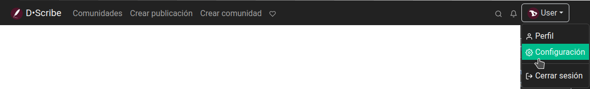

# D·Scribe: Primeros pasos

## Registro
Como ya mencionamos en la introducción, hay muchas instancias de **Lemmy** que podemos elegir para registrarnos. Y, aunque vamos a enfocarnos en la de **Disroot**, llamada **D·Scribe**, estos capítulos siguientes deberían servir como guía para movernos dentro de cualquier otra.

Así que el primer paso es registrar una cuenta de **D·Scribe**.

Vamos a [https://scribe.disroot.org](https://scribe.disroot.org), hacemos clic en **Crear cuenta**, arriba a la derecha de la página y completamos los siguientes campos:

- **Nombre de usuario**: este nombre no se puede cambiar y es único dentro de una instancia. Más adelante podremos establecer un "nombre para visualizar" diferente si queremos, que puede modificarse libremente. Si el nombre de usuarie que deseamos utilizar está tomado, necesitamos elegir uno diferente o considerar cambiar a otra instancia donde todavía esté disponible.

- **Correo electrónico**: nuestra dirección de correo. Esta se utiliza solamente para restablecimiento de la contraseña y notificaciones (si están habilitadas). Esto es opcional en **D·Scribe**, pero hay instancias donde es obligatorio y tendremos que esperar un correo de confirmación y hacer clic en el link después de completar este formulario. Ahora, si queremos recibir la confirmación de la activación de nuestra cuenta del equipo de **Disroot**, tenemos que considerar ingresar una dirección de correo. Podemos quitarla más tarde si lo deseamos.

- **Contraseña**: nuestra contraseña de acceso.

- **Verificar contraseña**: tenemos que repetir la misma contraseña de arriba para asegurarnos que fue ingresada correctamente.

- **Respuesta**: esto se utiliza para prevenir bots de spam, aunque no todas las instancias tienen implementada esta medida.

- **Introducir código**: solo necesitamos introducir las letras y números que vemos en el cuadro de texto, ignorando mayúsculas o minúsculas. Si por alguna razón no podemos leerlo, podemos recargar el captcha o utilizar el botón de reproducción para obtener su versión de audio.

- **Mostrar contenido explícito (NSFW)**: aquí podemos elegir si contenido etiquetado como NSFW ("not safe for work" o solo para adultos) será mostrado.

Finalmente, hacemos clic en el botón **Crear cuenta**. Una vez que los administradores de **Disroot** hayan revisado y aprobado nuestro registro recibiremos un correo de bienvenida y podremos iniciar sesión con el nombre de usuarie y contraseña que registramos.

## Primer inicio de sesión y configuración del perfil
La primera vez que ingresemos veremos algo como esto:

Podemos observar que hay dos grupos de botones: el de Publicaciones/Comentarios y el de Suscrito/Local/Todo.

A través de ellos podemos ver y revisar los comentarios y publicaciones de las comunidades locales, de las que federan con nuestra instancia y de aquellas a las que nos hemos suscrito.

Configuremos nuestro perfil antes de empezar a publicar o seguir comunidades.

Abrimos el menú arriba a la derecha y seleccionamos "Configuración".

Aquí podemos agregar algo de información para nuestro perfil público y establecer algunas preferencias.

- **Nombre para visualizar**: podemos establecer un nombre alternativo diferente de nuestro nombre de usuarie. Este puede cambiarse en cualquier momento.

- **Biografía**: también podemos agregar una descripción de nuestra persona, formateado con Markdown.

- **Correo electrónico**: modificar nuestro correo. Una vez guardada la modificación, un correo electrónico será enviado a la nueva dirección para verificarla.

- **Usuario Matrix**: agregar una cuenta de Matrix.

- **Avatar**: podemos subir una imagen para utilizarla como un avatar de perfil que se muestra junto a nuestras publicaciones.

- **Banner**: también podemos subir una imagen para establecerla como portada de nuestro perfil.

- **Idioma de la interfaz**: para establecer el idioma de nuestra interfaz de usuarie.

- **Idiomas**: podemos seleccionar los idiomas que hablamos para ver solo contenido en ellos. Como esta característica es nueva, todavía hay muchas publicaciones que no lo especifican, así que tenemos que asegurarnos de seleccionar "Undetermined (sin determinar)" para verlas.

- **Tema**: para elegir entre diferentes temas de colores para nuestra interfaz.

- **Tipo**: aquí podemos elegir qué tipo de publicaciones queremos ver por defecto en la página de inicio: solo aquellas de las comunidades a las que nos hemos suscrito, solo aquellas de las comunidades locales o todas las publicaciones de las comunidades incluidas las federadas.

- **Tipo de orden**: establecer cómo deben ordenarse por defecto las publicaciones y comentarios (veremos el sistema de votos y ranking más adelante).

- **Mostrar contenido explícito (NSFW)**: para elegir si queremos o no ver contenido explícito (o solo para adultos).

- **Difuminar contenido explícito (NSFW)**: podemos elegir difuminar el contenido explícito en lugar de no mostrarlo en absoluto.

- **Autoexpandir multimedias**: cuando está habilitado, el contenido multimedia será mostrado en lugar de estar colapsado.

- **Mostrar puntuaciones**: para elegir si el número de votos positivos y negativos debería ser visible.

- **Mostrar avatares**: para elegir si las imágenes de perfil de otras personas deberían mostrarse o no.

- **Cuenta de bot**: podemos habilitar esta opción si estamos utilizando un script o programa para crear publicaciones automáticamente.

- **Mostrar las cuentas de bots**: también podemos habilitar/deshabilitar la opción para esconder las publicaciones que fueron creadas por cuentas de bots.

- **Mostrar publicaciones leídas**: deshabilitando esta opción, las publicaciones que ya vimos no se mostrarán listadas.

- **Mostrar notificaciones de nuevos mensajes**: habilitar/deshabilitar la recepción de notificaciones emergentes por cada nueva publicación que es creada.

- **Enviar notificaciones al correo**: habilitar/deshabilitar la recepción de notificaciones sobre nuevos comentarios de respuestas y mensajes privados en nuestra dirección de correo.

- **Abrir enlaces en una nueva pestaña**: habilitar/deshabilitar la apertura de links en una pestaña nueva.

En la pestaña **Bloqueos** encontraremos a aquellas personas que hayamos bloqueado. Aprenderemos sobre esto en los capítulos siguientes.

### Habilitando/Deshabilitando la A2F
Para quienes quieran tener un inicio de sesión más seguro, **Lemmy** brinda la posibilidad de activar la autenticación de dos factores (A2F), una medida de seguridad adicional a la contraseña que requiere la utilización de un software para generar códigos temporarios. Ejemplos de estos programas son **Aegis Authenticator** y **FreeOTP+** para móviles o **KeePassXC** para computadoras de escritorio.

Para habilitarla hacemos clic en el botón **Activar autenticación de 2 factores**.

Ahora, para obtener el código temporario vinculado a nuestra cuenta necesitamos configurar nuestro programa generador de códigos con la información provista por **Lemmy** para ello.

Tenemos dos opciones:
- copiar la información, para hacerlo de manera manual, haciendo clic en el botón **Haz clic aquí para ver enlace de instalación de A2F**, o
- escaneando el código QR con nuestra aplicación para hacerlo automáticamente.

Una vez configurado, ingresamos el código temporario en el campo **Introduce tu código A2F** y presionamos Enter.

Si la A2F fue configurada correctamente veremos un mensaje informándonos esto.

A partir de ahora, cada vez que iniciemos sesión se nos solicitará, además de la contraseña, el código temporario para poder acceder a nuestra cuenta.

Por último, hacemos clic en el botón **Guardar** para guardar nuestras configuraciones.

Hay que recordar que para deshabilitar la A2F también se nos solicitará ingresar un código temporario.

## Cambiando nuestra contraseña
En esta misma página podemos modificar nuestra contraseña e importar/exportar nuestros ajustes.

Muy bien. En el próximo capítulo veremos cómo empezar a seguir comunidades, a publicar, comentar y votar.