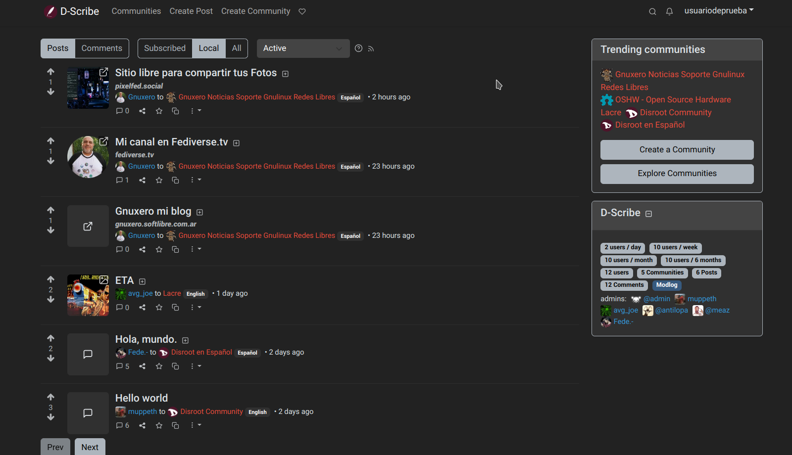
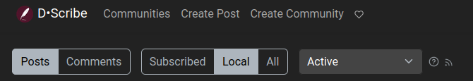
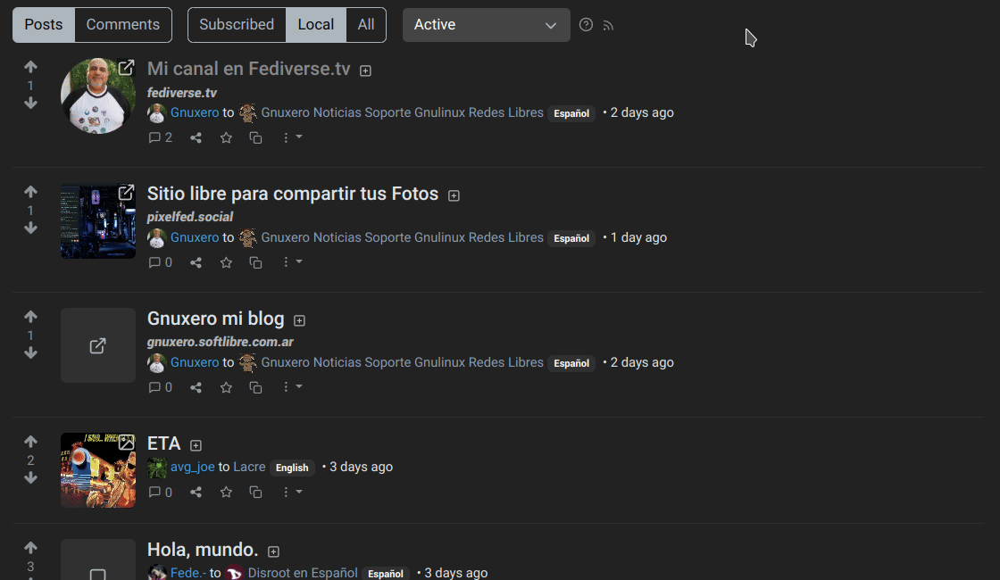
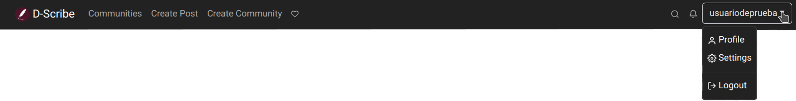
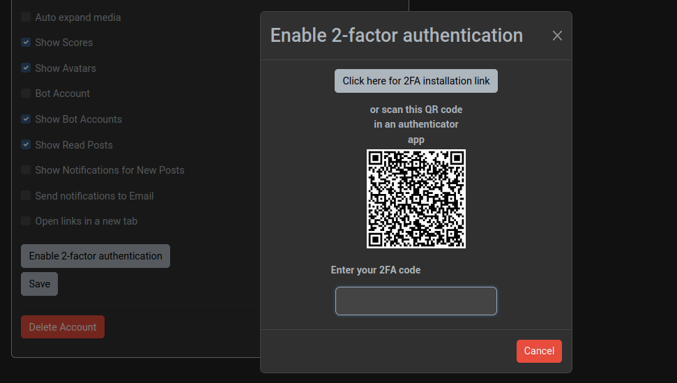
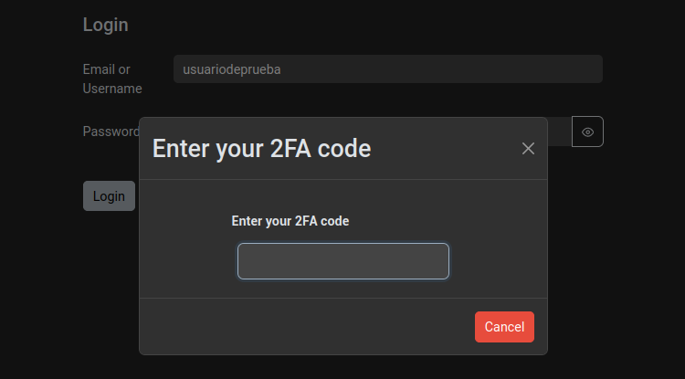
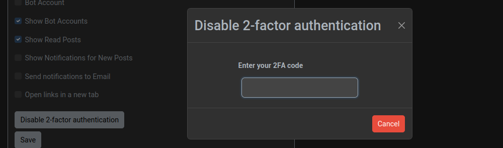
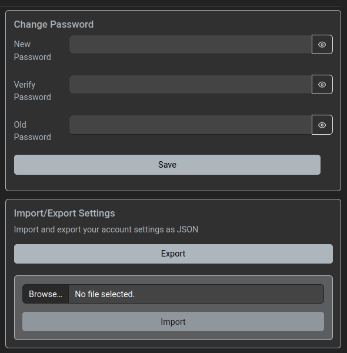

# D-Scribe : Mise en route

## Enregistrement
Comme nous l'avons déjà mentionné dans l'introduction, il existe de nombreuses instances **Lemmy** que nous pouvons choisir d'enregistrer. Et bien que nous allons nous concentrer sur celle de **Disroot**, appelée **D-Scribe**, ces prochains chapitres devraient servir de guide pour passer à n'importe quelle autre.

La première étape consiste donc à créer un compte **D-Scribe**.

Nous allons sur [https://scribe.disroot.org](https://scribe.disroot.org), cliquons sur **Sign up** en haut à droite de la page et remplissons les champs suivants :

- **Nom d'utilisateur** : ce nom ne peut être modifié et est unique au sein d'une instance. Plus tard, nous pourrons définir un nom d'affichage que nous pourrons modifier librement. Si le nom d'utilisateur que nous voulons utiliser est déjà pris, nous devons en choisir un autre ou envisager de passer à une autre instance où il est encore disponible.

- **Email** : notre adresse e-mail. Elle n'est utilisée que pour la réinitialisation du mot de passe et les notifications (si elles sont activées). Ceci est optionnel chez **D-Scribe**, mais il y a des cas où c'est obligatoire et nous devrons attendre un mail de confirmation et cliquer sur le lien après avoir rempli ce formulaire. Maintenant, si nous voulons recevoir la confirmation de l'activation de notre compte par l'équipe de **Disroot**, nous devons penser à entrer une adresse email. Nous pouvons la supprimer plus tard si nous le souhaitons.

- **Mot de passe** : notre mot de passe de connexion.

- **Vérifier le mot de passe** : nous devons répéter le même mot de passe que ci-dessus pour nous assurer qu'il a été entré correctement.

- **Réponse** : elle est utilisée pour empêcher les robots spammeurs, bien que cette mesure n'ait pas été mise en œuvre par toutes les instances.

- **Entrer le code** : il suffit d'entrer les lettres et les chiffres qui apparaissent dans la zone de texte, sans tenir compte des majuscules ou des minuscules. Si, pour une raison quelconque, nous ne sommes pas en mesure de le lire, nous pouvons rafraîchir le captcha ou utiliser le bouton " Lecture " pour obtenir une version audio.

- **Afficher le contenu NSFW** : cette option permet de choisir si le contenu "dangereux pour le travail" (ou réservé aux adultes) doit être affiché.

Enfin, nous cliquons sur le bouton **Inscription**. Une fois que les administrateurs de **Disroot** auront examiné et approuvé notre inscription, nous recevrons un e-mail de bienvenue et nous pourrons nous connecter avec le nom d'utilisateur et le mot de passe que nous avons enregistrés.

## Première connexion et configuration du profil
La première fois que nous nous connectons, nous verrons quelque chose comme ceci :

Nous pouvons voir qu'il y a deux groupes de boutons : les boutons Poster/Commenter et les boutons Abonnés/Locaux/Tous.

Grâce à eux, nous pouvons consulter et vérifier les commentaires et les messages des communautés locales, celles qui se fédèrent à notre instance et celles auxquelles nous sommes abonnés.

Configurons notre profil avant de commencer à poster ou à suivre des communautés.

Ouvrez le menu en haut à droite et sélectionnez "Paramètres".

Ici, nous pouvons ajouter des informations à notre profil public et définir certaines préférences.

- **Nom d'affichage** : nous pouvons définir un nom alternatif différent de notre nom d'utilisateur. Il peut être modifié à tout moment.

-**Bio** : nous pouvons également ajouter une description de nous-mêmes, formatée avec Markdown.

- **Email** : modifier notre email. Une fois la modification enregistrée, un email sera envoyé à la nouvelle adresse pour la vérifier.

- **Utilisateur Matrix** : ajouter notre nom d'utilisateur pour le chat de Matrix.

- **Avatar** : nous pouvons télécharger une image à utiliser comme image de profil qui s'affiche à côté de tous nos messages.

- **Bannière** : nous pouvons également télécharger une image pour l'utiliser comme image d'en-tête de notre page de profil.

- **Langue de l'interface** : pour définir la langue de l'interface utilisateur.

- **Langues** : nous pouvons sélectionner les langues que nous parlons pour ne voir que le contenu dans ces langues. Comme il s'agit d'une nouvelle fonctionnalité, il y a encore beaucoup d'articles qui ne précisent pas de langue, il faut donc s'assurer de sélectionner "Indéterminé" pour les voir.

- **Thème** : pour choisir entre différents thèmes de couleurs pour notre interface utilisateur.

- **Type** : ici nous pouvons choisir la ligne de temps que nous voulons voir par défaut sur la page d'accueil : seulement les messages des communautés auxquelles nous sommes abonnés, les messages des communautés locales, ou tous les messages, y compris ceux des communautés fédérées.

- **Type de tri** : définir comment les messages et les commentaires doivent être triés par défaut (nous verrons le système de vote et de classement plus tard).

- **Afficher le contenu NSFW** : pour choisir si nous voulons ou non voir le contenu qui n'est pas "sûr pour le travail" (ou réservé aux adultes).

- **Flouter le contenu NSFW** : vous pouvez choisir de flouter le contenu NSFW au lieu de ne pas l'afficher du tout.

- **Développer automatiquement les médias** : lorsque cette option est activée, le contenu des médias s'affiche automatiquement au lieu d'être réduit.

- **Afficher les scores** : permet de choisir si le nombre de "upvotes" et de "downvotes" doit être visible.

- **Afficher les avatars** : permet de choisir si les photos de profil des autres utilisateurs doivent être affichées.

- **Compte robot** : nous pouvons activer cette option si nous utilisons un script ou un programme pour créer des messages automatiquement.

- **Show Bot Accounts** : nous pouvons également activer/désactiver l'option permettant de masquer les messages créés par des comptes robots.

- **Afficher les messages lus** : en désactivant cette option, les messages déjà consultés ne seront plus affichés dans les listes.

- **Afficher les notifications pour les nouveaux messages** : pour activer/désactiver la réception d'une notification popup pour chaque nouveau message créé.

- **Envoyer des notifications par courriel** : pour activer/désactiver la réception de notifications concernant les réponses aux nouveaux commentaires et les messages privés à notre adresse de courriel.

- **Ouvrir les liens dans un nouvel onglet** : pour activer/désactiver l'ouverture des liens dans un nouvel onglet.

Dans l'onglet **Blocages**, nous trouverons les utilisateurs que nous avons bloqués. Nous en apprendrons plus à ce sujet dans les chapitres suivants.

### Activer/désactiver 2FA
Pour ceux qui veulent avoir un login plus sûr, **Lemmy** offre la possibilité d'activer l'authentification à deux facteurs (2FA), une mesure de sécurité en plus du mot de passe qui nécessite l'utilisation d'un logiciel pour générer des codes temporaires. Des exemples de ces programmes sont **Aegis Authenticator** et **FreeOTP+** pour les mobiles ou **KeePassXC** pour les ordinateurs de bureau.

Pour l'activer, il suffit de cliquer sur le bouton **Activer l'authentification à 2 facteurs**.

Maintenant, pour obtenir les codes temporaires liés à notre compte, nous devons configurer notre programme de génération de codes avec les informations fournies par **Lemmy**.

Nous avons deux options :
- copier les données de configuration pour le faire manuellement en cliquant sur le bouton **Cliquez ici pour le lien d'installation de 2FA**, ou
- scanner le code QR avec notre application pour le faire automatiquement.

Une fois la configuration effectuée, nous entrons le code temporaire dans le champ **Entrer le code 2FA** et nous appuyons sur la touche entrée.

Si le 2FA a été configuré correctement, nous verrons un message nous en informant.

A partir de maintenant, à chaque fois que nous nous connecterons, on nous demandera, en plus de notre mot de passe, le code temporaire, afin d'accéder à notre compte.

Enfin, nous cliquons sur le bouton **Save** pour enregistrer nos configurations.

N'oubliez pas que pour désactiver le 2FA, il vous sera également demandé d'entrer le code temporaire.

## Changer de mot de passe
Sur cette même page, nous pouvons modifier notre mot de passe et importer/exporter nos paramètres.

OK. Dans le prochain chapitre, nous verrons comment commencer à suivre les communautés, à poster, à commenter et à voter.