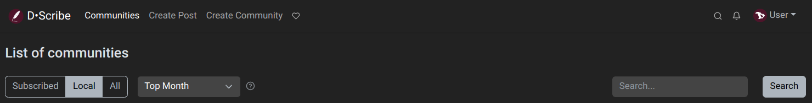
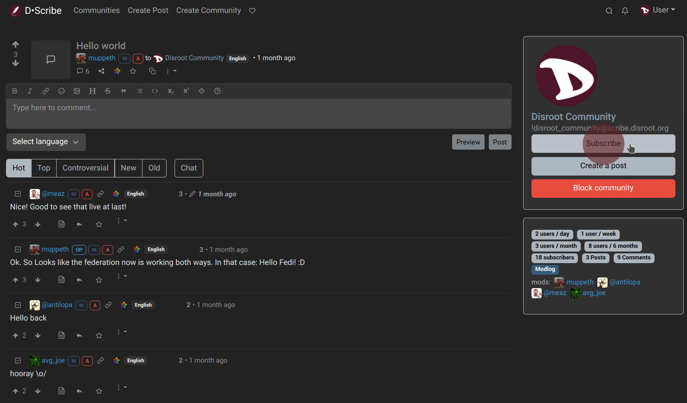
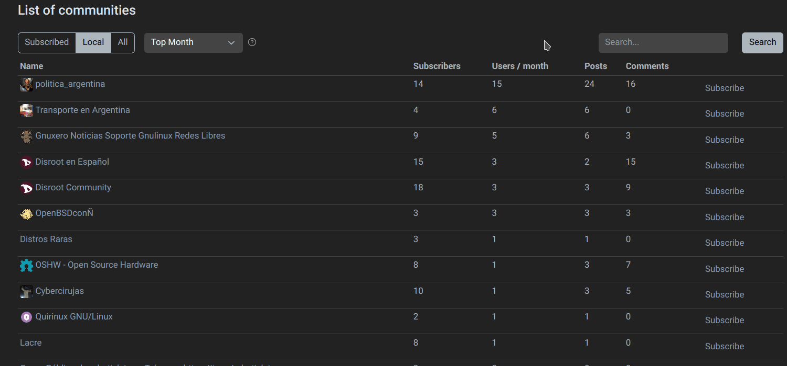
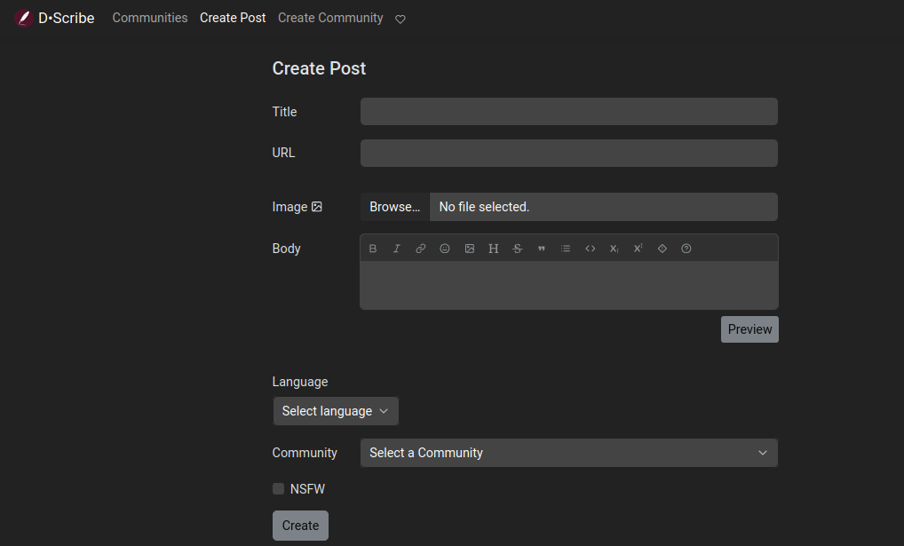
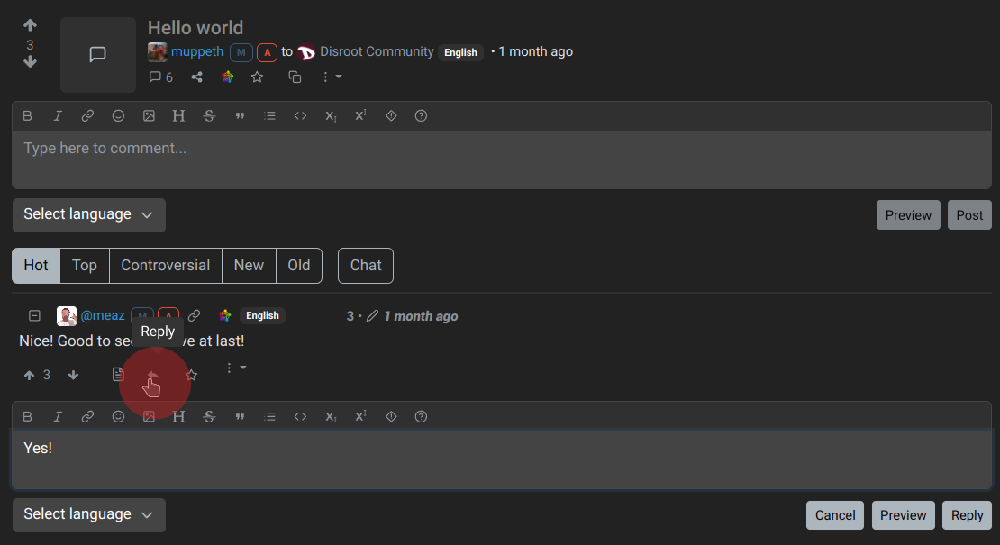

# Following communities, posting, commenting, voting

## Following communities
Our first step could be to find and follow communities that interest us.

By clicking on the "Communities" link at the top bar we will access a list of them which we can filter by *Subscribed*, *Local* or *All*.



*Local* are those which belong to the instance we are and *All* contains federated communities from other instances. We could also check the home page, browse the posts and see if there is any of them that looks interesting to us. Anyway, we can susbcribe to any community by clicking the "Subscribe" option at the right...


... or by clicking on the "Subscribe" button at the right of a post.



We can find more communities by browsing different Lemmy instances, using the [D·Scribe Instances list](https://scribe.disroot.org/instances) link at the bottom of the page or the [Lemmy Community Browser](https://browse.feddit.de/).

Once we have found a community we want to follow, we enter its **URL** (e.g. ```https://lemmy.ml/c/archlinux```) or the **identifier** (e.g. ```!archlinux@lemmy.ml```) into the search field of our own instance.


Lemmy will then fetch the community from its original instance, and allow us to interact with it. This same method will also works to fetch users, posts or comments from other instances.



All right, let's start interacting.

---

## Creating a post
To create a new post, we click on the "Create post" option in the top navigation bar.



- **Title**: this is mandatory and should describe what are we posting.
- **URL**: we can optionally share an external link.
- **Image**: we can also upload an image.
- **Body**: this is optional too. It allows us to write long texts and also to embed additional images here.
- **Language**: we can specify the language that the post is written in.
- **Community**: this Community dropdown menu allows us to choose a different community to post in.
- **NSFW**: to mark a "not safe for work" post as NSFW so other people can know.

And finally, click on "Create".

This is the same when we want to share images and videos.

First we click on the **Create post** option and then on the "Browse" button under the URL field to select a local image or video in .gif format.

We can also simply paste the URL of an image or video from another website.

Regarding multimedia content, we must keep in mind that they take up space and resources. So, what we can do is to upload it to other platforms that are more suitable for this purpose, like **PeerTube** or **Pixelfed**, and share the link on **D·Scribe**.

## Commenting
Besides creating a post we can comment on existing ones. This is as simple as going to a post and type our comment in the box directly below for a top-level reply.


We can also write a nested reply to an existing comment, by clicking the left-pointing arrow.



We can even write private messages to individual users. To do this, we just visit a user profile and click the "Send message" button.


We will be notified about new private messages and comment replies with the bell icon in the top right.


## Voting
Lemmy has a voting system to rank the posts. Those that receive more upvotes move up in the ranking (they are more visible) and those that receive downvotes move down (they are less visible). It is a collective way of showing the relevance or not of a post. Each post receives a score that is the result of substracting from the upvotes the downvotes. Of course, the reasons behind each vote are subjective and depends on the interest of each user.


When browsing the home page or a community page, we have the option to sort the post by type.


These are the types of post according to their score and ranking:

- **Hot**: Calculates a rank based on the score and time of the latest comment and when the post was published.
- **Active** (default): Calculates a rank based on the score and time of the latest comment, with decay over time.
- **Scaled**: Like hot, but gives a boost to less active communities.
- **Controversial**: Shows the posts and comments that have similar amounts of upvotes and downvotes.
- **New**: Shows most recent posts first.
- **Old**: Shows oldest posts first.
- **Most Comments**: Shows posts with highest number of comments first.
- **New Comments**: Bumps posts to the top when they are created or receive a new reply, similar to the sorting of traditional forums.
- **Top Hour**: Highest scoring posts during the last hour.
- **Top Six Hours**: Highest scoring posts during the last 6 hours.
- **Top 12 Hours**: Highest scoring posts during the last 12 hours.
- **Top Day**: Highest scoring posts during the last 24 hours.
- **Top Week**: Highest scoring posts during the last 7 days.
- **Top Month**: Highest scoring posts during the last 30 days.
- **Top Three Months**: Highest scoring posts during the last 90 days.
- **Top Six Months**: Highest scoring posts during the last 180 days.
- **Top nine Months**: Highest scoring posts during the last 270 days.
- **Top Year**: Highest scoring posts during the last 12 months.
- **Top All Time**: Highest scoring posts during all time.

Comments are organized by default in a hierarchy that shows at a glance who is being replied to. Top-level comments are those that reply directly to a post and appear on the left, with no indentation. Comments replying to top-level comments are indented one level and each additional indent level means the comment is further down in the conversation. With this layout it is always easy to see the context of a given comment by simply scrolling up to the next comment, which is indented one level down.

Comments can also be sorted in several ways. All of them keep the indentation intact, so only replies to the same parent are reordered.

- **Hot** (default): Equivalent to the Hot sort for posts.
- **Top**: Shows comments with highest score first.
- **Controversial**: Shows comments that have similar amounts of upvotes and downvotes.
- **New**: Shows most recent comments first.
- **Old**: Shows oldest comments first.

Additionally there is a sort option called **Chat** which eliminates the hierarchy and puts all comments on the top level, with newest comments shown at the top. It is useful to see new replies at any point in the conversation, but makes it difficult to see the context.

---

In the next and last chapter we will see how to create a community and our moderation tools.
