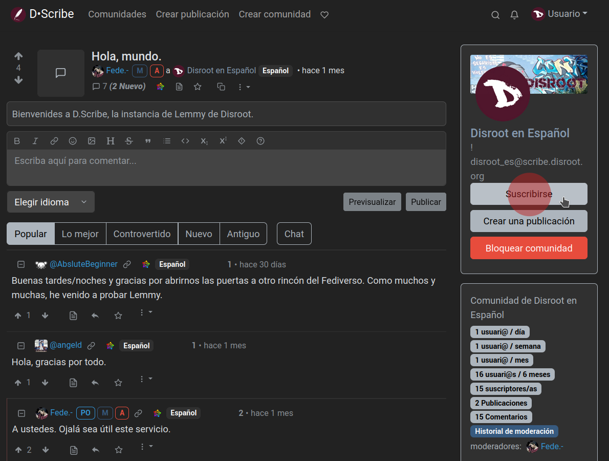

# Siguiendo comunidades, publicando, comentando, votando

## Siguiendo comunidades
Nuestro primer paso podría ser encontrar y seguir comunidades que nos interesen.

Haciendo clic en el enlace "Comunidades" en la barra superior accederemos a una lista de ellas que podemos filtrar por *Suscrito*, *Local* o *Todo*.


*Local* son aquellas que pertenecen a la instancia en la que estamos y *Todo* contiene las comunidades federadas de otras instancias. También podríamos revisar la página de inicio, navegar las publicaciones y ver si alguna de ellas nos parece interesante. De todos modos, podemos suscribirnos a cualquier comunidad haciendo clic en la opción "Suscribirse" que está a la derecha...


... o haciendo clic en el botón "Suscribirse" a la derecha de una publicación.



Podemos encontrar más comunidades navengando diferentes instancias de Lemmy, usando el enlace a la [lista de Instancias de D·Scribe](https://scribe.disroot.org/instances) que está en la parte inferior de la página o el [Navegador de Comunidades de Lemmy](https://browse.feddit.de/).

Una vez que encontremos una comunidad que queramos seguir, ingresamos su **URL** (p.ej. ```https://lemmy.ml/c/espanol```) o su **identificador** (p.ej. ```!espanol@lemmy.ml```) en el campo de búsqueda de nuestra instancia.


Lemmy buscará la comunidad desde su instancia original, y nos permitirá interactuar con ella. Este mismo método funcionará para buscar usuaries, publicaciones o comentarios desde otras instancias.


Muy bien, comencemos a interactuar.

---

## Crear una publicación
Para crear una nueva publicación, hacemos clic en la opción "Crear publicación" en la barra superior.


- **Título**: esto es obligatorio y debería describir qué estamos publicando.
- **URL**: podemos, opcionalmente, compartir un enlace externo.
- **Imagen**: también podemos subir una imágen.
- **Descripción**: esto también es opcional. Nos permite escribir textos más largos y también incrustar imágenes adicionales aquí.
- **Idioma**: podemos especificar el idioma en el que está escrita la publicación.
- **Comunidad**: este menú desplegable Comunidad, nos permite elegir una comunidad diferente para publicar.
- **Contenido explícito (NSFW)**: para marcar una publicación "explícita" o "para adultos" como "Contenido explícito" o "NSFW" así las demás personas pueden saberlo.

Y finalmente, clic en "Crear".

Esto es lo mismo cuando queremos compartir imágenes o videos.

Primero hacemos clic en la opción **Crear publicación** y luego en el botón "Examinar" bajo el campo URL para seleccionar una imagen local o un video en formato .gif.

También podemos simplemente pegar la dirección URL de una imagen o video desde otro sitio.

Con respecto al contenido multimedia, debemos tener presente que ocupa espacio y recursos. Así que, lo que podemos hacer es subirlo a otra plataforma más adecuada para este propósito, como **PeerTube** o **Pixelfed**, y compartir el enlace en **D·Scribe**.

## Comentar
Además de crear una publicación, podemos comentar en las que ya existen. Esto es tan simple como ir a una publicación y escribir nuestro comentario en el cuadro que está directamente debajo para dejar una respuesta de nivel superior.


También podemos escribir una respuesta anidada a un comentario existente haciendo clic en la flecha que apunta a la izquierda.


Incluso podemos escribir mensajes privados a una persona en particular. Para hacerlo, solo visitamos su perfil y hacemos clic en el botón "Enviar mensaje".


Seremos notificados sobre nuevos mensajes privados y respuestas a comentarios a través del ícono de la campana arriba a la derecha.


## Votar
Lemmy tiene un sistema de votación para clasificar las publicaciones. Aquellas que reciben más votos positivos suben en la clasificación (son más visibles) y las que reciben votos negativos descienden (son menos visibles). Es una forma colectiva de mostrar la relevancia o no de una publicación. Cada una recibe un puntaje que es el resultado de restar a los votos positivos los votos negativos. Por supuesto, las razones detrás de cada voto son subjetivas y dependen de los intereses de cada persona.


Cuando navegamos la página principal de una comunidad, tenemos la opción de ordenar las publicaciones por tipo.


Estos son los tipos de publicaciones de acuerdo a su puntaje y clasificación:

- **Popular**: Calcula una clasificación basada en el puntaje y el tiempo desde el último comentario y desde que la publicación se hizo.
- **Activo** (por defecto): Calcula una clasificación basada en el puntaje y el tiempo desde el último comentario, y desciende con el tiempo.
- **Proporcionado**: Como "Popular", pero da un impulso a las comunidades menos activas.
- **Controvertido**: Muestra las publicaciones y comentarios que tienen cantidades similares de votos positivos y negativos primero.
- **Nuevo**: Muestra las publicaciones más recientes primero.
- **Antiguo**: Muestra las publicaciones más antiguas primero.
- **Más comentados**: Muestra las publicaciones con mayor número de comentarios primero.
- **Nuevos Comentarios**: Sube las publicaciones a la parte superior cuando se crean o reciben una nueva respuesta, de forma similar a la clasificación de los foros tradicionales.
- **Lo mejor de esta hora**: Publicaciones mejor puntuadas en la última hora.
- **Lo mejor de las últimas 6 horas**: Publicaciones mejor puntuadas en las últimas 6 horas.
- **Lo mejor de las últimas 12 horas**: Publicaciones mejor puntuadas en la últimas 12 horas.
- **Lo mejor del día**: Publicaciones mejor puntuadas en las últimas 24 horas.
- **Lo mejor de la semana**: Publicaciones mejor puntuadas en los últimos 7 días.
- **Lo mejor del mes**: Publicaciones mejor puntuadas en los últimos 30 días.
- **Lo mejor de los últimos 3 meses**: Publicaciones mejor puntuadas en los últimos 90 días.
- **Lo mejor de los últimos 6 meses**: Publicaciones mejor puntuadas en los últimos 180 días.
- **Lo mejor de los últimos 9 meses**: Publicaciones mejor puntuadas en los últimos 270 días.
- **Lo mejor del año**: Publicaciones mejor puntuadas en los últimos 12 meses.
- **Lo mejor de los todos los tiempos**: Publicaciones mejor puntuadas durante todo el tiempo.

Los comentarios son organizados por defecto en una jerarquía que muestra de un vistazo a quién se está respondiendo. Los comentarios de nivel superior son aquellos que responden directamente a una publicación y aparecen a la izquierda, sin sangría. Los comentarios que responden a otros de nivel superior tienen una sangría de un nivel y cada nivel de sangría adicional significa que el comentario está más abajo en la conversación.

Los comentarios también pueden ordenarse de varias maneras. Todas ellas mantienen intacta la sangría, de modo que solo las respuestas al mismo comentario principal se reordenan.

- **Popular** (por defecto): Es el equivalente al "Popular" de las publicaciones.
- **Lo Mejor**: Muestra los comentarios con la puntuación más alta primero.
- **Controvertido**: Muestra los comentarios que tienen similares cantidades de votos positivos y negativos primero.
- **Nuevo**: Muestra los comentarios más recientes primero.
- **Antiguo**: Muestra los comentarios más antiguos primero.

Adicionalmente, hay una opción para ordenar llamada **Chat** que elimina la jerarquía y pone todos los comentarios en el nivel superior, con los comentarios más nuevos mostrándose en la parte de arriba. Es útil para ver las nuevas respuestas en cualquier momento de la conversación, pero dificulta ver el contexto.

---

En el siguiente y último capítulo veremos cómo crear una comunidad y nuestras herramientas de moderación.