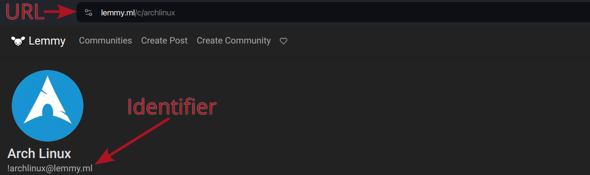
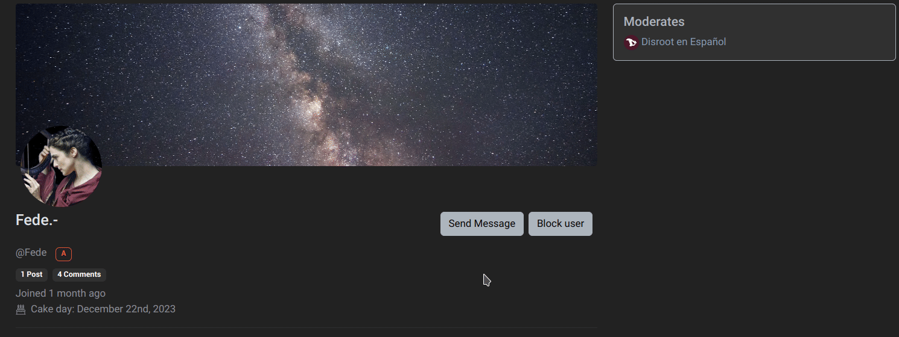

# Suivre des communautés, poster, commenter, voter

## Suivre des communautés
Notre première étape pourrait être de trouver et de suivre les communautés qui nous intéressent.

En cliquant sur le lien "Communautés" dans la barre supérieure, nous accédons à une liste de communautés que nous pouvons filtrer par *Souscrites*, *Locales* ou *Toutes*.

Les communautés *Locales* sont celles qui appartiennent à l'instance dans laquelle nous nous trouvons et *Toutes* contient les communautés fédérées d'autres instances. Nous pouvons également consulter la page d'accueil, parcourir les messages et voir si l'un d'entre eux nous semble intéressant. Quoi qu'il en soit, nous pouvons nous abonner à n'importe quelle communauté en cliquant sur l'option "S'abonner" à droite...

... ou en cliquant sur le bouton "S'abonner" à droite d'un article.

Nous pouvons trouver d'autres communautés en parcourant différentes instances de Lemmy, en utilisant le lien [D-Scribe liste des instances](https://scribe.disroot.org/instances) au bas de la page ou le [Navigateur de Communautés Lemmy](https://browse.feddit.de/).

Une fois que nous avons trouvé une communauté que nous voulons suivre, nous entrons son **URL** (par exemple ``https://lemmy.ml/c/archlinux``) ou son **identifiant** (par exemple `` ! archlinux@lemmy.ml``) dans le champ de recherche de notre propre instance.

Lemmy récupère alors la communauté dans son instance d'origine et nous permet d'interagir avec elle. Cette même méthode fonctionnera également pour récupérer des utilisateurs, des messages ou des commentaires dans d'autres instances.

Très bien, commençons à interagir.

---

## Créer un message
Pour créer un nouveau message, nous cliquons sur l'option "Créer un message" dans la barre de navigation supérieure.

- **Titre** : il est obligatoire et doit décrire ce que nous postons.
- **URL** : nous pouvons éventuellement partager un lien externe.
- **Image** : nous pouvons également télécharger une image.
- **Corps** : il est également facultatif. Il permet d'écrire de longs textes et d'intégrer des images supplémentaires.
- **Langue** : nous pouvons spécifier la langue dans laquelle le message est rédigé.
- **Communauté** : ce menu déroulant nous permet de choisir une communauté différente pour publier le message.
- **NSFW** : pour marquer un message "dangereux pour le travail" comme NSFW afin que d'autres personnes puissent le savoir.

Enfin, cliquez sur "Créer".

Il en va de même pour le partage d'images et de vidéos.

Nous cliquons d'abord sur l'option **Créer un message**, puis sur le bouton "Parcourir" sous le champ URL pour sélectionner une image ou une vidéo locale au format .gif.

Il est également possible de coller simplement l'URL d'une image ou d'une vidéo provenant d'un autre site web.

En ce qui concerne les contenus multimédias, nous devons garder à l'esprit qu'ils prennent de l'espace et des ressources. Nous pouvons donc les télécharger sur d'autres plateformes plus adaptées, comme **PeerTube** ou **Pixelfed**, et partager le lien sur **D-Scribe**.

## Commenter
Outre la création d'un article, il est possible de commenter les articles existants. Pour cela, il suffit de se rendre sur un billet et de taper son commentaire dans la case située juste en dessous pour obtenir une réponse de haut niveau.

Nous pouvons également écrire une réponse imbriquée à un commentaire existant, en cliquant sur la flèche pointant vers la gauche.

Nous pouvons même écrire des messages privés à des utilisateurs individuels. Pour ce faire, il suffit de visiter le profil d'un utilisateur et de cliquer sur le bouton "Envoyer un message".

Nous serons avertis des nouveaux messages privés et des réponses aux commentaires par l'icône de la cloche en haut à droite.

## Vote
Lemmy a mis en place un système de vote pour classer les messages. Ceux qui reçoivent le plus d'upvotes montent dans le classement (ils sont plus visibles) et ceux qui reçoivent des downvotes descendent (ils sont moins visibles). C'est une façon collective de montrer la pertinence ou non d'un message. Chaque message reçoit un score qui est le résultat de la soustraction des upvotes aux downvotes. Bien entendu, les raisons de chaque vote sont subjectives et dépendent de l'intérêt de chaque utilisateur.

Lorsque vous naviguez sur la page d'accueil ou sur la page d'une communauté, vous avez la possibilité de trier les messages par type.

Voici les types de postes en fonction de leur score et de leur classement :

- **Hot** : Calcule un classement basé sur le score et l'heure du dernier commentaire et sur la date de publication de l'article.
- **Actif** (par défaut) : Calcule un classement basé sur le score et l'heure du dernier commentaire, avec une décroissance au fil du temps.
- **Mise à l'échelle** : Comme chaud, mais donne un coup de pouce aux communautés moins actives.
- **Controversé** : Affiche les messages et les commentaires qui ont un nombre similaire d'upvotes et de downvotes.
- **Nouveau** : Affiche les messages les plus récents en premier.
- **Ancien** : Affiche les messages les plus anciens en premier.
- **Le plus de commentaires** : Affiche en premier les articles ayant le plus grand nombre de commentaires.
- **Nouveaux commentaires** : Affiche les messages en premier lorsqu'ils sont créés ou qu'ils reçoivent une nouvelle réponse, comme dans les forums traditionnels.
- **Top Hour** : Les messages ayant obtenu le meilleur score au cours de la dernière heure.
- **Top six heures** : Les messages ayant obtenu le meilleur score au cours des 6 dernières heures.
- **Top 12 Hours** : Les messages ayant obtenu le meilleur score au cours des 12 dernières heures.
- **Meilleur jour** : Postes ayant obtenu le meilleur score au cours des dernières 24 heures.
- **Top Semaine** : Messages ayant obtenu le meilleur score au cours des 7 derniers jours.
- **Meilleur mois** : Postes ayant obtenu le meilleur score au cours des 30 derniers jours.
- **Top trois mois** : Postes ayant obtenu le meilleur score au cours des 90 derniers jours.
- **Les six meilleurs mois** : Postes ayant obtenu le meilleur score au cours des 180 derniers jours.
- **Les neuf meilleurs mois** : Postes ayant obtenu le meilleur score au cours des 270 derniers jours.
- **Meilleure année** : Postes ayant obtenu le meilleur score au cours des 12 derniers mois.
- **Top de tous les temps** : Postes ayant obtenu le meilleur score au cours de toutes les années.

Les commentaires sont organisés par défaut selon une hiérarchie qui permet de voir d'un coup d'œil à qui l'on répond. Les commentaires de premier niveau sont ceux qui répondent directement à un message et apparaissent à gauche, sans indentation. Les commentaires qui répondent aux commentaires de premier niveau sont indentés d'un niveau et chaque niveau d'indentation supplémentaire signifie que le commentaire est plus bas dans la conversation. Avec cette disposition, il est toujours facile de voir le contexte d'un commentaire donné en défilant simplement vers le haut jusqu'au commentaire suivant, qui est indenté un niveau plus bas.

Les commentaires peuvent également être triés de plusieurs manières. Toutes conservent l'indentation intacte, de sorte que seules les réponses au même parent sont réorganisées.

- **Hot** (par défaut) : Équivalent au tri à chaud pour les messages.
- **Top** : Affiche en premier les commentaires ayant le score le plus élevé.
- **Controversé** : Affiche les commentaires qui ont un nombre similaire d'upvotes et de downvotes.
- **Nouveau** : Affiche les commentaires les plus récents en premier.
- **Ancien** : Affiche les commentaires les plus anciens en premier.

En outre, il existe une option de tri appelée **Chat** qui élimine la hiérarchie et place tous les commentaires au niveau supérieur, les commentaires les plus récents étant affichés en haut de la page. Il est utile de voir les nouvelles réponses à n'importe quel moment de la conversation, mais il est difficile de voir le contexte.

---

Dans le prochain et dernier chapitre, nous verrons comment créer une communauté et nos outils de modération.
