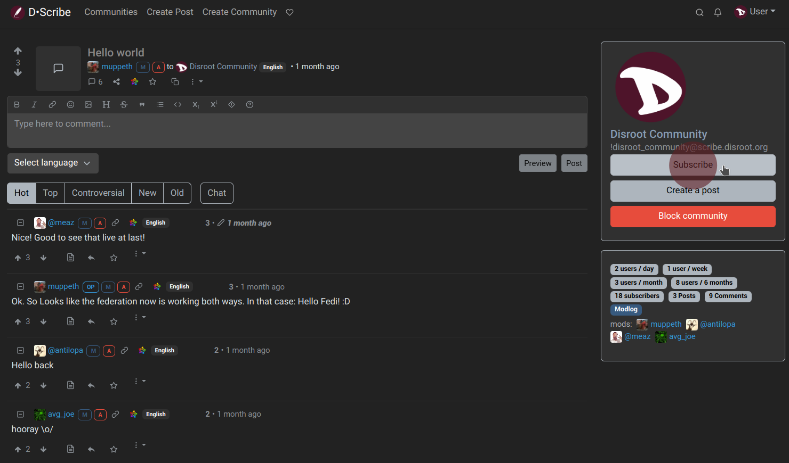
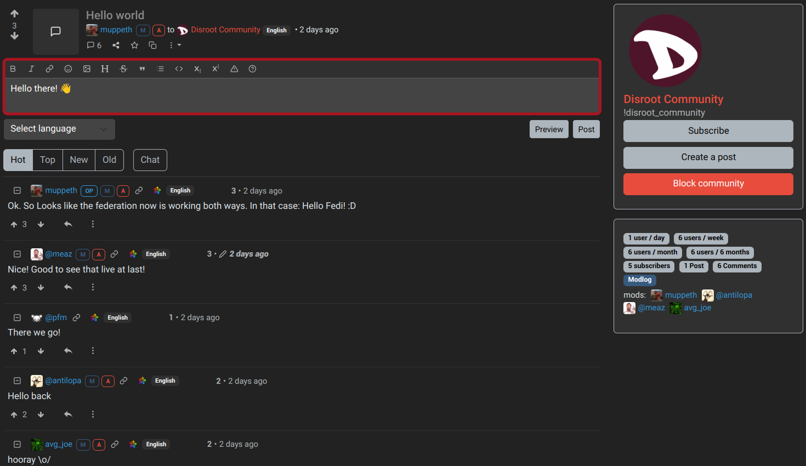

# Seguire le comunità, postare, commentare, votare

## Seguire le comunità
Il primo passo potrebbe essere quello di trovare e seguire le comunità che ci interessano.

Facendo clic sul link "Comunità" nella barra superiore, si accede a un elenco di comunità che può essere filtrato da *Sottoscritti*, *Locale* o *Tutti*.


*Local* sono quelle che appartengono all'istanza in cui ci troviamo e *All* contiene le comunità federate di altre istanze. Possiamo anche controllare la home page, sfogliare i post e vedere se ce n'è qualcuno che ci sembra interessante. In ogni caso, possiamo iscriverci a qualsiasi comunità facendo clic sull'opzione "Iscriviti" a destra...


... o cliccando sul pulsante "Iscriviti" a destra di un post.



È possibile trovare altre comunità navigando tra le diverse istanze di Lemmy, utilizzando il link [D-Scribe Instances list](https://scribe.disroot.org/instances) in fondo alla pagina o il [Lemmy Community Browser](https://browse.feddit.de/).

Una volta trovata la comunità che si vuole seguire, si inserisce il suo **URL** (ad esempio ```https://lemmy.ml/c/archlinux``) o l'**identificatore** (ad esempio ```!archlinux@lemmy.ml``) nel campo di ricerca della propria istanza.


Lemmy recupererà quindi la comunità dalla sua istanza originale e ci permetterà di interagire con essa. Questo stesso metodo funziona anche per recuperare utenti, post o commenti da altre istanze.


Bene, iniziamo a interagire.
---

## Creare un post
Per creare un nuovo post, facciamo clic sull'opzione "Crea post" nella barra di navigazione superiore.


- **Titolo**: è obbligatorio e deve descrivere ciò che stiamo pubblicando.
- **URL**: possiamo facoltativamente condividere un link esterno.
- **Image**: possiamo anche caricare un'immagine.
- **Corpo**: anche questo è facoltativo. Ci permette di scrivere testi lunghi e di incorporare immagini aggiuntive.
- **Lingua**: possiamo specificare la lingua in cui è scritto il post.
- **Community**: il menu a tendina Community ci permette di scegliere una comunità diversa in cui postare.
- **NSFW**: per contrassegnare un post "non sicuro per il lavoro"  in modo che gli altri lo sappiano.

Infine, fare clic su "Crea".

Lo stesso vale per la condivisione di immagini e video.

Per prima cosa facciamo clic sull'opzione **Crea post** e poi sul pulsante "Sfoglia" sotto il campo URL per selezionare un'immagine o un video locale in formato .gif.

Possiamo anche incollare semplicemente l'URL di un'immagine o di un video da un altro sito web.

Per quanto riguarda i contenuti multimediali, dobbiamo tenere presente che occupano spazio e risorse. Quindi, possiamo caricarli su altre piattaforme più adatte a questo scopo, come **PeerTube** o **Pixelfed**, e condividere il link su **D-Scribe**.

## Commentare
Oltre a creare un post, possiamo commentare quelli esistenti. Per farlo è sufficiente andare su un post e digitare il nostro commento nella casella sottostante per ottenere una risposta di livello superiore.



Possiamo anche scrivere una risposta annidata a un commento esistente, cliccando sulla freccia rivolta a sinistra.


Possiamo anche scrivere messaggi privati a singoli utenti. Per farlo, basta visitare il profilo di un utente e fare clic sul pulsante "Invia messaggio".


I nuovi messaggi privati e le risposte ai commenti ci verranno notificati con l'icona della campanella in alto a destra.


## Voto
Lemmy ha un sistema di votazione per classificare i post. Quelli che ricevono più upvotes salgono nella classifica (sono più visibili) e quelli che ricevono downvotes scendono (sono meno visibili). È un modo collettivo per mostrare la rilevanza o meno di un post. Ogni post riceve un punteggio che è il risultato della sottrazione degli upvotes dai downvotes. Naturalmente, le ragioni di ogni voto sono soggettive e dipendono dall'interesse di ciascun utente.


Quando si naviga nella home page o in una pagina della comunità, si ha la possibilità di ordinare i post per tipo.


Questi sono i tipi di post in base al loro punteggio e alla loro classifica:

- **Caldo**: Calcola una classifica in base al punteggio e all'ora dell'ultimo commento e a quando il post è stato pubblicato.
- **Attivo** (predefinito): Calcola una classifica in base al punteggio e all'ora dell'ultimo commento, con decadimento nel tempo.
- **Scalato**: Come hot, ma dà una spinta alle comunità meno attive.
- **Controverso**: Mostra i post e i commenti che hanno una quantità simile di upvotes e downvotes.
- **Nuovo**: Mostra prima i messaggi più recenti.
- **Vecchio**: Mostra prima i post più vecchi.
- **Maggiori commenti**: Mostra prima i post con il maggior numero di commenti.
- **Nuovi commenti**: Mette in cima i messaggi quando vengono creati o ricevono una nuova risposta, in modo simile all'ordinamento dei forum tradizionali.
- **Top Hour**: Messaggi con il punteggio più alto nell'ultima ora.
- **Top Six Hours**: Messaggi con il punteggio più alto nelle ultime 6 ore.
- **Top 12 Hours**: Messaggi con il punteggio più alto nelle ultime 12 ore.
- **Top Day**: I post con il punteggio più alto nelle ultime 24 ore.
- **Top Week**: I post con il punteggio più alto negli ultimi 7 giorni.
- **Mese**: I post con il punteggio più alto negli ultimi 30 giorni.
- **Top Three Months**: Post con il punteggio più alto negli ultimi 90 giorni.
- **Top Six Months**: Post con il punteggio più alto negli ultimi 180 giorni.
- **Top nine Months**: Post con il punteggio più alto negli ultimi 270 giorni.
- **Anno top**: I post con il punteggio più alto negli ultimi 12 mesi.
- **Top All Time**: I post con il punteggio più alto in assoluto.

I commenti sono organizzati di default in una gerarchia che mostra a colpo d'occhio chi sta rispondendo. I commenti di primo livello sono quelli che rispondono direttamente a un post e appaiono a sinistra, senza rientri. I commenti che rispondono ai commenti di primo livello sono rientrati di un livello e ogni ulteriore livello di rientro significa che il commento si trova più in basso nella conversazione. Con questa disposizione è sempre facile vedere il contesto di un determinato commento, semplicemente scorrendo verso l'alto fino al commento successivo, che è rientrato di un livello.

I commenti possono essere ordinati in diversi modi. Tutti mantengono l'indentazione intatta, quindi solo le risposte allo stesso genitore vengono riordinate.

- **Caldo** (predefinito): Equivale all'ordinamento Hot per i post.
- **Top**: Mostra prima i commenti con il punteggio più alto.
- **Controverso**: Mostra i commenti che hanno una quantità simile di voti alti e bassi.
- **Nuovo**: Mostra prima i commenti più recenti.
- **Vecchio**: Mostra prima i commenti più vecchi.

Inoltre, esiste un'opzione di ordinamento chiamata **Chat** che elimina la gerarchia e mette tutti i commenti al livello superiore, con i commenti più recenti mostrati in alto. È utile per vedere le nuove risposte in qualsiasi momento della conversazione, ma rende difficile vedere il contesto.

---

Nel prossimo e ultimo capitolo vedremo come creare una comunità e i nostri strumenti di moderazione.
