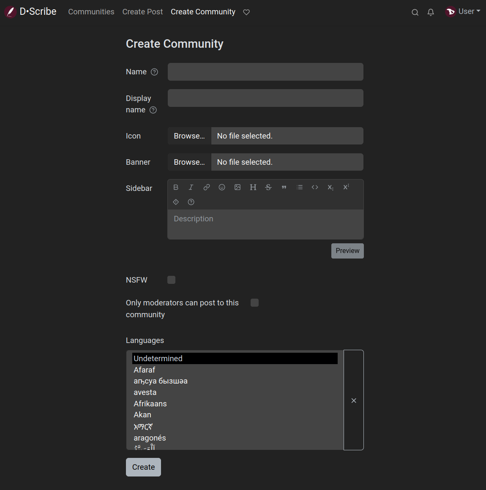
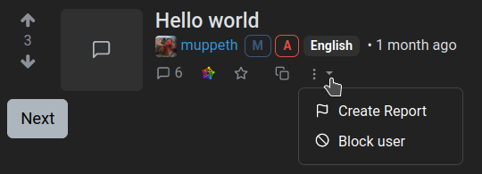
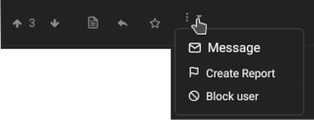
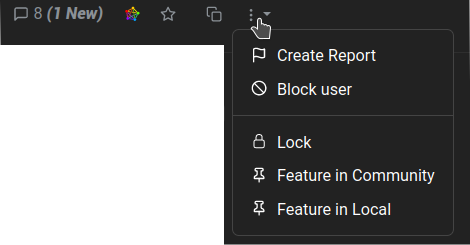
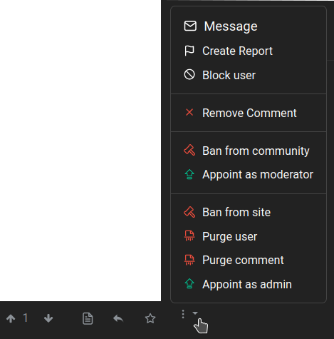

# Communities
In addition to creating and commenting posts, we can create our own community. The procedure is very simple:

1. Click on "Create Community" in the top bar.
2. Fill in the corresponding fields:
   - **Name**: this is the name that will be used as identifier of the community. It must be in lowercase, without periods or spaces and underscores may be used. It cannot be changed.
   - **Display name**: this will be the title of the community page and it can be changed.
   - **Icon**: we can upload an image to use as the community picture.
   - **Banner**: we can also upload an image to set it as header image for our community page.
   - **Sidebar**: here we can (and should) describe the topic of our community and explain its rules.
   - **NSFW**: check if the community supports explicit or adult content.
   - **Only moderators can post to this community**: if we enable this option, only we and the people we invite will be able to create posts but everyone else can comment. This is very useful if we want to use Lemmy as a blog. And it also can be followed from other Fediverse platforms and over RSS, like any other Lemmy community.
   - **Languages**: to set or not a specific language for our community.
3. Click on the **Create** button.

# Moderation
Sooner or later we will have to deal with malicious bots, trolls and other despicable characters that swarm the internet. Lemmy provides a set of tools for this, some of them can be used by the communities moderators while others can be used only by the administrators of the instance.

Maintaining the health of the instance is a collective task involving users, moderators and administrators.

- As **users** we can use the **Create Report** function when we notice rules breaking or suspicious posts. It can be found in the three-dots menu below a post...

  

  ... or a comment...

  

  ... and clicking on it will notify moderators and administrators so they can take actions.

  If it happens that we find a post that we think is offensive or dislike us, but does not violate any of the rules of the instance or community, we can block its author, so that their posts will be hidden from us.

- As **moderators** we are responsible for our communities and we can ban a user from them but not from the instance, only **administrators (or admins)** can do that. Indeed, they are responsible for the entire instance.

To be a **moderator** we either need to create a new community or be assigned by another moderator. Similarly to become an **administrator**, we need to create a new instance, or be appointed by an existing instance admin.

Admins and moderators are organized in a hierarchy, where the user who is listed first has privileges to remove admins or mods who are listed later.

We will find all available moderation actions by clicking the three-dot icon. All of them can be reverted in the same way.

- **Lock**: this option prevents making new comments on a post.
- **Feature in Community**: to pin a post to the top of the community listing.
- **Feature in Local (admins only)**: to pin a post to the top of the home page.

- **Remove Comment**: to delete a comment.
- **Ban from community**: to ban a user from interacting with the community. The banned user still can interact with the rest of the instance. There is also an option to remove all existing posts.
- **Appoint as moderator**: to give a user moderator privileges and responsabilities.
- **Ban from site (admins only)**: to completely ban an account, so it cannot login or interact at all with the instance. There is also an option to remove all existing posts.
- **Purge user (admins only)**: to completely delete a user, including all posts and uploaded media. This option must be used with caution.
- **Purge comment**: to completely delete a post/comment, including attached media.
- **Appoint as admin (admins only)**: to give a user administrator privileges and responsabilities.

---

\O/ That's it.