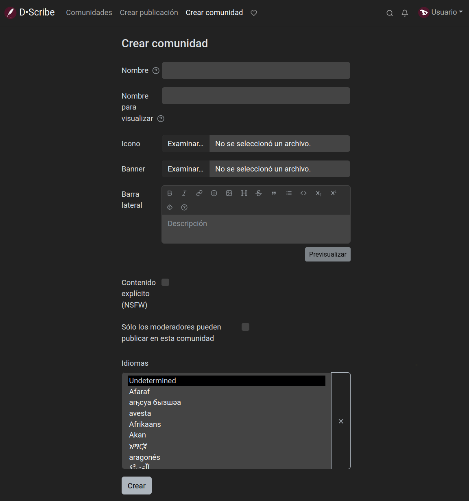
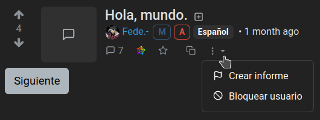
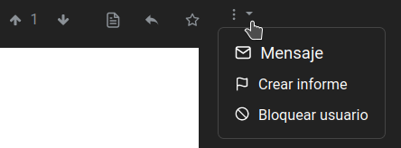
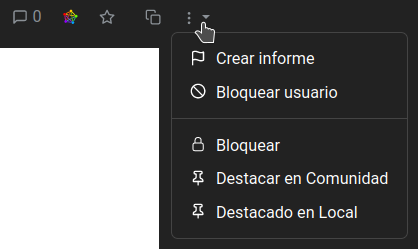
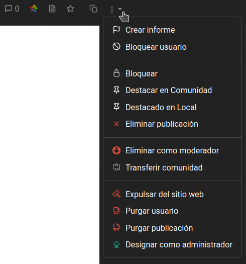

# Comunidades
Además de crear y comentar publicaciones, podemos crear nuestra propia comunidad. El procedimiento es muy simple:

1. Hacemos clic en "Crear comunidad" en la barra superior.
2. Completamos los campos correspondientes:
   - **Nombre**: este el nombre que se utilizará como identificador de la comunidad. Debe ser en minúsculas, sin puntos ni espacios y se pueden usar guiones bajos. No se puede modificar.
   - **Nombre para visualizar**: este será el título de la página de la comunidad y puede modificarse.
   - **Icono**: podemos subir una imagen para usar como logo de la comunidad.
   - **Banner**: también podemos subir una imagen para establecerla como imagen de cabecera para nuestra página de la comunidad.
   - **Barra lateral**: aquí podemos (y deberíamos) describir la temática de nuestra comunidad y explicar sus reglas.
   - **Contenido explícito (NSFW)**: marcar si la comunidad admite contenido explícito o para adultos.
   - **Solo los moderadores pueden publicar en esta comunidad**: si habilitamos esta opción, solo nosotres y las personas que invitemos podremos crear publicaciones pero todas las demás podrán comentar. Esto es muy útil si queremos utilizar Lemmy como un blog. Y puede ser seguido desde otras plataformas del Fediverso y a través del RSS, como cualquier comunidad de Lemmy.
   - **Idiomas**: para establecer o no un idioma específico para nuestra comunidad.
3. Hacer clic en el botón **Crear**.

# Moderación
Más tarde o más temprano tendremos que lidiar bots malintencionados, trolls y otros personajes despreciables que pululan por la internet. Para esto, Lemmy provee un conjunto de herramientas, algunas de ellas pueden ser utilizadas por moderadores de las comunidades mientras que otras solo por administradores de la instancia.

Mantener la instancia saludable es una tarea colectiva que involucra a usuaries, moderadores y administradores.

- Como **usuaries** podemos usar la función **Crear reporte** cuando notemos publicaciones que infrinjan las reglas o sean sospechosas. Se puede encontrar en el menú de tres puntos debajo de una publicación...

  

  ... o un comentario...

  

  ... y haciendo clic en ella notificará a moderadores y administradores para que puedan tomar acciones.

  Si sucede que encontramos una publicación que nos parece ofensiva o nos disgusta, pero que no viola ninguna de las reglas de la instancia o comunidad, podemos bloquear a sus autores para que lo que publiquen no se nos muestre.

- Como **moderadores** somos responsables por nuestras comunidades y podemos excluir a usuaries de ellas pero no de la instancia, solo **administradores (o admins)** pueden hacerlo. De hecho, son las personas responsables de toda la instancia.

Para ser **moderadores** necesitamos o bien crear una nueva comunidad o ser designades por otres moderadores. Y de manera parecida, para ser **administradores**, necesitamos crear una instancia, o ser designades por otra persona que administre.

Admins y moderadores están organizades en una jerarquía donde la persona usuaria que está listada primero tiene privilegios para quitar admins o moderadores que están más abajo en la lista.

Todas las acciones disponibles de moderación están en el menú de tres puntos de publicaciones o comentarios. Y pueden ser revertidas de la misma manera.

- **Bloquear**: esta opción previene que se hagan nuevos comentarios en una publicación.
- **Destacar en Comunidad**: para fijar una publicación en la parte superior de la lista de la comunidad.
- **Destacado en Local (solo admins)**: para fijar una publicación en la parte superior de la página de inicio.

- **Eliminar publicación**: para borrar un comentario.
- **Expulsar de la Comunidad**: para expulsar a alguien de las interacciones de la comunidad. La persona expulsada todavía puede interactuar con el resto de la instancia. Hay también una opción para quitar todas las publicaciones existentes.
- **Designar como moderador**: para otorgar a una persona privilegios y responsabilidades de moderación.
- **Transferir comunidad (solo admins)** : para transferir la gestión de una comunidad a otra persona.
- **Expulsar del sitio web (solo admins)**: para bloquear completamente una cuenta, de modo que no pueda iniciar sesión ni interactuar en absoluto con la instancia. También hay una opción para eliminar todas las publicaciones existentes.
- **Purgar usuario (solo admins)**: para eliminar completamente una cuenta, incluyendo todos los mensajes y medios subidos. Esta opción debe utilizarse con precaución.
- **Purgar publicación (solo admins)**: para eliminar completamente una publicación/comentario, incluyendo los medios subidos.
- **Designar como administrador (solo admins)**: para otorgar a una persona privilegios y responsabilidades de administración.

---

\O/ Eso es todo.