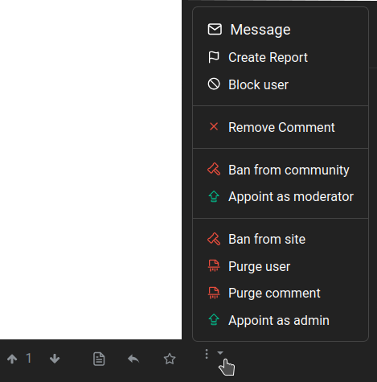

# Communautés
En plus de créer et de commenter des posts, nous pouvons créer notre propre communauté. La procédure est très simple :

1. Cliquez sur "Créer une communauté" dans la barre supérieure.
2. Remplissez les champs correspondants :
   - **Nom** : il s'agit du nom qui sera utilisé comme identifiant de la communauté. Il doit être en minuscules, sans point ni espace et des traits de soulignement peuvent être utilisés. Il ne peut pas être modifié.
   - **Nom d'affichage** : il s'agit du titre de la page de la communauté et il peut être modifié.
   - **Icône** : vous pouvez télécharger une image à utiliser comme image de la communauté.
   - **Bannière** : nous pouvons également télécharger une image pour en faire l'image d'en-tête de notre page communautaire.
   - **Barre latérale** : ici, nous pouvons (et devons) décrire le sujet de notre communauté et expliquer ses règles.
   - **NSFW** : vérifiez si la communauté supporte des contenus explicites ou pour adultes.
   - **Seuls les modérateurs peuvent publier dans cette communauté** : si nous activons cette option, seuls nous et les personnes que nous avons invitées pourront créer des messages, mais tous les autres pourront les commenter. Ceci est très utile si nous voulons utiliser Lemmy comme un blog. Il peut également être suivi depuis d'autres plateformes Fediverse et via RSS, comme n'importe quelle autre communauté Lemmy.
   - **Langues** : pour définir ou non une langue spécifique pour notre communauté.
3. Cliquez sur le bouton **Créer**.

# Modération
Tôt ou tard, nous devrons faire face à des bots malveillants, des trolls et d'autres personnages méprisables qui pullulent sur Internet. Lemmy fournit un ensemble d'outils pour cela, certains d'entre eux peuvent être utilisés par les modérateurs de la communauté tandis que d'autres ne peuvent être utilisés que par les administrateurs de l'instance.

Le maintien de la santé de l'instance est une tâche collective impliquant les utilisateurs, les modérateurs et les administrateurs.

- En tant qu'**utilisateurs**, nous pouvons utiliser la fonction **Créer un rapport** lorsque nous remarquons des infractions aux règles ou des messages suspects. Elle se trouve dans le menu à trois points situé sous un message...

  

  ... ou un commentaire...

  

  ... et en cliquant dessus, les modérateurs et les administrateurs seront avertis et pourront prendre des mesures.

  Si nous trouvons un message que nous jugeons offensant ou qui nous déplaît, mais qui ne viole aucune des règles de l'instance ou de la communauté, nous pouvons bloquer son auteur, de sorte que ses messages nous soient cachés.

- En tant que **modérateurs**, nous sommes responsables de nos communautés et nous pouvons bannir un utilisateur de celles-ci mais pas de l'instance, seuls les **administrateurs (ou admins)** peuvent le faire. En effet, ils sont responsables de toute l'instance.

Pour devenir **modérateur**, il faut soit créer une nouvelle communauté, soit être désigné par un autre modérateur. De même, pour devenir **administrateur**, nous devons créer une nouvelle instance ou être désignés par un administrateur d'instance existant.

Les administrateurs et les modérateurs sont organisés dans une hiérarchie, où l'utilisateur qui est listé en premier a le privilège de supprimer les administrateurs ou les modérateurs qui sont listés plus tard.

Vous trouverez toutes les actions de modération disponibles en cliquant sur l'icône à trois points. Toutes ces actions peuvent être annulées de la même manière.

- **Verrouiller** : cette option empêche de faire de nouveaux commentaires sur un article.
- **Fonctionnalité dans la communauté** : pour placer un message en haut de la liste de la communauté.
- **Fonctionnalité dans Local (administrateurs uniquement)** : pour afficher un message en haut de la page d'accueil.

- **Supprimer le commentaire** : pour supprimer un commentaire.
- **Bannir de la communauté** : pour interdire à un utilisateur d'interagir avec la communauté. L'utilisateur banni peut toujours interagir avec le reste de l'instance. Il existe également une option permettant de supprimer tous les messages existants.
- **Nommer comme modérateur** : pour donner à un utilisateur des privilèges et des responsabilités de modérateur.
- **Banquer du site (administrateurs uniquement)** : pour bannir complètement un compte, de sorte qu'il ne puisse pas se connecter ou interagir avec l'instance. Il existe également une option pour supprimer tous les messages existants.
- **Purger l'utilisateur (administrateurs uniquement)** : pour supprimer complètement un utilisateur, y compris tous les messages et les médias téléchargés. Cette option doit être utilisée avec précaution.
- **Purger les commentaires** : pour supprimer complètement un message/commentaire, y compris les fichiers multimédias qui y sont attachés.
- **Nommer en tant qu'administrateur (administrateurs uniquement)** : pour donner à un utilisateur des privilèges et des responsabilités d'administrateur.

---

\O/ C'est tout.