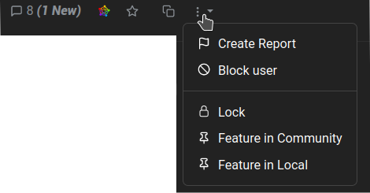

# Comunità
Oltre a creare e commentare i post, possiamo creare la nostra comunità. La procedura è molto semplice:

1. Cliccare su "Crea comunità" nella barra superiore.
2. Compilate i campi corrispondenti:
   - **Nome**: è il nome che verrà utilizzato come identificativo della comunità. Deve essere in minuscolo, senza punti o spazi e si possono usare i trattini bassi. Non può essere modificato.
   - **Nome visualizzato**: sarà il titolo della pagina della comunità e può essere modificato.
   - **Icona**: possiamo caricare un'immagine da utilizzare come immagine della comunità.
   - **Banner**: possiamo anche caricare un'immagine per impostarla come immagine di intestazione della nostra pagina della comunità.
   - **Sidebar**: qui possiamo (e dovremmo) descrivere l'argomento della nostra comunità e spiegarne le regole.
   - **NSFW**: controlla se la comunità supporta contenuti espliciti o per adulti.
   - **Solo i moderatori possono postare in questa comunità**: se attiviamo questa opzione, solo noi e le persone che abbiamo invitato potremo creare messaggi, ma tutti gli altri potranno commentare. Questo è molto utile se vogliamo usare Lemmy come un blog. Inoltre può essere seguito da altre piattaforme Fediverse e tramite RSS, come qualsiasi altra comunità Lemmy.
   - **Lingue**: per impostare o meno una lingua specifica per la nostra comunità.
3. Cliccare sul pulsante **Crea**.

# Moderazione
Prima o poi dovremo fare i conti con bot maligni, troll e altri personaggi spregevoli che pullulano su Internet. Lemmy fornisce una serie di strumenti a questo scopo, alcuni dei quali possono essere utilizzati dai moderatori della comunità, mentre altri possono essere utilizzati solo dagli amministratori dell'istanza.

Il mantenimento della salute dell'istanza è un compito collettivo che coinvolge utenti, moderatori e amministratori.

- Come **utenti** possiamo utilizzare la funzione **Create Report** quando notiamo una violazione delle regole o messaggi sospetti. Si trova nel menu a tre puntini sotto un post...

  

  ... oppure un commento...

  

  ... e cliccando su di esso si informeranno i moderatori e gli amministratori in modo che possano prendere provvedimenti.

  Se ci capita di trovare un post che riteniamo offensivo o antipatico, ma che non viola nessuna delle regole dell'istanza o della comunità, possiamo bloccare il suo autore, in modo che i suoi post ci vengano nascosti.

- Come **moderatori** siamo responsabili delle nostre comunità e possiamo bannare un utente da esse ma non dall'istanza, solo gli **amministratori (o admin)** possono farlo. Infatti, essi sono responsabili dell'intera istanza.

Per diventare **moderatore** dobbiamo creare una nuova comunità o essere assegnati da un altro moderatore. Allo stesso modo, per diventare un **amministratore**, dobbiamo creare una nuova istanza o essere nominati da un amministratore dell'istanza esistente.

Gli amministratori e i moderatori sono organizzati in una gerarchia, in cui l'utente che è elencato per primo ha il privilegio di rimuovere gli amministratori o i moderatori che sono elencati successivamente.

Tutte le azioni di moderazione disponibili sono disponibili facendo clic sull'icona con i tre puntini. Tutte le azioni possono essere annullate allo stesso modo.

- **Blocca**: questa opzione impedisce di fare nuovi commenti su un post.
- **Feature in Community**: per posizionare un post in cima all'elenco della community.
- **Feature in Local (solo per gli amministratori)**: per appuntare un post in cima alla home page.

- **Blocca**: questa opzione impedisce di fare nuovi commenti su un post.
- **Feature in Community**: per posizionare un post in cima all'elenco della community.
- **Feature in Local (solo per gli amministratori)**: per appuntare un post in cima alla home page.

---

\O/ Questo è tutto.
