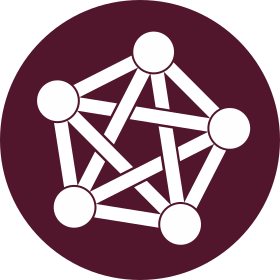

# What is the Fediverse?

The **Fediverse** (from the words "federation" and "universe") is a network of independent servers that provide different types of federated software and services, that is, that can interact and communicate with each other on the basis of open communication and operation standards. It consists of social networks, blogging, microblogging and file hosting services dedicated mainly to the creation and publication of content. Its main characteristics are its decentralized nature, its interoperability, the predominance of open standard protocols and free licensed software and the absence of a central authority or entity that concentrates and controls it. Unlike private centralized services such as **Facebook**, **Twitter** or **Instagram**, this network allows users not only to communicate and collaborate with each other regardless of the software or server they choose, but also to have control over their data.

If you have read our [**Mission Statement**](https://disroot.org/en/mission-statement) (if you haven't, we invite you to do it) then you will understand how important it is for us conceptually and culturally.

Within the Fediverse, there are a growing number of platforms and services focused on users, their autonomy and privacy. We have been using and promoting them since the very beginning of **Disroot** and tried different approaches. And this time, we have decided to take smaller but firmer steps in that direction.

Currently, the [**ActivityPub**](https://www.w3.org/TR/activitypub/) protocol is the main engine of this Fediverse. Its quick and widespread adoption is due to the constant development and the maturity it has reached. As proof, just look at the wide range of platforms and services that implement it: **Mastodon**, **Pleroma**, **Nextcloud**, **PeerTube**, **Funkwhale**, **Friendica**, **PixelFed**, **BookWyrm**, **Lemmy**, **Plume**, **Writefreely**, **Misskey**, among others.

For all of this, and because "we want to encourage the emergence of more independent, decentralized service providers who work in cooperation - not in competition -, with each other" we decided to create **FEDisroot**, our **Akkoma**'s instance. The first of the many seeds we hope to plant in this wonderful ecosystem.

With this new project, we hope not only to provide you with an accessible, open and useful communication tool, but also to collaborate in the construction of "a truly strong decentralized network" that will help us "uprooting society from the current status quo ruled by advertising, consumerism and the power of the highest bidder".

So...

**You are all welcome to the Fediverse and to FEDisroot**.

---
