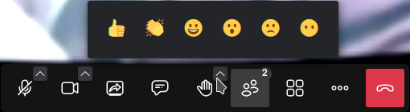

# How to make a videoconference

First, we go to [**https://calls.disroot.org**](https://calls.disroot.org)

Here we have two options:
- we enter a name for our conference (e.g. `OurMeeting`) in the "Start meeting" field, or
- use the random meeting name generator funtionality that automatically suggests names for the conferences from a set of over a trillion possible combinations.

!! **Things to keep in mind when creating a videoconference meeting**  
!! When we create a meeting room it only exists while the meeting is actually taking place. It gets created when the first participant joins and it is destroyed when the last one leaves. If someone joins the same room again, a brand new meeting is created with the same name and there is no connection to any previous meeting that might have been held with the same name.  
!! Since a name is all that we need to access a room, we have to be really careful about how we choose and advertise it if we don’t want others accidentally find it or have anyone to join in to spy or bother us. 

Once we have choosen the room name we click on the **Start meeting** button.

The first time we joining the room, the browser will ask for permission to use the camera and microphone. Without any of them we will not be able to partipate of the meeting, so we click on **Allow**.

Once we enter the meeting we will be the **moderators** of the call and we will prompted with the controls and options to manage it and interact.

## Controls, options and settings
These controls and options are self-explanatory:

- **Mute/Unmute** the microphone.
- **Start/Stop the camera**.
- **Start/Stop** screen sharing,

  

  - we can choose to share the entire screen or only a window.

- **Open the chat**, for written communication.

  

- **Raise/Lower** the hand, to request to speak,

  

  - by clicking on the arrow we can choose an emoji to show our reactions.

- **View the participants**,

  

  - here we can see the people who are currently participating in the meeting, **Invite someone**, search for a particular participant and see if they have enable/disable their audio or video. We also have some basic moderation options such as **Mute all** and in the three-dots menu the one to stop everyone's video.

  

  * Clicking on the **More moderation controls** will open the moderation settings (we will see them below).

- The **Toggle view** option to change to the grid or the full view.

- The **More actions** menu (we will see these options below).

- The **Leave the meeting** button to end the meeting.

## More actions and settings

In the **More actions** menu we have some additional settings. Let's see them in detail.

- **me**: this is a shortcut to our profile settings

  

  * where we can set our display name and a [Gravatar](https://en.wikipedia.org/wiki/Gravatar) (if we have one).

- **Invite people**:

  

  * to invite other people we can just copy the room link and paste it elsewhere or share it via email.

- **Performance settings**:

  

  * to adjust the audio/video settings according to our hardware possibilites, bandwith connection, etc.

- **View full screen**: to change to full screen view.

- **Security options**:

  

  * we can enable the **Lobby** option that allows to verify who wants to join the meeting and decide whether to give access or not.
  * Additionally, we can add an extra layer of security by adding a password to the meeting. Only those with the password will be able to join. 

- **Share video**:

  

  * to share a YouTube video with the meeting participants. Just paste the video URL and it will be played with the usual playback controls.

- **Noise suppression**: to reduce the noise that might leak in while we talk.

- **Select background**:

  

  * this option allows us to add an image to use as virtual background. We can also choose to "Blur" our real background (useful if for example we do not want our room or what is happening around us to be seen).

- **Participants stats**:

  

  * this option allows to see which participants and to what extent they have been speaking or not.

- **Settings**: here we can see and configure
  * our **Devices** (camera and microphone);

  

  * our **Profile**, as we already seen;

  

  * the **Moderator** options. Here we can choose options regarding how we want the participants to start when joining the meeting;

  

  * if we want to enable **Sounds** in the meeting;

  

  * and **More**: where we can enable the chat notifications, the keyboard shortcuts, to hide the self view, change the interface language, the desktop sharing frame rate and the number of participants who can be pinned to the main screen.

  

- **View shortcuts**: to display the keyboard shortcuts we can use.

  

- **Embed meeting**: this is another way to invite people to the meeting by embeding the link as a piece of code.

  

Once we end the meeting, it will appear on the home page as part of the Calls history and we can access it again at another time if we want, or delete it permanently.  

Note if we have configured our web browser to delete its navigation history once we close it, the meetings will not appear here.

This is basically it. Now we know how we can start organizing meetings and communicating with whomever we want in a simple and secure way.