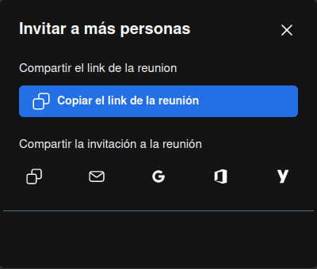

# Cómo realizar videoconferencias

Primero, vamos a [**https://calls.disroot.org**](https://calls.disroot.org)

Aquí tenemos dos opciones:
- podemos ingresar un nombre para nuestra videoconferencia (p.ej. `NuestraReunión`) en el campo "Iniciar la reunión", o
- utilizar la funcionalidad del generador de nombres aleatorios de reunión que automáticamente sugiere nombres para la llamada a partir de un conjunto de más de un billón de combinaciones posibles.

!! **Cosas a tener en cuenta cuando creamos una reunión de videollamada**  
!! Cuando creamos una sala de reunión, esta solo existe mientras la reunión se está llevando a cabo. Se crea cuando ingresa la primera persona participante y es destruida cuando la última se va. Si alguien se une a la misma sala de nuevo, una nueva reunión es generada con el mismo nombre y no tiene ninguna relación o conexión con cualquier otra previa que haya tenido el mismo nombre.  
!! Como un nombre es todo lo que se necesita para acceder a una sala, debemos tener mucho cuidado con la forma en que la nombramos y anunciamos si no queremos que otras personas accidentalmente den con ella o que cualquiera se una para espiar o molestarnos. 

Luego que hemos elegido el nombre de la sala, hacemos clic en el botón **Iniciar la reunión**.

La primera vez que nos unimos a la sala, el navegador nos pedirá permiso para utilizar la cámara y el micrófono. Sin ninguno de ellos, no podremos participar de la reunión, así que le damos clic a **Permitir**.

Una vez que ingresemos a la reunión seremos les **moderadores** de la llamada y se nos presentarán los controles y opciones para gestionarla e interactuar.

## Controles, opciones y configuraciones
Estos controles y opciones se explican solos:

- **Activar o silenciar** el micrófono.
- **Iniciar o detener la cámara**.
- **Comenzar/detener compartir pantalla**,

  

  - podemos elegir compartir toda la pantalla o solo una ventana.

- **Abrir chat**, para comunicarnos por escrito.

  

- **Levantar o bajar** la mano, para pedir la palabra,

  

  - haciendo clic en la flecha podemos seleccionar un emoji para mostrar nuestras reacciones.

- **Participantes**,

  

  - aquí podemos ver a las personas que actualmente participan en el reunión, **Invitar a alguien** más, buscar a una persona en particular y ver si tienen habilitado/deshabilitado el audio o el video. También tenemos algunas opciones básicas de moderación como **Silenciar a todos los demás** y en el menú de tres puntos la de detener el video de las demás personas.

  

  * Haciendo clic en **More moderation controls (Más controles de moderación)** se abrirán las configuraciones de moderación (las veremos más adelante).

- La opción de **Activar o desactivar la vista en cuadrícula** para cambiar a la vista en cuadrícula o el modo completo.

- El menú **Más acciones** (veremos estas opciones a continuación).

- El botón de **Colgar** para finalizar la reunión.

## Más acciones y configuraciones

En el menú **Más acciones** tenemos algunas configuraciones adicionales. Veámoslas en detalle.

- **yo**: este es un atajo a nuestras configuraciones de perfil

  

  * donde podemos configurar nuestro nombre para mostrar y un [Gravatar](https://es.wikipedia.org/wiki/Gravatar) (si tenemos uno).

- **Invitar personas**:

  

  * para invitar a otras personas podemos simplemente copiar el enlace de la sala y pegarlo en otro lado o compartirlo por correo.

- **Configuraciones de Rendimiento (Performance settings)**:

  

  * para ajustar las opciones de audio/video de acuerdo a nuestras posibilidades de hardware, ancho de banda de la conexión, etc.

- **Pantalla completa**: para cambiar a la pantalla completa.

- **Opciones de seguridad**:

  

  * podemos habilirar la opción de **Sala de espera** que nos permite verificar quién quiere unirse a la reunión y decidir si le damos acceso o no.
  * Adicionalmente, podemos sumar una capa extra de seguridad agregando una contraseña a la reunión. Solamente quienes tengan la contraseña podrán unirse. 

- **Compartir un video**:

  

  * para compartir un video de YouTube con las personas participantes de la reunión. Solo pegamos la dirección del video y será reproducido con los controles de reproducción usuales.

- **Supresión de ruido (Noise suppression)**: para reducir el ruido que pudiera filtrarse mientras hablamos.

- **Seleccionar fondo**:

  

  * esta opción nos permite agregar una imagen para utilizar como fondo virtual. También podemos elegir aplicar el "Desenfoque" sobre nuestro fondo real (útil si, por ejemplo, no queremos que nuestra habitación o lo que sucede a nuestro alrededor sea visto).

- **Estadísticas de los hablantes**:

  

  * esta opción permite ver cuáles participantes y en qué medida han estado hablando o no.

- **Configuración**: aquí podemos ver y configurar
  * nuestros **Dispositivos** (cámara y micrófono);

  

  * nuestro **Perfil**, como ya vimos;

  

  * las opciones de **Moderador**. Aquí podemos seleccionar opciones relativas a cómo queremos que las personas participantes inicien al ingresar a la reunión;

  

  * si queremos habilitar **Sonidos** en la reunión;

  

  * y **Más**: donde podemos habilitar las notificaciones del chat, los atajos de teclado, ocultar la vista propia, cambiar el idioma de la interfaz, la velocidad de los fotogramas al compartir el escritorio y el número de participantes que pueden fijarse en la pantalla principal.

  

- **Ver atajos del teclado**: para mostrar los atajos del teclado que podemos utilizar.

  

- **Insertar reunión**: esta es otra manera de invitar a personas a la reunión insertando el enlace como un fragmento de código.

  

Una vez que hayamos finalizado la reunión, esta aparecerá en la página de inicio como parte del historial de Llamadas y podremos acceder a ella de nuevo en otro momento si queremos o borrarla de forma permanenente.  

Cabe notar que si tenemos configurado nuestro navegador web para que se elimine su historial de navegación cuando lo cerramos, las reuniones no aparecerán aquí.

Esto es, básicamente, todo. Ahora sabemos cómo podemos comenzar una reunión y comunicarnos con quienes queramos de manera simple y segura.