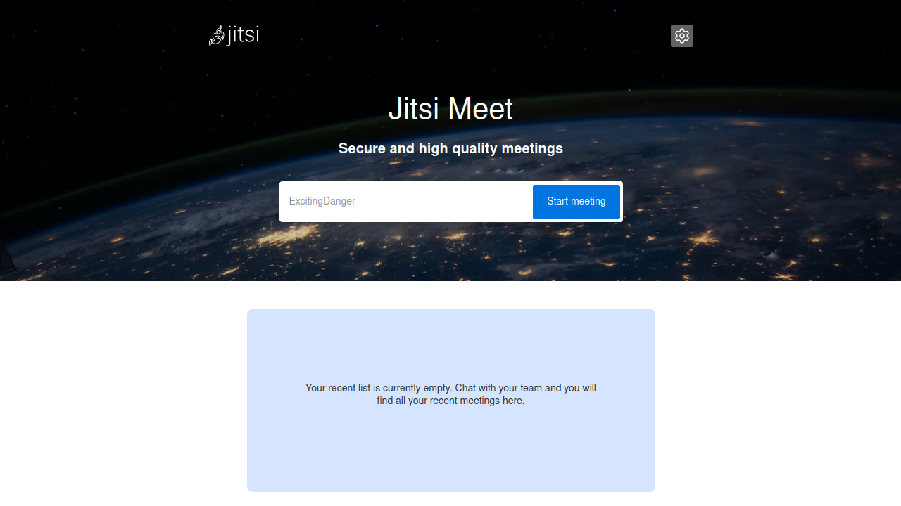
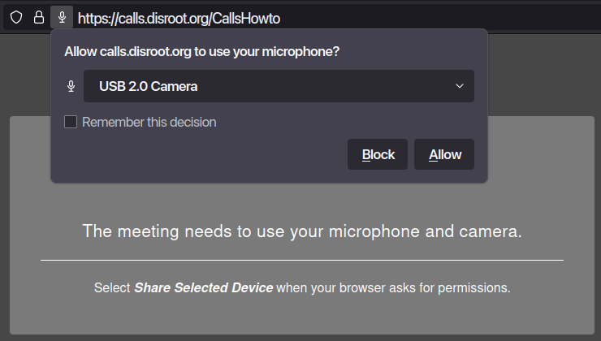
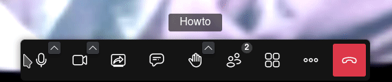
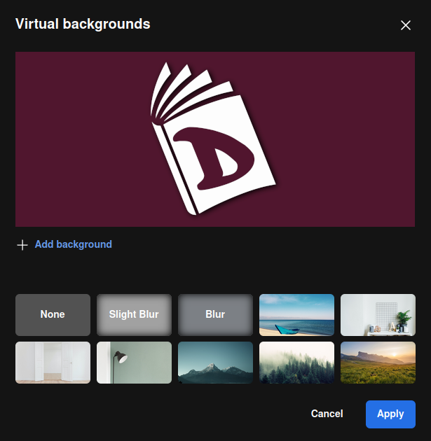
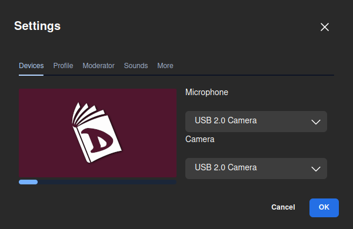
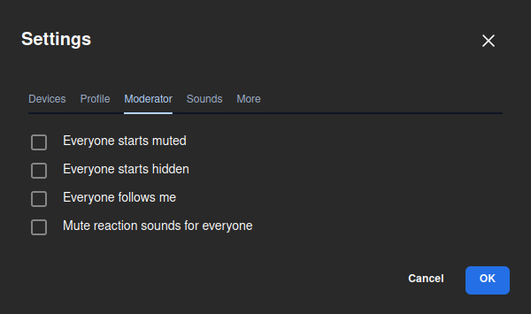
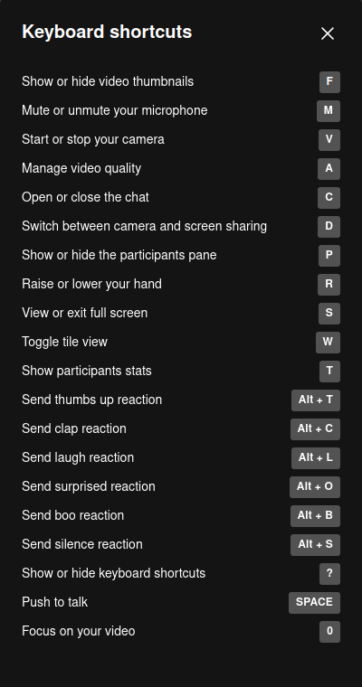
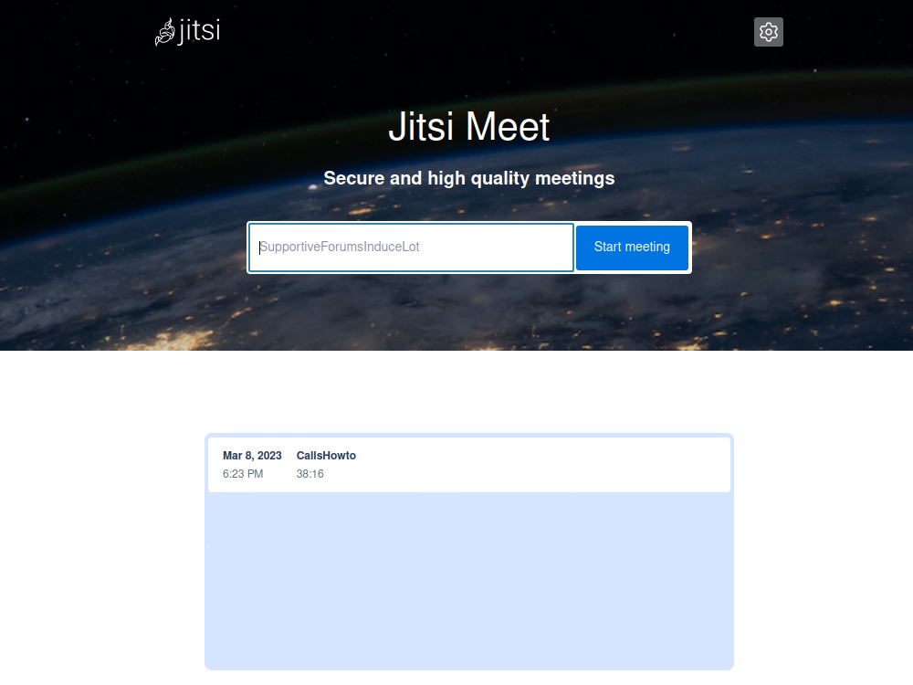

# Comment faire une vidéoconférence

Tout d'abord, nous nous rendons sur le site [**https://calls.disroot.org**](https://calls.disroot.org)

Deux possibilités s'offrent à nous :
- saisir un nom pour notre conférence (par exemple `NotreRéunion`) dans le champ "Commencer la réunion", ou
- utiliser la fonctionnalité de génération aléatoire de noms de réunion qui suggère automatiquement des noms pour les conférences à partir d'un ensemble de plus d'un trillion de combinaisons possibles.

!! **Choses à garder à l'esprit lors de la création d'une réunion par vidéoconférence**  
!! Lorsque nous créons une salle de réunion, elle n'existe que pendant la durée de la réunion. Elle est créée lorsque le premier participant la rejoint et elle est détruite lorsque le dernier participant la quitte. Si quelqu'un rejoint à nouveau la même salle, une toute nouvelle réunion est créée avec le même nom et il n'y a aucun lien avec une réunion précédente qui aurait pu avoir lieu avec le même nom.  
!! Puisque le nom est tout ce dont nous avons besoin pour accéder à une salle, nous devons faire très attention à la façon dont nous le choisissons et l'annonçons si nous ne voulons pas que d'autres personnes le trouvent accidentellement ou que quelqu'un nous rejoigne pour nous espionner ou nous ennuyer. 

Une fois que nous avons choisi le nom de la salle, nous cliquons sur le bouton **Démarrer la réunion**.

La première fois que nous rejoignons la salle, le navigateur nous demande la permission d'utiliser la caméra et le microphone. Sans eux, nous ne pourrons pas participer à la réunion, nous cliquons donc sur **Autoriser**.

Une fois que nous entrons dans la réunion, nous serons les **modérateurs** de l'appel et nous serons invités à utiliser les commandes et les options pour gérer l'appel et interagir.

## Contrôles, options et réglages
Ces contrôles et options se passent d'explications :

- **Allumer/Eteindre** le microphone.
- **Démarrer/arrêter la caméra**.
- **Démarrer/arrêter** le partage d'écran,

  

  - nous pouvons choisir de partager tout l'écran ou seulement une fenêtre.

- **Ouvrir le chat**, pour la communication écrite.

  

- **lever/baisser** la main, pour demander la parole,

  

  - en cliquant sur la flèche, nous pouvons choisir un emoji pour montrer nos réactions.

- **View the participants**,

  

  - Ici, nous pouvons voir les personnes qui participent actuellement à la réunion, **Inviter quelqu'un**, rechercher un participant particulier et voir s'il a activé/désactivé son audio ou sa vidéo. Nous disposons également d'options de modération de base telles que **Couper le micro de tout le monde** et, dans le menu à trois points, celle qui permet d'arrêter la vidéo de tout le monde.

  

  * En cliquant sur le bouton **Plus de contrôles de modération**, les paramètres de modération s'ouvriront (nous les verrons plus loin).

- L'option **Changer de vue** pour passer à la grille ou à la vue complète.

- Le menu **Plus d'actions** (nous verrons ces options plus loin).

- Le bouton **Quitter la réunion** pour mettre fin à la réunion.

## Plus d'actions et de paramètres

Dans le menu **Plus d'actions**, nous disposons de quelques paramètres supplémentaires. Voyons-les en détail.

- **moi** : il s'agit d'un raccourci vers les paramètres de notre profil

  

  * où nous pouvons définir notre nom d'affichage et un [Gravatar](https://en.wikipedia.org/wiki/Gravatar) (si nous en avons un).

- **Inviter des gens**:

  

  * pour inviter d'autres personnes, il suffit de copier le lien de la salle et de le coller ailleurs ou de le partager par e-mail.

- **Performance settings**:

  

  * pour ajuster les paramètres audio/vidéo en fonction des possibilités de notre matériel, de la bande passante de notre connexion, etc.

- **Voir plein écran** : pour passer à l'affichage plein écran.

- **Options de sécurité** :

  

  * Nous pouvons activer l'option **Lobby** qui permet de vérifier qui veut se joindre à la réunion et de décider d'y donner accès ou non.
  * En outre, nous pouvons ajouter une couche supplémentaire de sécurité en ajoutant un mot de passe à la réunion. Seules les personnes possédant ce mot de passe pourront participer à la réunion.

- **Parage de video**:

  

  * pour partager une vidéo YouTube avec les participants à la réunion. Il suffit de coller l'URL de la vidéo pour qu'elle soit lue avec les commandes de lecture habituelles.

- **Suppression du bruit** : pour réduire le bruit qui pourrait s'infiltrer pendant que nous parlons.

- **Sélectionner l'arrière-plan**:

  

  * cette option nous permet d'ajouter une image à utiliser comme arrière-plan virtuel. Nous pouvons également choisir de "flouter" notre arrière-plan réel (utile si, par exemple, nous ne voulons pas que notre chambre ou ce qui se passe autour de nous soit visible).

- **Stats de participants**:

  

  * Cette option permet de voir quels sont les participants et dans quelle mesure ils se sont exprimés ou non..

- **Réglages** : ici nous pouvons voir et configurer
  * nos **dispositifs** (caméra et microphone) ;

  

  * notre **Profil**, comme nous l'avons déjà vu;

  

  * les options **Modérateur**. Ici, nous pouvons choisir des options concernant la façon dont nous voulons que les participants commencent à rejoindre la réunion;

  

  * si nous voulons activer les **Sons** dans la réunion;

  

  * et **Plus** : où l'on peut activer les notifications de chat, les raccourcis clavier, cacher la vue de soi, changer la langue de l'interface, la fréquence d'images du partage du bureau et le nombre de participants qui peuvent être épinglés à l'écran principal..

  

- **Afficher les raccourcis** : pour afficher les raccourcis clavier que nous pouvons utiliser.

  

- **Intégrer la réunion** : il s'agit d'une autre façon d'inviter des personnes à la réunion en intégrant le lien dans un morceau de code..

  

Une fois la réunion terminée, elle apparaîtra sur la page d'accueil dans l'historique des appels et nous pourrons y accéder à nouveau à un autre moment si nous le souhaitons, ou la supprimer définitivement. 

Notez que si nous avons configuré notre navigateur web pour qu'il efface son historique de navigation une fois fermé, les réunions n'apparaîtront pas ici.

Voilà pour l'essentiel. Nous savons maintenant comment organiser des réunions et communiquer avec qui nous voulons de manière simple et sécurisée.