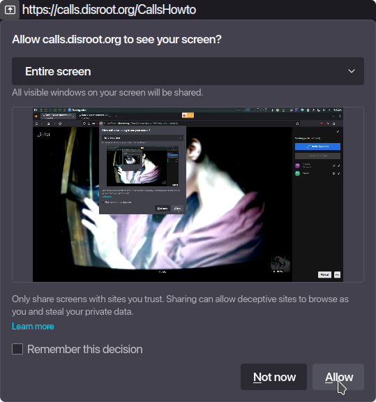
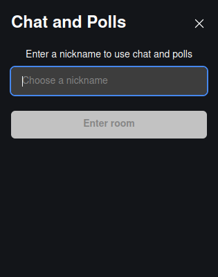
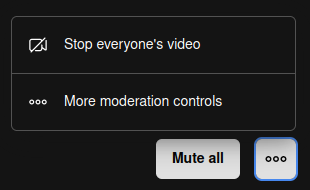
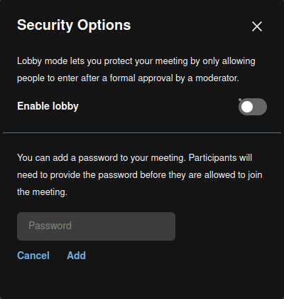
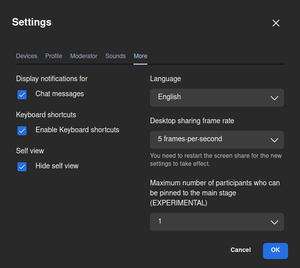

# Come fare una videoconferenza

Per prima cosa, andiamo su [**https://calls.disroot.org**](https://calls.disroot.org)

Qui abbiamo due opzioni:
- inserire un nome per la nostra conferenza (ad esempio `NostraRiunione`) nel campo "Inizia riunione", oppure
- utilizzare la funzionalità del generatore casuale di nomi per le riunioni, che suggerisce automaticamente i nomi per le conferenze da un insieme di oltre mille miliardi di combinazioni possibili.

!! **Cose da tenere a mente quando si crea una riunione in videoconferenza**
!! Quando si crea una chiamata (una stanza), questa esiste solo mentre la riunione si sta svolgendo. Viene creata quando si unisce il primo partecipante e viene distrutta quando l'ultimo se ne va. Se qualcuno si unisce di nuovo alla stessa sala, viene creata una nuova riunione con lo stesso nome e non c'è alcun collegamento a qualsiasi riunione precedente che potrebbe essere stata tenuta con lo stesso nome. 
!! Poiché il nome è tutto ciò di cui abbiamo bisogno per accedere a una stanza, dobbiamo fare molta attenzione a come lo scegliamo e lo pubblicizziamo se non vogliamo che altri lo trovino per sbaglio o che qualcuno si unisca a noi per spiarci o disturbarci. 

Una volta scelto il nome della sala, facciamo clic sul pulsante **Avvia riunione**.
La prima volta che entriamo nella stanza, il browser ci chiederà il permesso di usare la telecamera e il microfono. Senza di essi non saremo in grado di partecipare alla riunione, quindi facciamo clic su **Permetti**.

Una volta entrati nella riunione, saremo i **moderatori** della chiamata e ci verranno richiesti i controlli e le opzioni per gestirla e interagire.

## Controlli, opzioni e impostazioni
Questi controlli e opzioni sono autoesplicativi:

- **Mutare/disattivare** il microfono.
- Avviare/arrestare la videocamera**.
- Avviare/arrestare la condivisione dello schermo
  

 - possiamo scegliere di condividere l'intero schermo o solo una finestra.

 - Aprire la chat**, per la comunicazione scritta.

  

 - Alzare/abbassare** la mano, per chiedere di parlare,

  

 - cliccando sulla freccia possiamo scegliere un'emoji per mostrare le nostre reazioni.

- **Vedi i partecipanti**,

  

 - Qui possiamo vedere le persone che stanno partecipando alla riunione, **invitare qualcuno**, cercare un particolare partecipante e vedere se ha attivato/disattivato l'audio o il video. Abbiamo anche alcune opzioni di moderazione di base come **Mute all** e nel menu a tre puntini quella per fermare il video di tutti.

  

* Cliccando su **Più controlli di moderazione** si apriranno le impostazioni di moderazione (le vedremo più avanti).
- L'opzione **Modifica vista** per passare alla griglia o alla vista completa.

- Il menu **Altre azioni** (vedremo queste opzioni più avanti).

- Il pulsante **Lascia la riunione** per terminare la riunione.

## Altre azioni e impostazioni

Nel menu **Altre azioni** sono presenti alcune impostazioni aggiuntive. Vediamole in dettaglio.

- **me**: è un collegamento alle impostazioni del nostro profilo

  

* dove possiamo impostare il nostro nome di visualizzazione e un [Gravatar](https://en.wikipedia.org/wiki/Gravatar) (se ne abbiamo uno).

- **Invitare persone**:

  

 * per invitare altre persone possiamo semplicemente copiare il link della stanza e incollarlo altrove o condividerlo via e-mail.

- **Impostazioni delle performance**:

  

  * per regolare le impostazioni audio/video in base alle nostre possibilità hardware, alla connessione di banda, ecc.

- **Visualizza a schermo intero**: per passare alla visualizzazione a schermo intero.

- **Opzioni di sicurezza**:

  

  * possiamo attivare l'opzione **Lobby** che consente di verificare chi vuole partecipare alla riunione e decidere se dare l'accesso o meno.
  * Inoltre, possiamo aggiungere un ulteriore livello di sicurezza aggiungendo una password alla riunione. Solo chi ha la password potrà partecipare. 

- **Condividere il video**:

  

  * per condividere un video di YouTube con i partecipanti alla riunione. È sufficiente incollare l'URL del video per riprodurlo con i consueti controlli di riproduzione.

- **Soppressione del rumore**: per ridurre il rumore che potrebbe entrare durante la conversazione.

- **Selezionare lo sfondo**:

  

  * Questa opzione ci permette di aggiungere un'immagine da usare come sfondo virtuale. Possiamo anche scegliere di "sfocare" il nostro sfondo reale (utile se, ad esempio, non vogliamo che si veda la nostra stanza o ciò che accade intorno a noi).

- **Statistiche sui partecipanti**:

  

  * Questa opzione permette di vedere quali partecipanti e in che misura hanno parlato o meno.

- **Impostazioni**: qui possiamo vedere e configurare
  * i nostri **dispositivi** (telecamera e microfono);

  

  * our **Profile**, as we already seen;

  

  * the **Moderator** options. Here we can choose options regarding how we want the participants to start when joining the meeting;

  
  
  * se si desidera abilitare i **suoni** nella riunione;

  

  
  * e **Altro**: dove possiamo attivare le notifiche della chat, le scorciatoie da tastiera, nascondere la visualizzazione autonoma, cambiare la lingua dell'interfaccia, la frequenza dei fotogrammi della condivisione del desktop e il numero di partecipanti che possono essere bloccati nella schermata principale.

  

- **Visualizza scorciatoie**: per visualizzare le scorciatoie da tastiera che possiamo utilizzare.

  

- **Riunione incorporata**: questo è un altro modo per invitare le persone alla riunione incorporando il link in un pezzo di codice.

  

Una volta terminata la riunione, questa apparirà nella home page come parte della cronologia delle chiamate e sarà possibile accedervi nuovamente in un altro momento, se lo si desidera, o cancellarla definitivamente.  

Se il browser è stato configurato in modo da cancellare la cronologia di navigazione una volta chiuso, le riunioni non appariranno qui.

Questo è quanto. Ora sappiamo come iniziare a organizzare riunioni e comunicare con chi vogliamo in modo semplice e sicuro.
