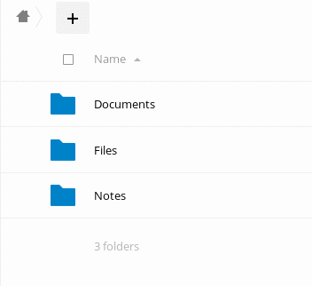
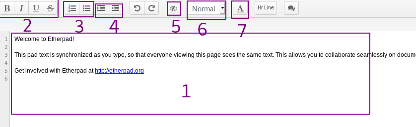

**NOTE:**```If the howto reffers to an older software version than the provided by``` **Disroot**,```or the one you're using in your device, there could be missing features or small parts of the information that may have changed.```<br> **Disroot's** ```how-to documentation is a community driven procces. We try to keep it as updated as we can.```

---

||
|:--:|
|Etherpad is a collaborative application for multi-user real-time text edition. You can reach it directly from your browser at: https://pad.disroot.org.<br>No user account is needed to make use of it. However our cloud comes with very handy plugin that helps you keep track of all your pads, just as if they are one of your files.|

----

# Creating a new pad

## From pad.disroot.org
To create a pad, you can go to [pad.disroot.org](https://pad.disroot.org).


1. Clicking on this button will create a pad with random characters name. It will look like this: https://pad.disroot.org/p/AfV61cgLe_ax... This is the most secure way to create a pad because it's very hard to just guess the name.
2. Giving your pad the name you want allows you to find it easily because you will get an address like this: https://pad.disroot.org/p/the_name_I_want. But it's a bit less secure way to create a pad because someone could enter the same name you chose and then see your pad.

## From your Cloud account (Ownpad plugin)

You can also create a pad directly from your Cloud account and it works the same as creating a new file.

Login in to [cloud.disroot.org](https://cloud.disroot.org) and go to the files app. Click on the *+* icon and choose to create a pad. Give it a name, and press *Enter* on your keyboard. A new file with a *.pad* extension will be created. You can move and share that file just like any other file you have on your Cloud account.



To open the newly created pad, just click on it's name. The application will open up your pad using https://pad.disroot.org within the cloud interface. You can now easily work on your document and once you're done, use the red icon on the top-right corner to close it.


# User interface

1. This is where participants write. As soon as someone writes something, it is automatically saved. All users can all write at the same time! What will differentiate what each writer writes is that each one of them is set with a different color.
If you delete something, it's also saved. Therefore be careful.
2. These are the usual formatting options: bold, italic, etc.
3. These two options allow you to create lists.
4. These buttons are used to shift the text, i. e. to create paragraphs.
5. This button allows you to remove all the colors from the pad. Indeed, as explained above, each author will have a color in order to clearly differentiate what each one writes. It may be interesting, at the end of the work, to remove all these colors.
6. This button allows you to assign a style to a text, for example "Title 1".
7. This button allows you to change the color of the text. WHen you click on it, another icon will appear with a list of color you can choose from.


# Options
## Add your name
In order to know who is writing what, it is useful to provide your name.

1. Click on this icon
2. Enter your name here. It doesn't have to be your real name if you don't want it.

You can also change your color by clicking on the color square.

## Comment
You can add a comment on text:

1. Select the words you want to comment.
2. Click on this icon: 
3. Add your comment and validate.

You can even suggest a modification to the text:

1. Select the word you want to suggest for change.
2. Click on this icon: 
3. Add your comment.
4. Check the **Include suggested change** box
5. Suggest your change in the **To:** box. For some reason, it is not alays working with your mouse, so you may have to use the tab key of your keyboard to get there.
6. Click on **Comment**.

To accept the change, go on the comment and click on **Accept change**.

Note: this comment feature is a bit buggy...

## Revision and History
There is the possibility to record a state of your pad at a given moment. This is called a *revision*. This is very convenient, because it means you can go back to an earlier version of your pad, ideal when someone else is mistakenly deleting everything!
Just click on the star:


The other button allows you to see the entire history, including revisions made and authors' names. To better understand it, look at what it allows you to do:


Here are the possibilities:

1. Use those buttons to navigate through your pad history.
2. Move this bar with your mouse to navigate through the pad history.
3. Here you can see the dates of the changes made.
4. Here are the different authors.
5. Here are the texts evolution.
6. The stars represent the different revisions you have made. Here, there is only one revision because there is only one star.
7. Click here to return to your pad, without changing anything.
8. If you click on a star, then on this button, your pad will be restored at this revision, at this date.

# Share a pad
## Directly from pad.disroot.org
In order to share with someone, you simply need to share the actual link to the pad. You can do it by opening your pad in the browser and hovering above it's name. You will see the actual link to the pad, which you can then copy and send it to anyone you wish to share the pad with.

You can also do it this way:

1. Click on this button 
2. **Link**: Here you have the link to your pad. Copy and send it to anyone you want!
3. **Read only**: You can also get a *Read only* link so that people could see the content of your pad but couldn't change its content. Just check this box to get the link to your read-only pad.

## From your Nextcloud account
Sharing pads with other **Disroot** users is the same as sharing normal files. Click on *sharing* icon and select with whom you want to share the file with.


Note: Using public link will not work as easy since these are not normal files. So in order to share with someone outside **Disroot** cloud, you should use the previous method.

# Export/Import
You can import any text file directly into your pad.

1. Click on this button.
2. **Browse**: search for your file. Here the user is about to import a file named *test.md*
3. **Import now**: click here to import the file into the pad.

Note: HTML can not be import at the moment.

You can also export the content of your pad into a document file on your computer.

1. Click on this button.
2. Choose one of this file format.

Note: Etherpad exportation doesn't work at the moment.

# Delete a pad
It is impossible to delete a pad. Once created they stay online. In fact anyone who could guess the url could look it up. That's why **Disroot** cloud's plugin creates links to your pads using random strings instead of the name you specify when creating the file. In that way the links to the pads are impossible to guess making them safe from anyone but you and users you share the pads with.


# Etherpad
To know more about the software used, check [Etherpad](https://etherpad.org/) website

---

 <center><a rel="license" href="http://creativecommons.org/licenses/by- sa/4.0/"></a><br />This work is licensed under a <br><a rel="license" href="http://creativecommons.org/licenses/by-sa/4.0/">Creative Commons Attribution-ShareAlike 4.0 International License</a>.</center>

---
