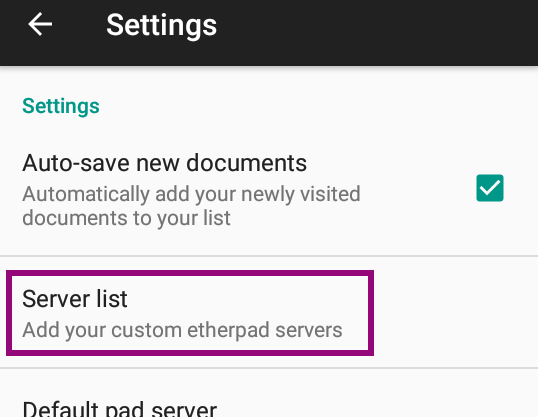
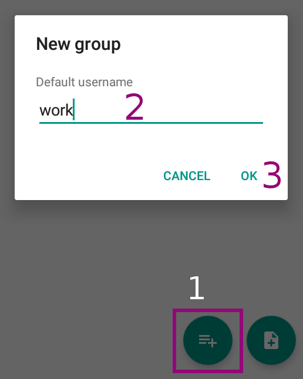

**NOTE:**```If the howto reffers to an older software version than the provided by``` **Disroot**,```or the one you're using in your device, there could be missing features or small parts of the information that may have changed.```<br> **Disroot's** ```how-to documentation is a community driven procces. We try to keep it as updated as we can.```

---

||
|:--:|
|Padland is a tool to create, manage, share, remember and read collaborative documents based on the Etherpad technology in Android.|

----

# Get padland
Download it from [**f-droid**](https://f-droid.org/) and install it on your device.

# Set Disroot pad server
Once you've installed it,  proceed to start it up. First time you open it, you'll see a screen like this:<br>


By clicking on the wheel icon at the top-right corner wheel you can access  the **settings**. Then choose **Server list**.



The list will be empty at this point. To add a server, click on the **+** button at the bottom-right corner.


Then, you can add the pad server of your choice. To choose **Disroot**, just fill in the server url like this:<br>
<br>

Then click on **OK**. **Disroot** is now in your server list.


# Create or add a pad
Click on the "new pad"  button to create or add a pad 

You'll see  this:<br>

- **Pad name (URL)**: set the pad name if you know it. For example if the pad address you want to add is *https://pad.disroot.org/p/test* just add *test* here.
- **Pad Alias**: you can an alias if the pad address/name doesn't make to much sense to you. For example, if the pad address is *https://pad.disroot.org/p/1r4o_f6-Rzc* you may want to set *Shopping_list* as an alias!
- **Choose a server**: you can choose any server. If you set **Disroot** in your server list as explained above, then you can choose **Disroot** now.
- Click on **Create or go to** when you're done. If the pad exists, then you will go to it. If it doesn't, it will be created.

Here is how the document looks from **Padland**:


# Add a folder
You can easily create folders in order to keep your pads organized.


1. Click on the "**+**" button to add a folder.
2. **Default username**: choose a folder name.
3. Don't forget to validate!


# Open, share and delete a pad
In your pads list, just click on the pad you want to open.<br>


You'll see a page like this:

1. **View pad**: by clicking on it, your pad will be opened in **Padland**.
2. **Share**: click here to share you pad, for example by email. It will send your pad address, not the actual content of your pad.
3. **Trash**: click it to remove your pad from **Padland**. It won't delete it from the server.

# Change the pad name, address, and folder.

1. If you want to edit your pad's configuration, just long press on the pad name.
2. Then click on the *pencil* icon.

You should be able to edit it:<br>
<br>
There, you can change the pad name (**Pad Alias**), it's address (**Pad Name**) and also **Select group** to move your pad into a folder.

---

 <center><a rel="license" href="http://creativecommons.org/licenses/by- sa/4.0/"></a><br />This work is licensed under a <br><a rel="license" href="http://creativecommons.org/licenses/by-sa/4.0/">Creative Commons Attribution-ShareAlike 4.0 International License</a>.</center>

---
