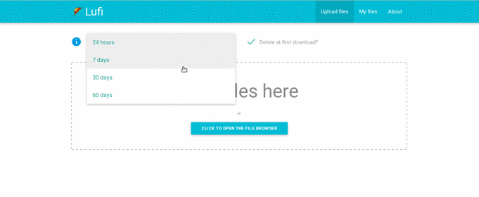
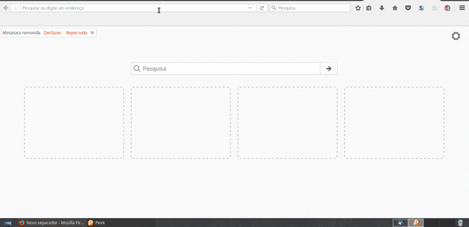
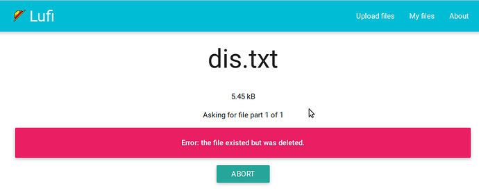

# How safe is Lufi and how it works

When you use Lufi to upload files, "all the files are encrypted by your the browser! It means that your files never leave your computer unencrypted. The administrator of the Lufi instance you use will not be able to see what is in your file, neither will your network administrator, or your ISP".

When someone downloads your file, it is decrypted locally in that person's browser after the download. Meaning, the network administrator, or the ISP will not be able to see what's in the downloaded file.

You can read more about it [here](https://git.framasoft.org/luc/lufi).

The whole encryption/decryption process is done automatically by the browsers, so no need of manually encrypt the files before, or manually decrypt at the download.

The encryption key (the thing that permits whomever downloads the file to decrypt it) is a part of the link that is presented to you by your browser after you have uploaded a file.

It's an anchor (Cf. Fragment Identifier). That means this part (the encryption key) is only processed client-side (in your computer) and does not reach the server of your Lufi provider, so they cannot decrypt the file.

**Only persons that have the full link will be able to download and decrypt the file.**

For example this is a link to a file in upload.disroot.org:

[https://upload.disroot.org/r/FA7MHOOL#AgsmqnJEyUZAcybZmOGKljqYRtDhJKsvZC/Qt05N8dE=](https://upload.disroot.org/r/FA7MHOOL#AgsmqnJEyUZAcybZmOGKljqYRtDhJKsvZC/Qt05N8dE=)

It has two components:

* Left of the **#** symbol in the link is the URL to the file:
"https://upload.disroot.org/r/FA7MHOOL"

* Right of the **#** symbol in the link is the encryption key of the file:
"#AgsmqnJEyUZAcybZmOGKljqYRtDhJKsvZC/Qt05N8dE="

If you try to use just, [https://upload.disroot.org/r/FA7MHOOL](https://upload.disroot.org/r/FA7MHOOL)
Without the second part you will get this message:

----------
# The Interface

The interface is pretty straightforward, when you upload a file you have the following options:

* Choose how many days it stays online. **The maximum is 60 days, (for smaller files)**
* Choose if you want the file to be deleted after it was downloaded for the first time

In the upper centre part of the panel you can set the options mentioned above. In the upper right part you have the menu to go "My files" and manage your uploads. The centre is where you upload your files.

----------

# Maximum file size

There is no size limit to the files you can upload. But the maximum amount of time that a file stays stored in Lufi varies according to it's size. After that time expired the file is deleted.

Larger files will be stored for a shorter time. "The expiration delay of your file will be the minimum between what you choose and the following limitations":

* between 0 and 48M, the file will be kept 60 day(s)
* between 48M and 96M, the file will be kept 30 day(s)
* between 96M and 954M, the file will be kept 15 day(s)
* for 954M and more, the file will be kept 2 day(s)

You can also check this information any time you want by pressing the  button in the main interface in Lufi.

----------

# How to upload and download

To upload a file just choose the options you want (if delete after download or not, and how many days it stays online) and "click to open the file browser" in the centre of the screen, and navigate to your file and select it, or just drag your file to the center of the screen.

After the upload is complete you will be presented by your browser with the link (URL and encryption key) of the uploaded file, copy it to somewhere else.

You will also get the deletion link which permits you to delete the uploaded file from the server at any time you want.

To download the file just use the link in the browser:

----------

# How to share a file

Well this is also very simple, you can either:

* copy the link manually to your email or a text file, or any other option

* send it directly by email from Lufi

For the last option (if you have an email client in your machine e.g Thunderbird, Evolution, etc.), just click the  button, after your file is successfully uploaded. Write the email address and text, and press . You email client will pop-up with the email ready to send.

**The option**  **should not be used as a matter of principle.**

The reason is, if you use this option the link is sent using an email of your Lufi provider, not your personal email. Which means the administrators of that Lufi instance can see the full link, and thus are able to download it, and decrypt it if they want to.

In this case disroot is a privacy conscious provider, but as a matter of principle you should avoid it.  

----------

# How manage/delete your uploads

You can manage your uploads by pressing the button  in the main panel.

There you will see all your uploads and you can:

* See the download links of all your uploads
* See which ones where set to delete after the first download
* Choose which uploads you want to delete from the server

 This list of uploads is kept locally in your browser in a .json file. Which leaves a record in your browser of the files you uploaded. Thus, you will not be able to see the list of your uploaded files when using different browser or different computer.

If you want, in this panel you can also:

* Purge the this information from your browser local storage (it will wipe the information of the uploaded files and their links from your browser, but it wont delete the files from the server, and link is still valid)

* Export to your computer the json file with these information

* Import to your browser local storage a json file with information about uploads and links

Another way to delete a file from the server any time you want is to use the deletion link, provided when you first upload the file. Copy it and keep it in a text file for whenever you want to use it.
To use it just put it in your browser and press enter.

If you delete a file or the expiration date that was set passed, anyone trying to download the file will see a message like this:

