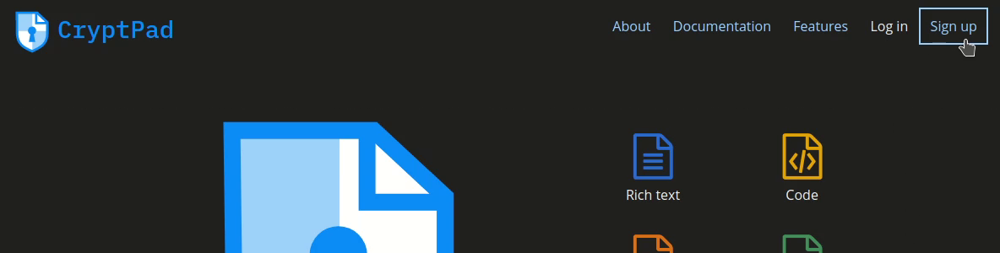
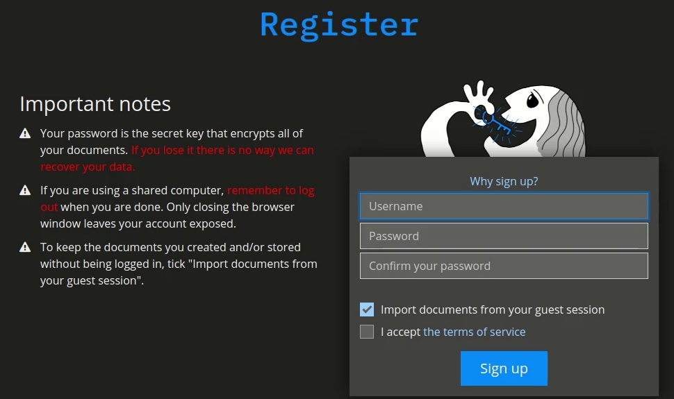
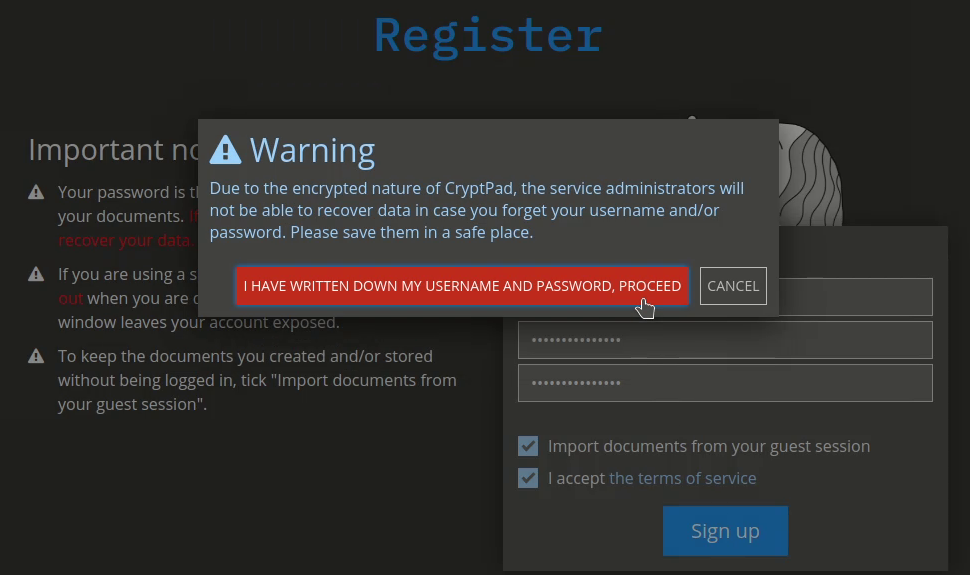

# Account types

**Disroot's CryptPad** has two type of accounts, neither of which requires to provide any personal information:

1. **Guest**: you can access and use all the applications and common collaboration and sharing features without registering. This type of account has the **storage time limited to 90 days of inactivity** (per document), the **CryptDrive** features reduced (you can store visited pads to open them later) and you cannot edit and customize your profile.

2. **Registered**: with this type of account you access not only to the guest features (with extra functions) but also to the complete social, collaboration and **CryptDrive** functionalities and it has no storage time limitations (we will see these features in detail later on).

!! **NOTE:**
!! If you want to keep all your documents and files, you need to register an account on **CryptPad**. Your **Disroot** one will not work.

# Registering an account
To register a new account, click on the **Sign up** button at the top right.

Complete the registration form:

* **Username**: the name you will use to log in to **CryptPad**. It is different from the **Display name** (which is visible to other users) and it cannot be changed once the account is created.

* **Password**: it is highly recommended to use a strong password and save it securely. Remember that due to the private nature of **CryptPad**, it is impossible for the admins to access or recover your data in case you forget/loose your password and/or your username.

Read and accept the terms of the service and finally click on **Sign up**. That's it.

!! **If you have documents created as a guest (non-registered) user, you can import them into your account.**
