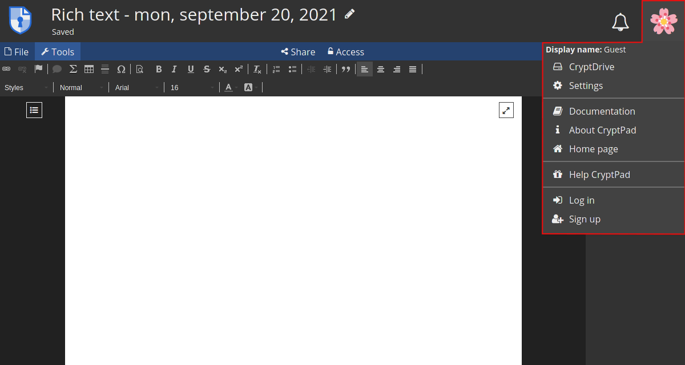
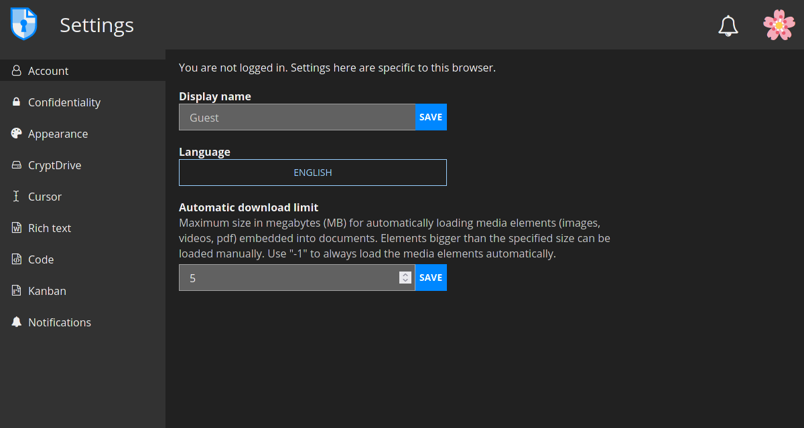
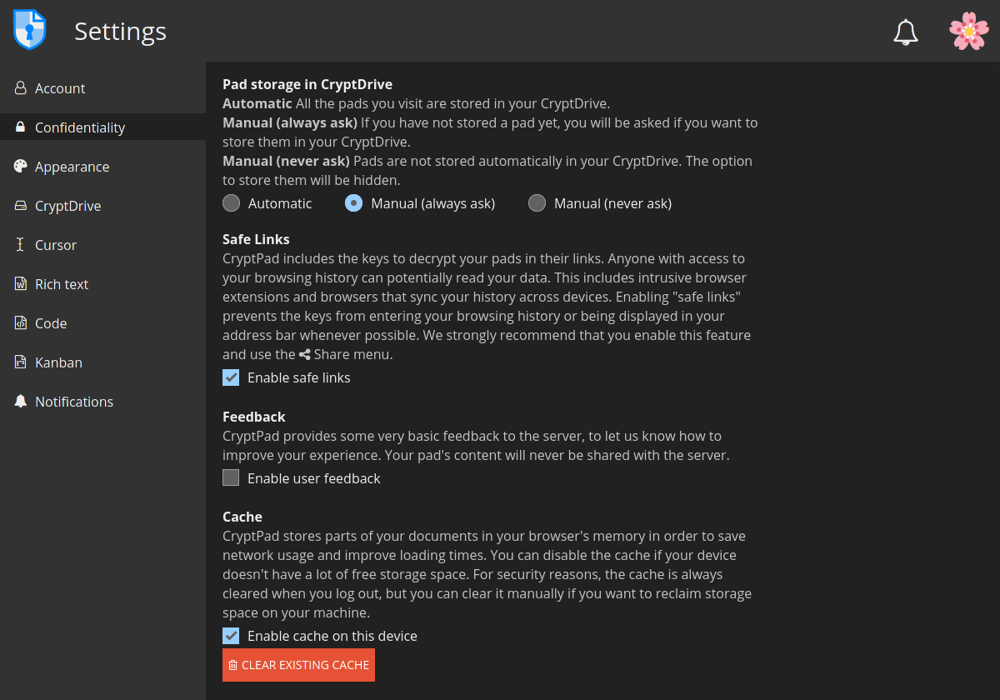
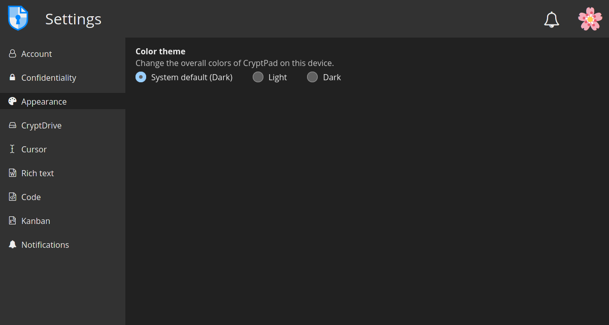
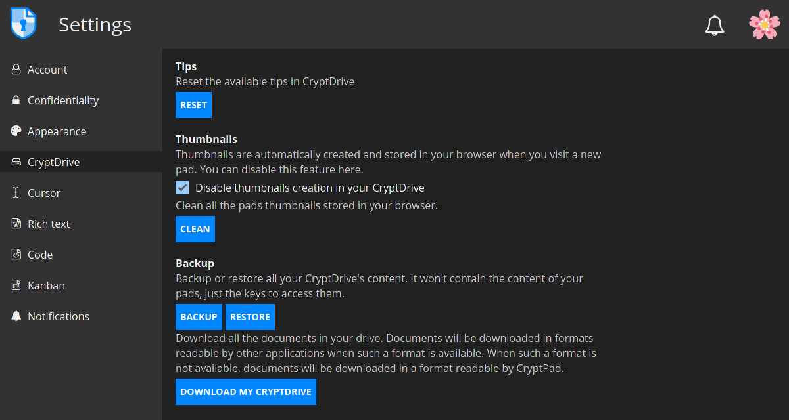
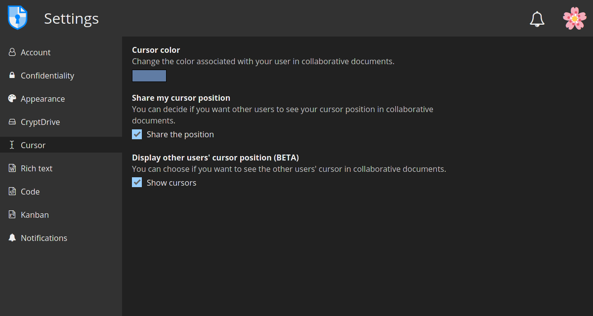
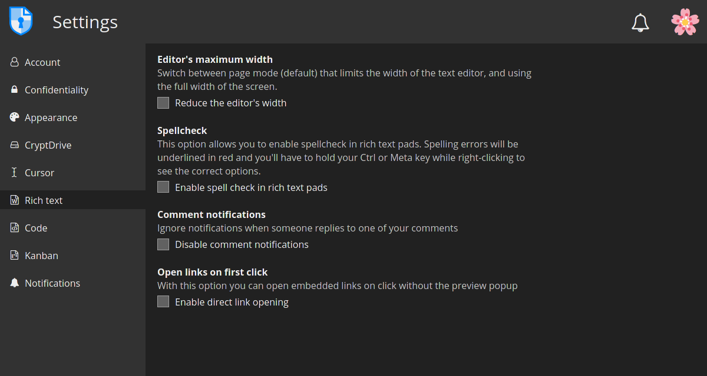
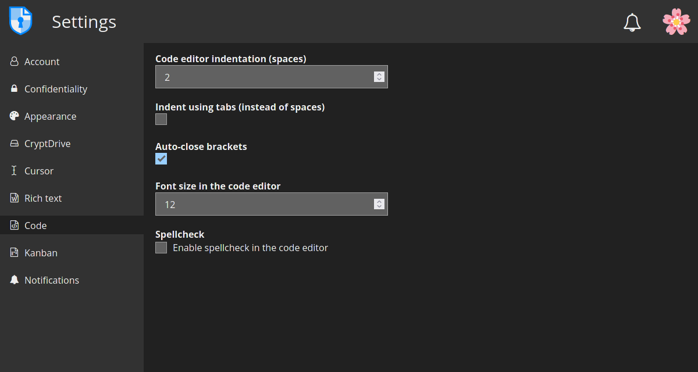
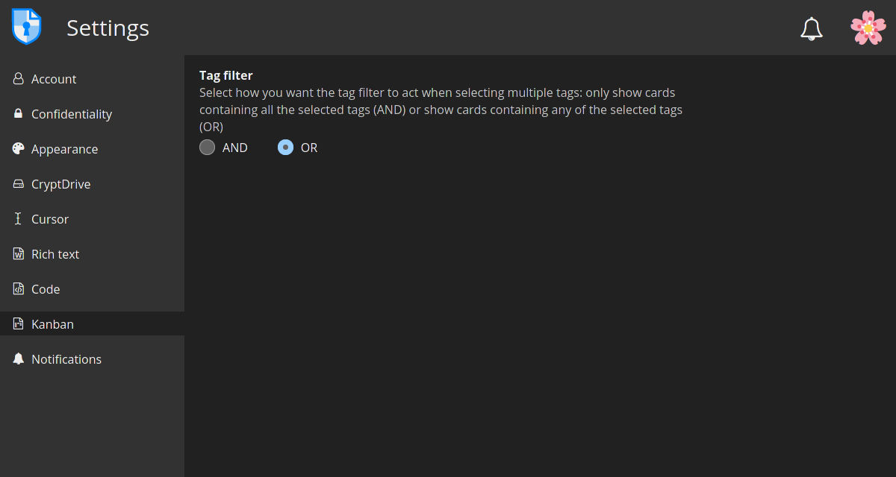
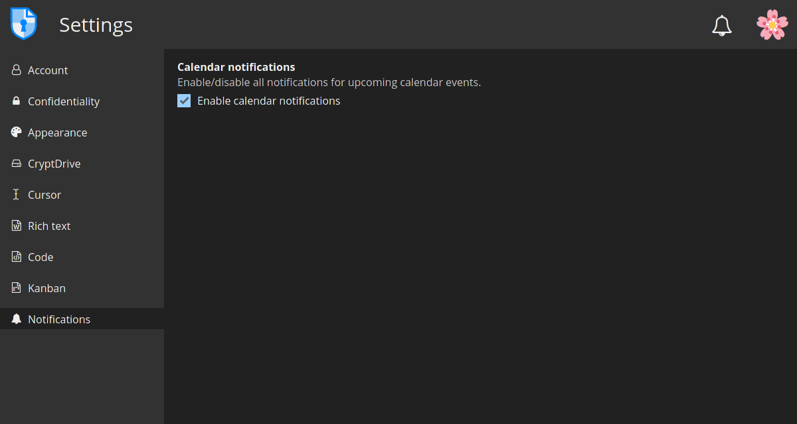

# Guest users configurations
To access your CryptPad settings, just click on the user avatar at the top right.

## Account

Here you can change:
- the **display name**, which is the name other users will see when collaborating on documents, for example;
- the interface **language**
- and the **automatic download limit**  settings

## Confidentiality

At this section you will find the following options:
- **Pad storage in CryptDrive**: here you can manage the way the documents you visit are stored in your CryptDrive. Options are:
    - **Automatic**: all the pads you visit are stored
    - **Manual (always ask)**: you will be asked if you want to store them
    - **Manual (never ask)**: pads are not stored automatically and the option to do it will be hidden

- **Safe links**: this setting is active by default. When enabled, the link in your browser’s address bar does not provide access to the document unless the recipient already has it in their CryptDrive.

- **Feedback**: this option is disabled by default. When enabled, CryptPad sends anonymous usage feedback to the server (for user experience improvements). The content of documents is never shared.

- **Cache**: enable/disable CryptPad cache.

## Appearance

- **Color theme**: set the theme colors (light or dark) for CryptPad interface.

## CryptDrive

**CryptDrive** is where documents are stored and managed.

- **Tips**: the CryptPad's help messages. Clicking on **Reset** will display them again (in case they have been dismissed).

- **Thumbnails**: Enable/disable the grid mode. When enabled, CryptPad creates thumbnails of the documents and store them in your browser. To delete all existing thumbnails, use the **Clean** button.

- **Backup**: there are two types of backups:
    - **Backup/Restore**: this option saves access to documents that can be restored in another session. This means **only the keys of documents in the drive are saved, not their content**.
    - **Download my CryptDrive**: this option saves the content of all documents in the drive.

## Cursor

Here you can change:
- **Cursor color**: the color of your cursor (useful to identify yourself when collaborating on documents). It also determines the color of your text when color by author is active in **Code** documents.

- **Share my cursor position**: choose whether or not to display your cursor's position to other users in collaborative documents.

- **Display other users’ cursor position (BETA)**: choose whether or not to see other users cursor's position in collaborative documents.

## Rich text

These are the user settings for the **Rich Text** application.

- **Editor’s maximum width**: Switch between page mode (default) that limits the width of the text editor, and using the full width of the screen.

- **Spellcheck**: Enable/disable spellcheck in Rich Text documents.

- **Comment notifications**: check this option to disable notifications when another user replies to one of your comments.

## Code

User settings for the Code / Markdown application.

- **Code editor indentation (spaces)**: Choose the number of spaces for each level of indentation.

- **Indent using tabs (instead of spaces)**: Check this option to insert tabs rather than spaces with the `Tab` key.

- **Auto-close brackets**: Automatically insert a closing character `)` when brackets are opened with `(` (it also works with `[`, `'`, `"`).

- **Font size in the code editor**: Set the size of text in the code editor.

- **Spellcheck**: Underline spelling mistakes in the code editor, correction suggestions are available through right click on the word to correct.

## Kanban

- **Tag filter**: Select how you want the tag filter to act when selecting multiple tags: only show cards containing all the selected tags (AND) or show cards containing any of the selected tags (OR)

## Notifications

- **Calendar notifications**: Enable/disable all notifications for upcoming calendar events.
