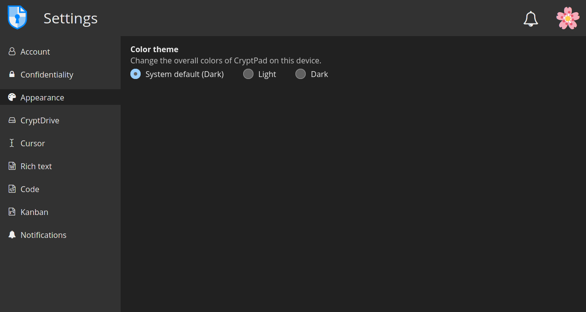
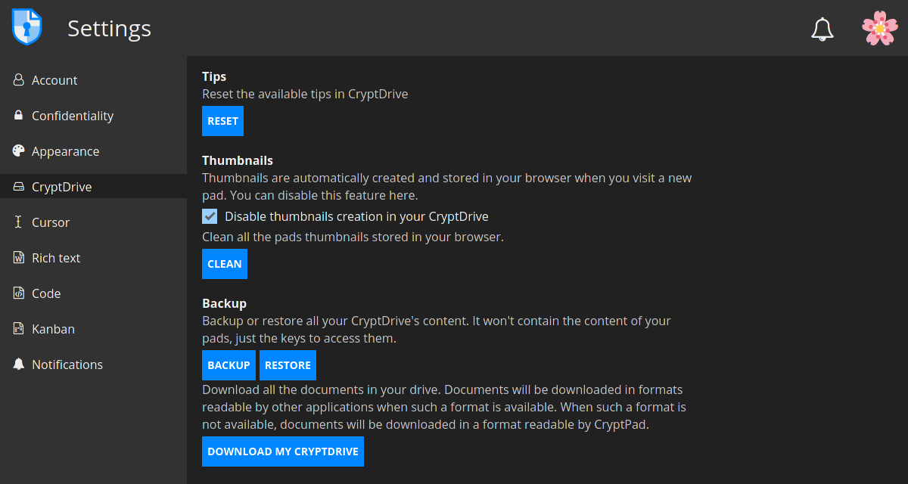
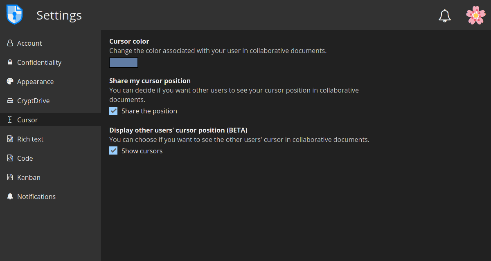
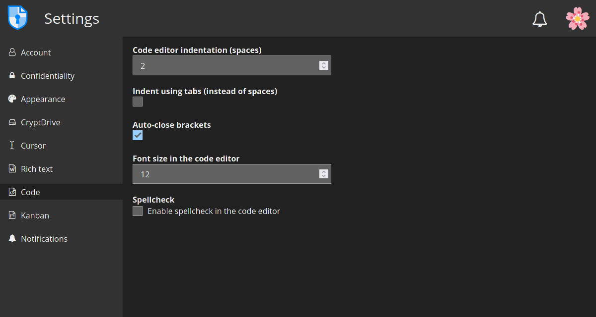

# Configurations des utilisateurs invités
Pour accéder à vos paramètres CryptPad, il suffit de cliquer sur l'avatar de l'utilisateur en haut à droite.

## Compte

Ici, vous pouvez modifier :
- le **nom d'affichage**, qui est le nom que les autres utilisateurs verront lorsqu'ils collaboreront à des documents, par exemple ;
- la **langue** de l'interface
- et les paramètres de **limite de téléchargement automatique**.

## Confidentialité

Dans cette section, vous trouverez les options suivantes :
- **Stockage des documents dans le CryptDrive** : ici vous pouvez gérer la façon dont les documents que vous visitez sont stockés dans votre CryptDrive. Les options sont :
    - **Automatique** : tous les pads que vous visitez sont stockés.
    - **Manuel (toujours demandé)** : il vous sera demandé si vous voulez les stocker.
    - **Manuel (jamais demandé)** : les pads ne sont pas stockés automatiquement et l'option pour le faire sera cachée.

- **Liens sécurisés** : ce paramètre est actif par défaut. Lorsqu'il est activé, le lien dans la barre d'adresse de votre navigateur ne donne pas accès au document, sauf si le destinataire l'a déjà dans son CryptDrive.

- **Feedback** : cette option est désactivée par défaut. Lorsqu'elle est activée, CryptPad envoie un retour d'information anonyme sur l'utilisation au serveur (pour améliorer l'expérience utilisateur). Le contenu des documents n'est jamais partagé.

- **Cache** : activer/désactiver le cache de CryptPad.

## Apparence

- **Thème de couleur** : définir les couleurs du thème (clair ou foncé) pour l'interface CryptPad.

## CryptDrive

**CryptDrive** est l'endroit où les documents sont stockés et gérés.

- **Tips** : les messages d'aide du CryptPad. En cliquant sur **Reset**, ils seront affichés à nouveau (au cas où ils auraient été rejetés).

- **Vignettes** : Activer/désactiver le mode grille. Lorsqu'il est activé, CryptPad crée des vignettes des documents et les stocke dans votre navigateur. Pour supprimer toutes les vignettes existantes, utilisez le bouton **Nettoyer**.

- **Sauvegarde** : il existe deux types de sauvegardes :
    - **Sauvegarde/Restauration** : cette option sauvegarde l'accès aux documents qui peuvent être restaurés dans une autre session. Cela signifie que **seulement les clés des documents dans le lecteur sont sauvegardées, pas leur contenu**.
    - **Télécharger mon CryptDrive** : cette option sauvegarde le contenu de tous les documents dans l'unité.

## Curseur

Ici, vous pouvez modifier :
- **Couleur du curseur** : la couleur de votre curseur (utile pour vous identifier lorsque vous collaborez à des documents). Elle détermine également la couleur de votre texte lorsque la couleur par auteur est active dans les documents **Code**.

- **Partager la position de mon curseur** : choisissez d'afficher ou non la position de votre curseur aux autres utilisateurs dans les documents collaboratifs.

- **Afficher la position du curseur des autres utilisateurs (BETA)** : choisissez d'afficher ou non la position du curseur des autres utilisateurs dans les documents collaboratifs.

## Texte riche

Voici les paramètres utilisateur de l'application **Texte enrichi**.

- **Largeur maximale de l'éditeur** : Basculez entre le mode page (par défaut) qui limite la largeur de l'éditeur de texte, et l'utilisation de la pleine largeur de l'écran.

- **Vérification orthographique** : Activer/désactiver la vérification orthographique dans les documents Rich Text.

- **Notifications de commentaires** : cochez cette option pour désactiver les notifications lorsqu'un autre utilisateur répond à l'un de vos commentaires.

## Code

Paramètres utilisateur pour l'application Code / Markdown.

- **Indentation de l'éditeur de code (espaces)** : Choisissez le nombre d'espaces pour chaque niveau d'indentation.

- **Indenter en utilisant des tabulations (au lieu d'espaces)** : Cochez cette option pour insérer des tabulations plutôt que des espaces avec la touche `Tab`.

- **Fermeture automatique des parenthèses** : Insérez automatiquement un caractère de fermeture `)` lorsque les parenthèses sont ouvertes avec `(` (cela fonctionne également avec `[`, `'`, `"`).

- **Taille de la police dans l'éditeur de code** : Définissez la taille du texte dans l'éditeur de code.

- **Vérification orthographique** : Souligner les fautes d'orthographe dans l'éditeur de code, les suggestions de correction sont disponibles par un clic droit sur le mot à corriger.

## Kanban

- **Filtre de balises** : Sélectionnez la façon dont vous souhaitez que le filtre de balises agisse lorsque vous sélectionnez plusieurs balises : afficher uniquement les cartes contenant toutes les balises sélectionnées (ET) ou afficher les cartes contenant n'importe laquelle des balises sélectionnées (OU).

## Notifications

- **Notifications de l'agenda** : Activez/désactivez toutes les notifications pour les événements de calendrier à venir.
