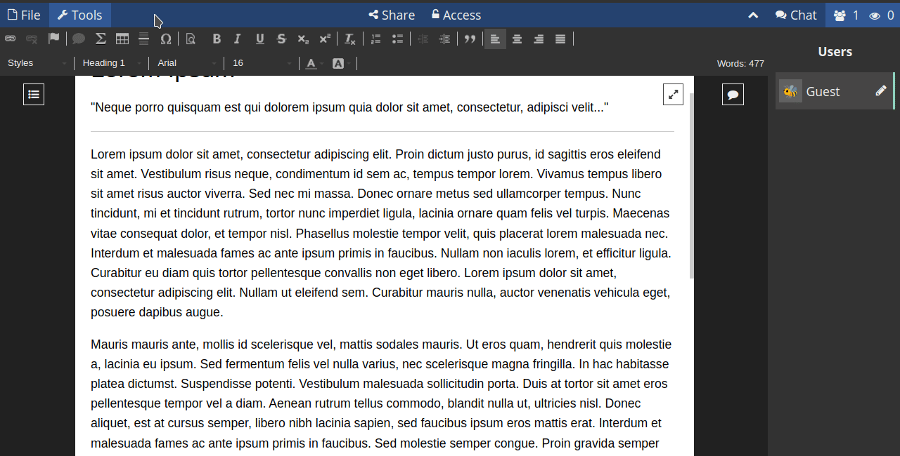

# CryptPad Basics

# Documents management

## Create a document
To create a new document you can either do it from the **CryptPad** main page...

or from the **CryptDrive** by clicking the **+ New** button.

If you create a document from the main page, once it is open, a message will prompt in the lower right corner asking you whether you want to store it or not.

You can configure how CryptPad should manage the pads you visit (set if they are automatically or manually stored) in the **Confidentiality** tab at your [**user settings**](../configurations#confidentiality).

If you choose to store them, a message will appear indicating they were added to your drive.

Now you can access the document from your drive.

## Saving changes
CryptPad automatically saves the changes made on documents. Under the title, you will see a notification when changes have been saved.

## Toolbar & pads options

The main options you will find in the **toolbar** are:

1. **File**: here you have several options regarding the document you are working on

- **+ New**: create a new document.

- **Snapshots**: it creates a specific point in the document history that you can name and use as a reference. To create a snapshot from the current state of a document, click on this option and giving it a name. Also from this same menu you can view (open), restore and/or delete snapshots.

- **History**: the history of a document is automatically saved and you can navigate to a certain point and restore it if you needed. To view and restore the history of a document, click on this option and use the arrows to navigate between each edit, each author or each editing session (when the same group of authors was connected to the document) in the history. Once you have found the desired version, click on the **RESTORE** button to restore it. You can also make a snapshot from the history line of a pad.

- **Import**: to import a document from a local file.

- **Make a copy**: creates a duplicate of a file.

- **Export**: exports the document to a local file in .html, .md or .doc format.

- **Print**: prints the document or exports it to a .pdf file.

- **Move to trash**: removes a document from your drive (although it could remain in other users' drive who have store it).

- **Properties**: get the current document properties.

  * Document identifier: it is the file identifier (you can use it to share with an instance administrator in case of an issue). **This does not expose the content of the document.**

  * **Editing** and **Read-only** links (depending on your permissions) to share).

  * **Creation** and **Last access** dates.

- **Help**: access the documentation regarding the application in use.

2. **Tools**: to hide/show the application tools

## Users & Chat
You can interact with other users connected to the same document through the **User list** and the **Chat**.

## Share
As guest user, you have two ways to share documents (Contacts sharing requires to be logged in):

- via a **Link**: this option provides a link that can be shared through the medium of your choice.
- or **embedding** it: this allow you to display a document on a web page.

In any of the cases, access rights can be set to allow the recipient to **Edit** the pad or to only **View** it.

!! The Access feature is disable for guest users

