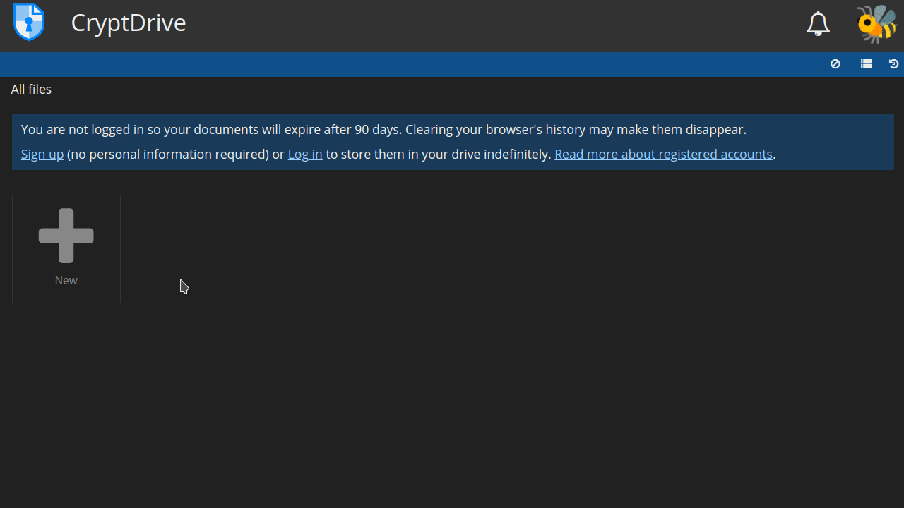
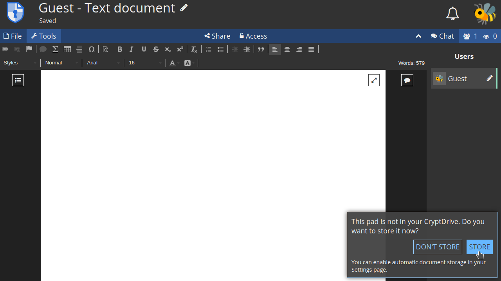
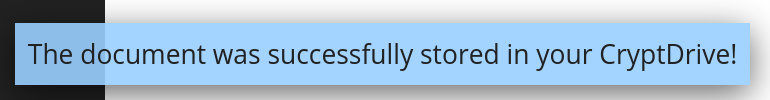
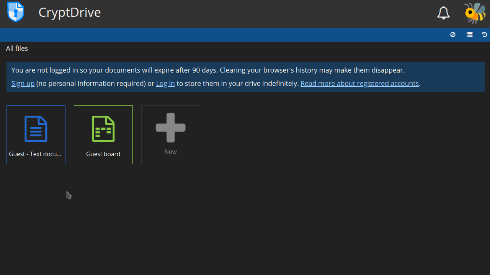
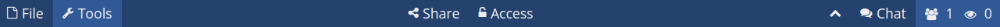
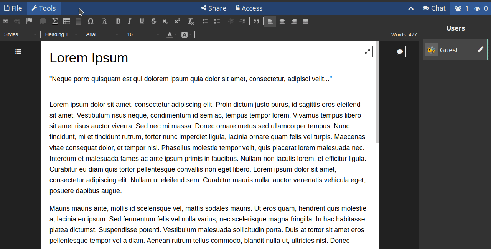
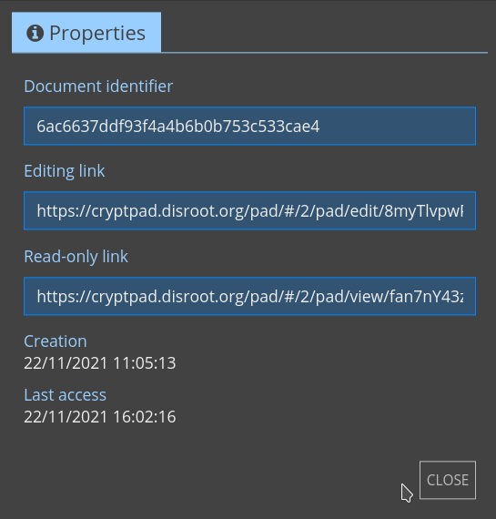
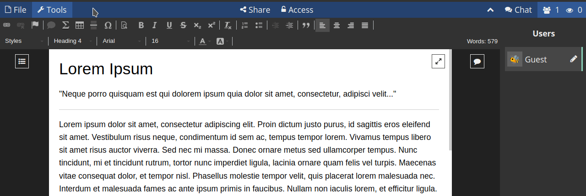
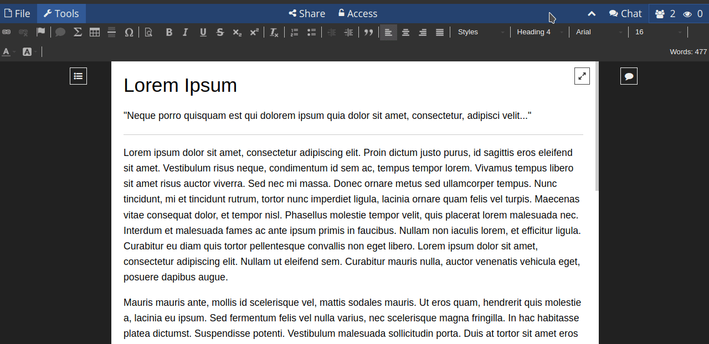

# Les bases de CryptPad

# Gestion des documents

## Créer un document
Pour créer un nouveau document, vous pouvez soit le faire à partir de la page principale de **CryptPad**...

ou depuis le **CryptDrive** en cliquant sur le bouton **+ Nouveau**.

Si vous créez un document à partir de la page principale, une fois qu'il est ouvert, un message s'affiche dans le coin inférieur droit pour vous demander si vous souhaitez le stocker ou non.

Vous pouvez configurer la manière dont CryptPad doit gérer les pads que vous visitez (définir s'ils sont stockés automatiquement ou manuellement) dans l'onglet **Confidentialité** de vos [**paramètres utilisateur**].(../configurations#confidentiality).

Si vous choisissez de les stocker, un message apparaîtra pour indiquer qu'ils ont été ajoutés à votre disque.

Vous pouvez maintenant accéder au document depuis votre "disque".

## Sauvegarde des changements
CryptPad enregistre automatiquement les modifications apportées aux documents. Sous le titre, vous verrez une notification lorsque les modifications ont été enregistrées.

## Options de la barre d'outils & des pads

Les principales options que vous trouverez dans la **barre d'outils** sont les suivantes :

1. **Fichier** : vous disposez ici de plusieurs options concernant le document sur lequel vous travaillez.

- **+ Nouveau** : crée un nouveau document.

- **Snapshots** : il crée un point spécifique dans l'historique du document que vous pouvez nommer et utiliser comme référence. Pour créer un instantané de l'état actuel d'un document, cliquez sur cette option et donnez-lui un nom. À partir de ce même menu, vous pouvez également afficher (ouvrir), restaurer et/ou supprimer des instantanés.

- **Historique** : l'historique d'un document est automatiquement sauvegardé et vous pouvez naviguer jusqu'à un certain point et le restaurer si nécessaire. Pour visualiser et restaurer l'historique d'un document, cliquez sur cette option et utilisez les flèches pour naviguer entre chaque édition, chaque auteur ou chaque session d'édition (lorsque le même groupe d'auteurs était connecté au document) dans l'historique. Une fois que vous avez trouvé la version souhaitée, cliquez sur le bouton **RESTAURER** pour la restaurer. Vous pouvez également faire un instantané à partir de la ligne d'historique d'un bloc.

- **Importer** : pour importer un document à partir d'un fichier local.

- **Faire une copie** : crée un duplicata d'un fichier.

- **Exporter** : exporte le document vers un fichier local au format .html, .md ou .doc.

- **Imprimer** : imprime le document ou l'exporte vers un fichier .pdf.

- **Déplacer vers la corbeille** : supprime un document de votre disque (bien qu'il puisse rester dans le disque d'autres utilisateurs qui l'ont stocké).

- **Propriétés** : obtient les propriétés du document actuel.

* Identifiant du document : c'est l'identifiant du fichier (vous pouvez l'utiliser pour le partager avec un administrateur d'instance en cas de problème). **Ceci n'expose pas le contenu du document.**

* Liens **Modification** et **Lecture seule** (en fonction de vos autorisations) à partager).

* Dates de création** et **dernier accès**.

- **Aide** : accéder à la documentation relative à l'application utilisée.

2. **Outils** : pour masquer/afficher les outils de l'application.

## Utilisateurs et Chat
Vous pouvez interagir avec d'autres utilisateurs connectés au même document par le biais de la **liste d'utilisateurs** et du **Chat**.

## Partager
En tant qu'utilisateur invité, vous avez deux façons de partager des documents (le partage des contacts nécessite d'être connecté) :

- via un **lien** : cette option fournit un lien qui peut être partagé sur le support de votre choix.
- ou par une **intégration** : cette option permet d'afficher un document sur une page web.

Dans tous les cas, des droits d'accès peuvent être définis pour permettre au destinataire de **Modifier** le bloc ou de seulement **Voir**.

!! La fonction d'accès est désactivée pour les utilisateurs invités

