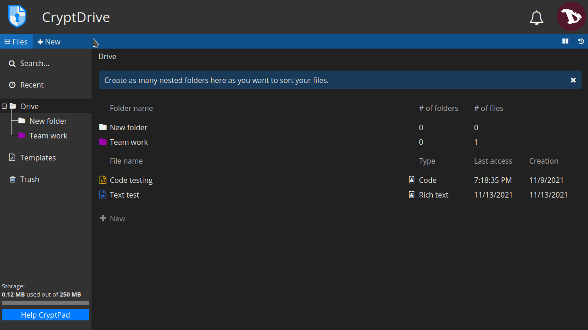
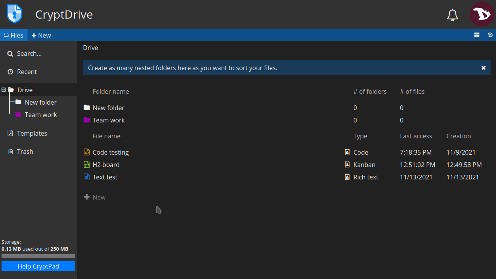
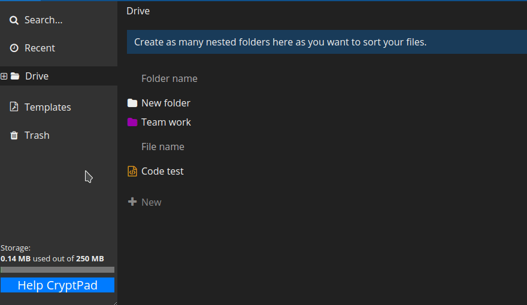
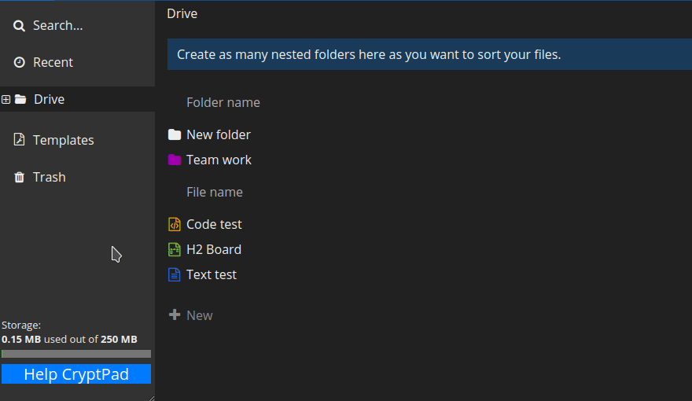
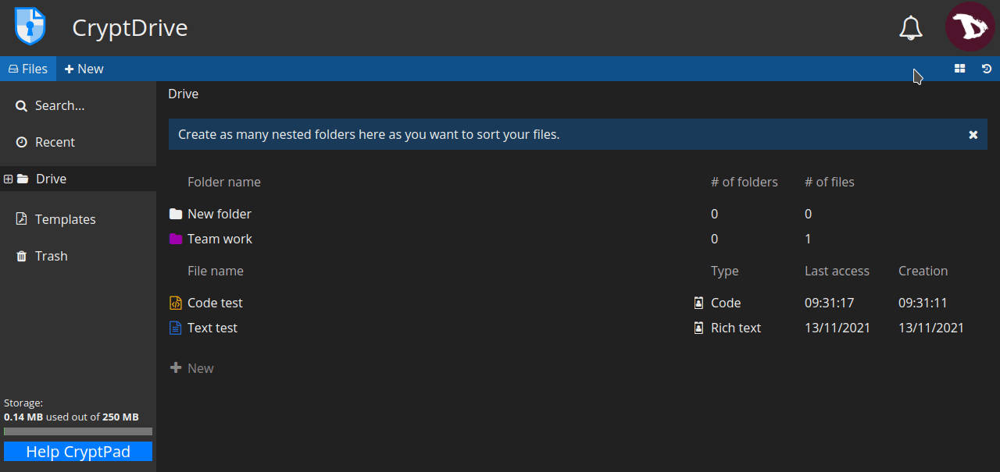
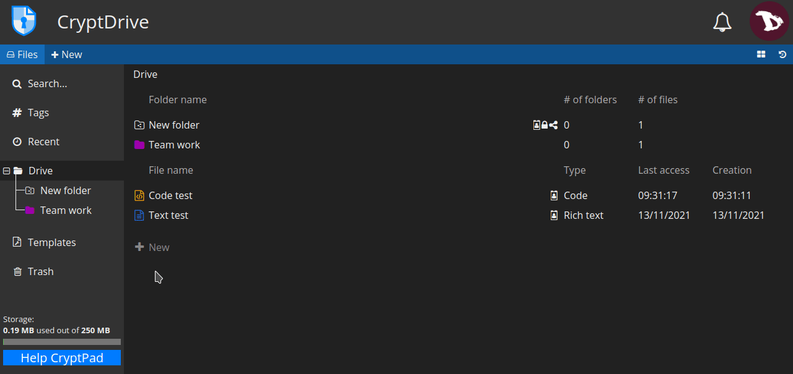
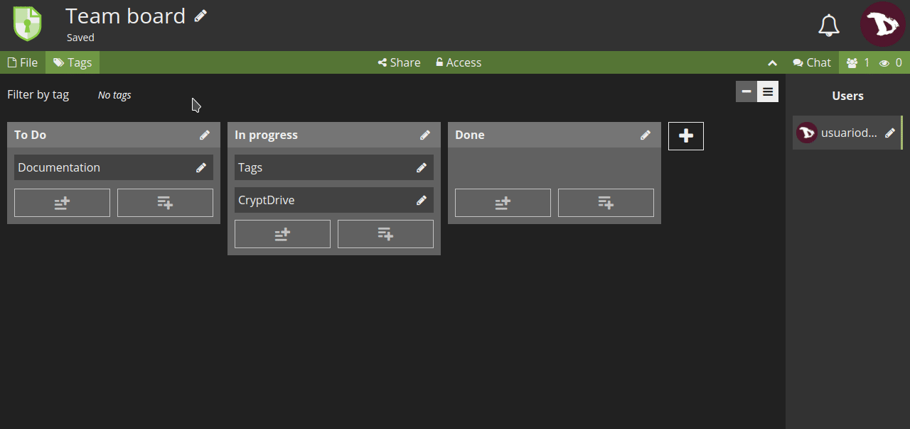
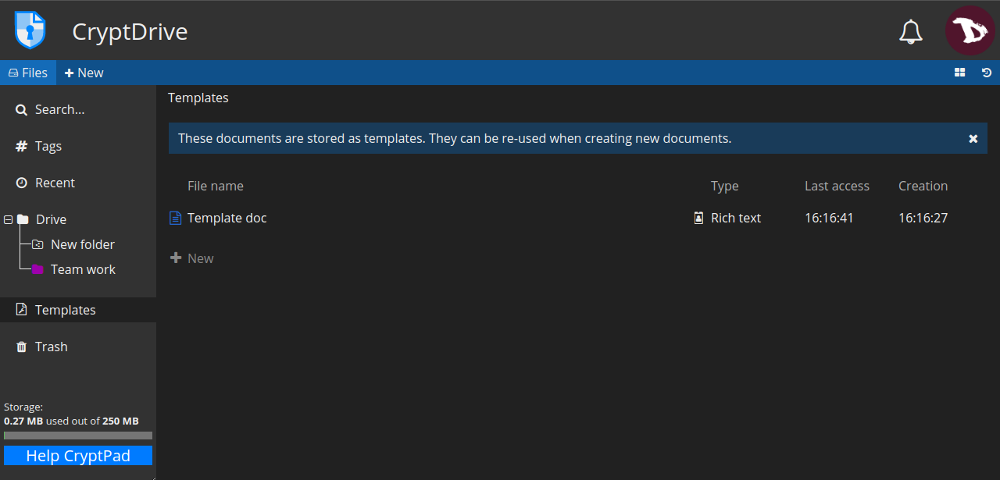
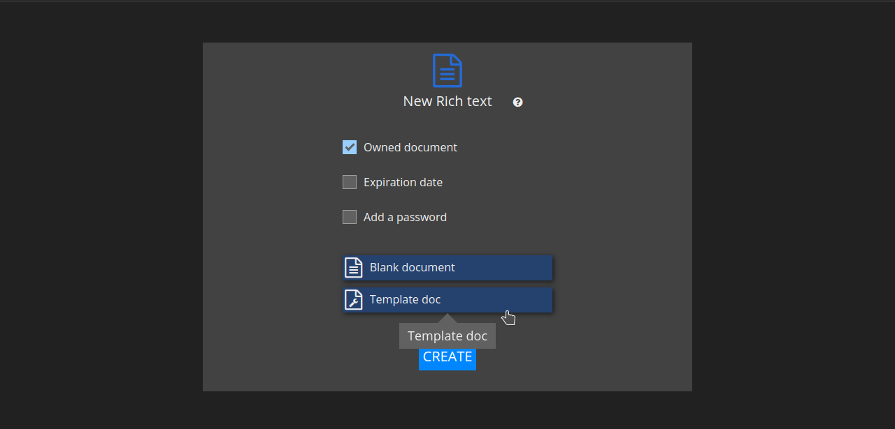

# CryptDrive
CryptDrive is where documents are stored and managed. It is the default landing page for **registered** users. You can also access it from the user menu.

## Display
You can choose to display your documents as a list or a grid. To switch between them, click on the view button at the right under the user avatar.

In grid mode, documents thumbnails are displayed. These can be turned on/off in the [**user settings**](../users/registered/settings#cryptdrive-settings).

# Documents management
Most common operations on folders can be done from the right-click menu. But there are also other ways.

## Create a folder
There are several ways to create a folder:
  - clicking **+ New** option either at the toolbar or the main window (list mode or grid mode),
  - right-clicking, or
  - pressing `Ctrl` + `e` keys and selecting **Folder**.

Once the folder has been created, you can add documents to it by dragging them from the drive.

## Change folder color
To change a folder color, right-click on the folder you want to modify, select **Change color** and pick up a new color from the palette.

## Rename a folder
To rename a folder, right-click on the folder you want to rename, select **Rename** and edit the folder name.

## Renaming documents
You can rename a document just for you or for all users you are working with.

## To rename a document in your drive
- Right-click on a document, select **Rename**, change it and press `Enter`.

A flag icon will indicate that a document title is different in your drive than for other users.

## To rename a document for all users
- Access a document, click on the pencil icon at the right of its name, modify the name and click on the `✓` icon or press `Enter` to save it.

## Deleting a document
There are two options to delete a document:

1. **Move to trash**: this will send a document to your **Trash** can but it will remains in the CryptDrive database for other users who have previously stored it. The document can be recovered using the drive **history**.

  

 - You can remove a document by dragging it to the **Trash**, right-clicking on it and selecting **Move to trash** or selecting it and pressing the `Del` key.

 - To remove a document from the drive without storing it in the **Trash** first, select it and press the `Shift` + `Del` keys.

 - To empty the **Trash** just right-click on the **Trash** tab and select **Empty the trash** or click on the **Trash** tab and then **EMPTY THE TRASH** button. 
 In any case, if you are the owner of some documents in the trash when you empty it, you will be prompted to decide if you want to **REMOVE** or **DESTROY** them.

  

2. **Detroy**: this action deletes a document from the database permanently. Destroying a document will delete it from all users drives that have store it, and it cannot be recovered again.

  

 - To destroy a document, right-click on it and select **Destroy**.

!! Remember that if a document is not stored in any CryptDrive, it is automatically destroyed from the database after 90 days.

!! **NOTE** 
!! Once destroyed, documents may still appear in other user's CryptDrives. Once a document has been added to someone's drive, the encrypted nature of CryptPad makes it impossible to take it back. Therefore a destroyed document may still appeared in a user's drive if they had previously stored it. However, they will not be able to open the document.

## History
CryptDrive saves a history of versions that can be restored if you need it.

To restore a version:
- click on the history button at the right of the toolbar, under the user avatar;
- navigate the history with the **|<< |<** and **>| >>|** arrows;
- once you find the version you were looking for, restore it by clicking on **RESTORE**. To exit the history without restoring, click on **CLOSE**.

!! **NOTE on shared folders** 
!! Shared folders have their own history, separate from the CryptDrive's one. Restoring the history of the drive does not affect shared folders, conversely the history of a shared folder can be restored without affecting the rest of the drive.

## Tags
You can group documents in multiple categories by using tags. Your tags will not be visible to other users.

- To add or remove tags from a document in CryptPad: 
  Right-click on the document and select **Tags**

- To add or remove tags from a document: 
  Go to **File** -> **Tags**

- To add tags to multiple files: 
  1. Select the documents with the `Ctrl` + click,
  2. right-click on the selected files and then **Tags**

## Templates
Templates are useful to create documents that has similar structure, avoiding creating new ones from the start.

To create a template, you can:
1. go to the **Template** tab and select **+ New**, or
2. from an existing document, go to **File** -> **Save as template**

Now to use a template, you can:
1. select it when creating a new document,

2. in an existing document, go to **File** -> **Import a template**. Keep in mind that **this option replaces the contents** of the document with the template.

