# CryptDrive
CryptDrive est l'endroit où les documents sont stockés et gérés. C'est la page d'accueil par défaut pour les utilisateurs **enregistrés**. Vous pouvez également y accéder à partir du menu utilisateur.

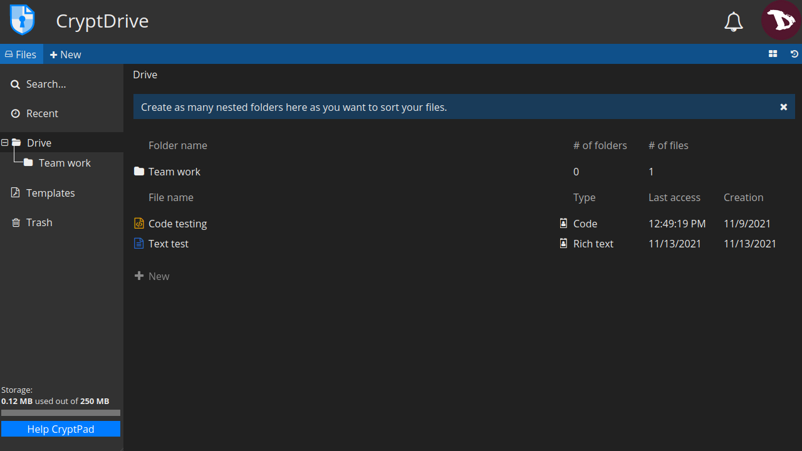

## Affichage
Vous pouvez choisir d'afficher vos documents sous forme de liste ou de grille. Pour passer de l'un à l'autre, cliquez sur le bouton d'affichage situé à droite sous l'avatar de l'utilisateur.

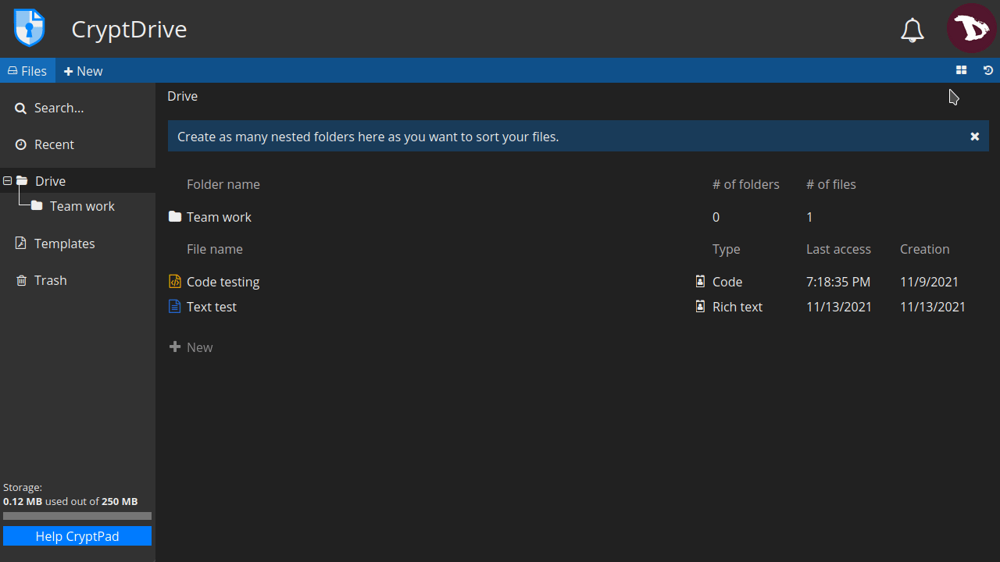

En mode grille, les vignettes des documents sont affichées. Elles peuvent être activées/désactivées dans les [**paramètres utilisateur**](../users/registered/settings#cryptdrive-settings).

# Gestion des documents
La plupart des opérations courantes sur les dossiers peuvent être effectuées à partir du menu du clic droit. Mais il existe aussi d'autres moyens.

## Créer un dossier
Il existe plusieurs façons de créer un dossier :
  - en cliquant sur l'option **+ Nouveau** soit dans la barre d'outils, soit dans la fenêtre principale (mode liste ou mode grille),
  - en cliquant avec le bouton droit de la souris, ou
  - en appuyant sur les touches `Ctrl` + `e` et en sélectionnant **Dossier**.

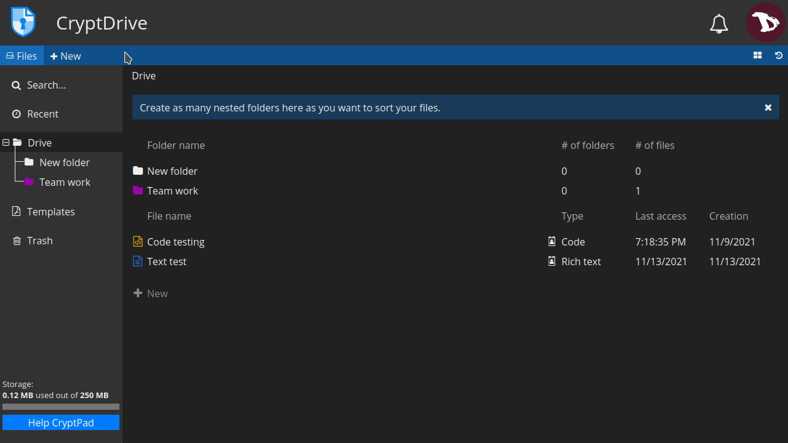

Une fois le dossier créé, vous pouvez y ajouter des documents en les faisant glisser depuis le lecteur.

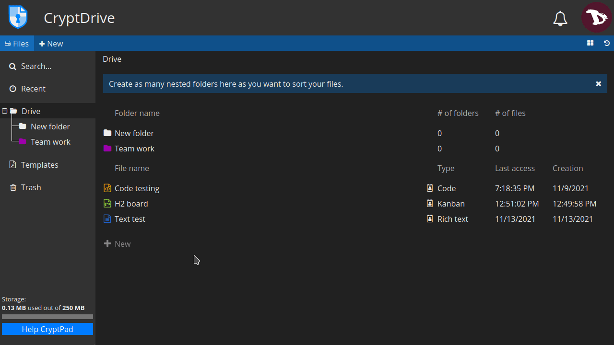

## Changer la couleur d'un dossier
Pour modifier la couleur d'un dossier, cliquez avec le bouton droit de la souris sur le dossier à modifier, sélectionnez **Changer de couleur** et choisissez une nouvelle couleur dans la palette.

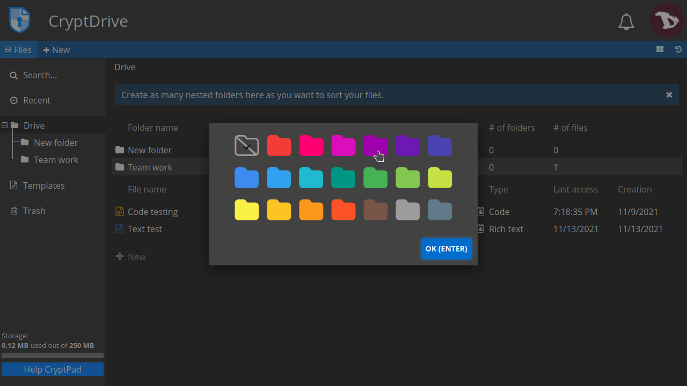

## Renommer un dossier
Pour renommer un dossier, cliquez avec le bouton droit de la souris sur le dossier que vous souhaitez renommer, sélectionnez **Renommer** et modifiez le nom du dossier.

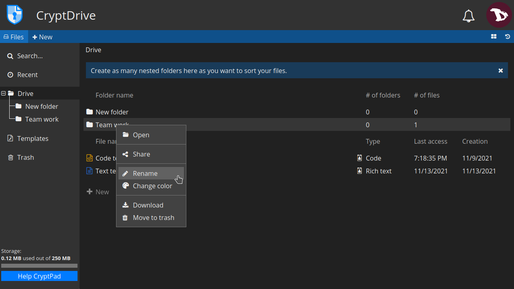

## Renommer des documents
Vous pouvez renommer un document uniquement pour vous ou pour tous les utilisateurs avec lesquels vous travaillez.

## Pour renommer un document dans votre lecteur
- Cliquez avec le bouton droit de la souris sur un document, sélectionnez **Renommer**, modifiez-le et appuyez sur `Entrée`.

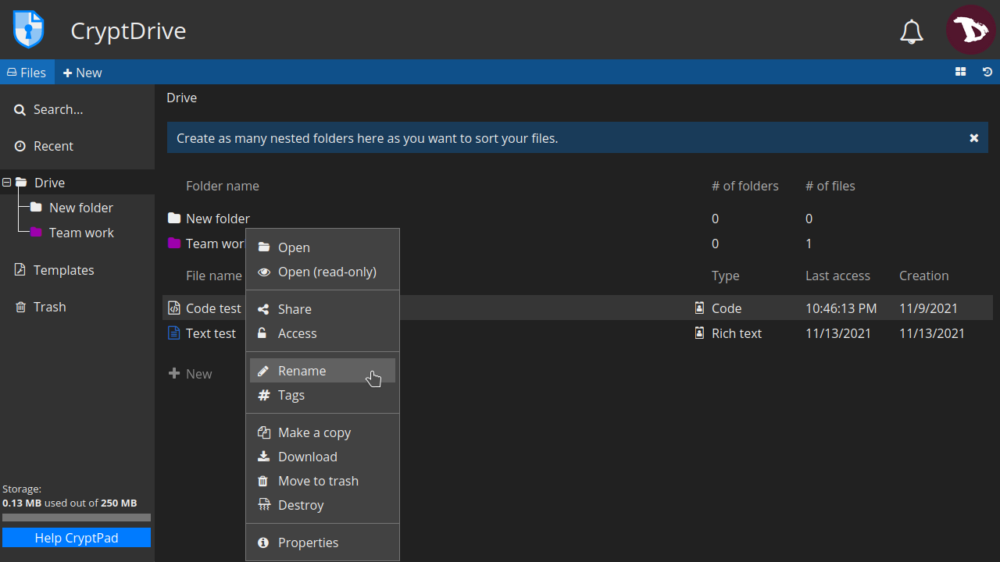

Une icône en forme de drapeau indique que le titre d'un document est différent dans votre lecteur et pour les autres utilisateurs.

## Pour renommer un document pour tous les utilisateurs
- Accédez à un document, cliquez sur l'icône crayon à droite de son nom, modifiez le nom et cliquez sur l'icône `✓` ou appuyez sur `Enter` pour l'enregistrer.

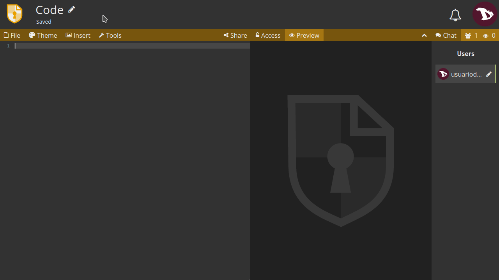

## Suppression d'un document
Il existe deux possibilités pour supprimer un document :

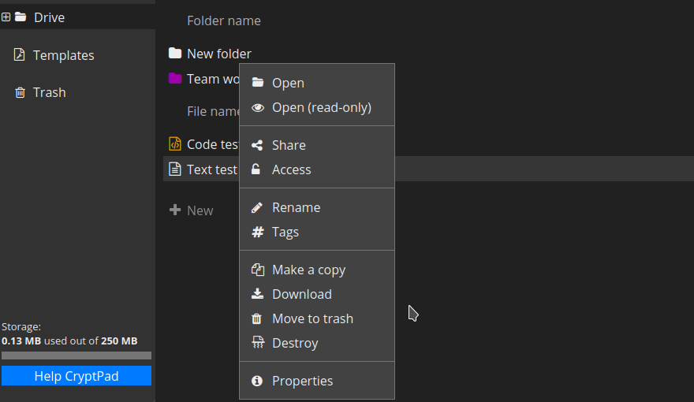

1. **Déplacer vers la poubelle** : ceci enverra un document vers votre **poubelle** mais il restera dans la base de données CryptDrive pour les autres utilisateurs qui l'ont précédemment stocké. Le document peut être récupéré en utilisant l' **historique** du lecteur.

  

  - Vous pouvez supprimer un document en le faisant glisser vers la **Corbeille**, en cliquant dessus avec le bouton droit de la souris et en sélectionnant **Déplacer vers la corbeille** ou en le sélectionnant et en appuyant sur la touche `Del`.

  - Pour supprimer un document du lecteur sans le mettre d'abord dans la **Corbeille**, sélectionnez-le et appuyez sur les touches `Shift` + `Del`.

  - Pour vider la **Corbeille**, il suffit de faire un clic droit sur l'onglet **Corbeille** et de sélectionner **Vider la corbeille** ou de cliquer sur l'onglet **Corbeille** puis sur le bouton **Vider la corbeille**. 
  Dans tous les cas, si vous êtes le propriétaire de certains documents dans la corbeille lorsque vous la videz, vous serez invité à décider si vous voulez les **REMOVE** ou **DESTROY**.

  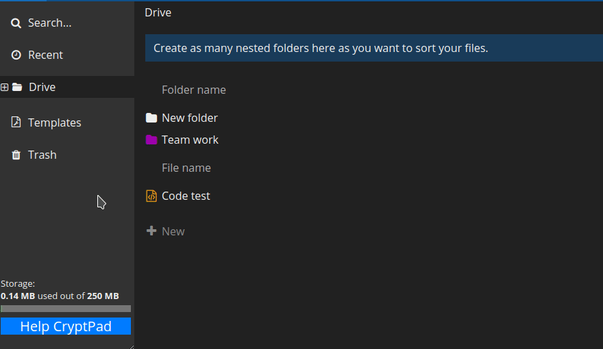

2. **Détruire** : cette action supprime définitivement un document de la base de données. La destruction d'un document le supprimera de tous les lecteurs des utilisateurs qui l'ont stocké, et il ne pourra plus être récupéré.

  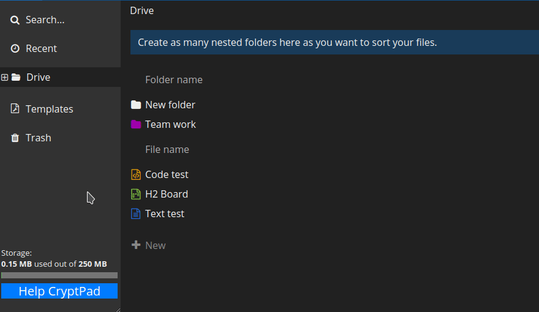

  - Pour détruire un document, cliquez dessus avec le bouton droit de la souris et sélectionnez **Destroy**.

!! Rappelez-vous que si un document n'est pas stocké dans un CryptDrive, il est automatiquement détruit de la base de données après 90 jours.

!! **Remarque** 
!! Une fois détruits, les documents peuvent encore apparaître dans les CryptDrives d'autres utilisateurs. Une fois qu'un document a été ajouté au lecteur de quelqu'un, la nature cryptée de CryptPad fait qu'il est impossible de le reprendre. Par conséquent, un document détruit peut encore apparaître dans le lecteur d'un utilisateur si celui-ci l'avait précédemment stocké. However, they will not be able to open the document.

## Historique
 CryptDrive enregistre un historique des versions qui peut être restauré en cas de besoin.

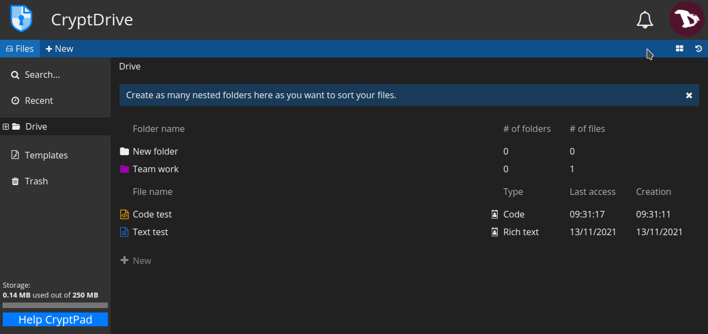

Pour restaurer une version :
- cliquer sur le bouton historique à droite de la barre d'outils, sous l'avatar de l'utilisateur ;
- naviguer dans l'historique avec les flèches **|<<<** et **>| >>|** ;
- une fois la version recherchée trouvée, restaurez-la en cliquant sur **RESTORE**. Pour quitter l'historique sans restaurer, cliquez sur **FERMER**..

!! **Remarque sur les dossiers partagés** .
!! Les dossiers partagés ont leur propre historique, séparé de celui du CryptDrive. Restaurer l'historique du lecteur n'affecte pas les dossiers partagés, inversement l'historique d'un dossier partagé peut être restauré sans affecter le reste du lecteur.

## Balises
Vous pouvez regrouper des documents dans plusieurs catégories en utilisant des balises. Vos balises ne seront pas visibles par les autres utilisateurs.

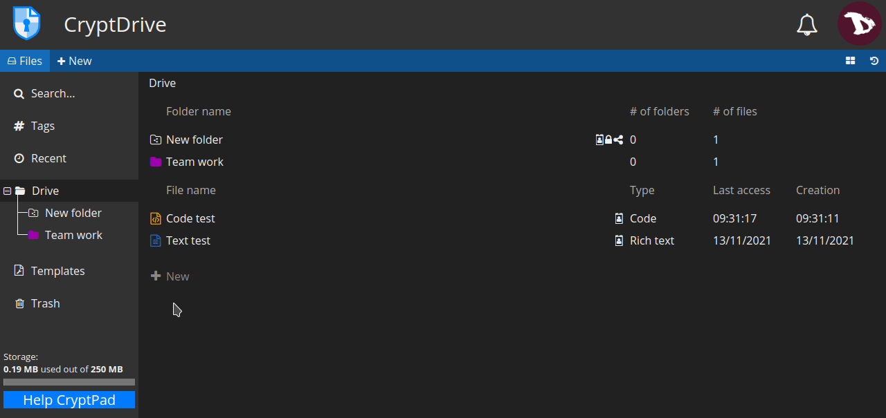

- Pour ajouter ou supprimer des balises d'un document dans CryptPad: 
  Cliquez avec le bouton droit de la souris sur le document et sélectionnez **Balises**.

- Pour ajouter ou supprimer des balises dans un document : 
  Allez dans **Fichier** -> **Balises**.

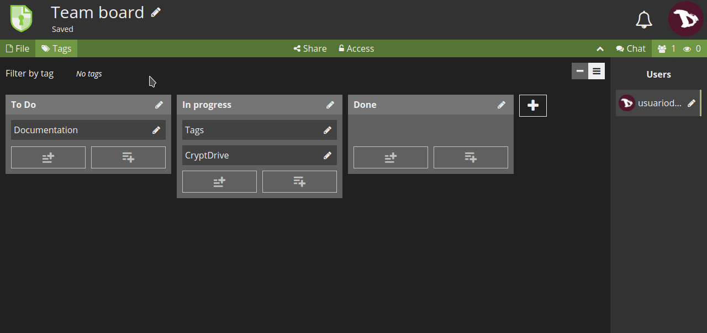

- Pour ajouter des balises à plusieurs fichiers : 
  1. Sélectionnez les documents avec le `Ctrl` + clic,
  2. cliquez avec le bouton droit de la souris sur les fichiers sélectionnés, puis sur **Balises**.

## Modèles
Les modèles sont utiles pour créer des documents dont la structure est similaire, ce qui évite d'en créer de nouveaux dès le départ.

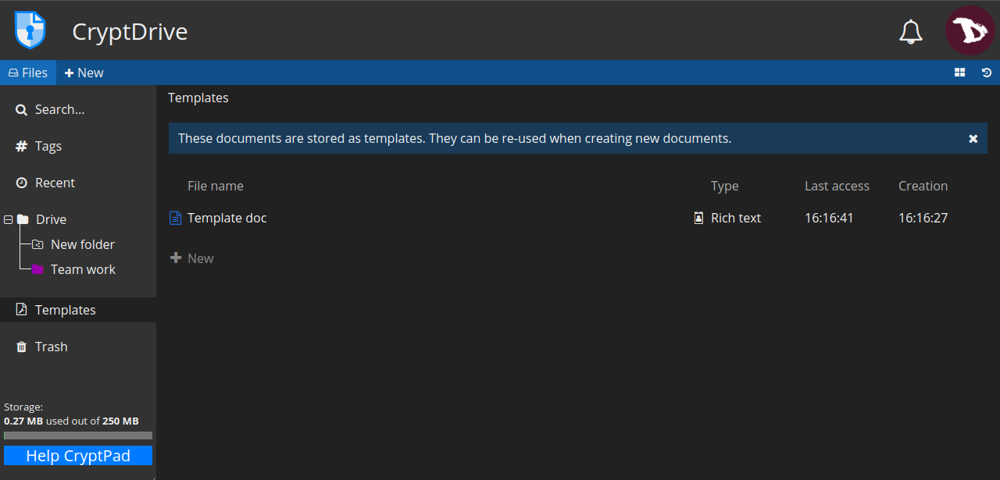

Pour créer un modèle, vous pouvez :
1. aller dans l'onglet **Modèle** et sélectionner **+ Nouveau**, ou
2. à partir d'un document existant, aller dans **Fichier** -> **Enregistrer comme modèle**.

Pour utiliser un modèle, vous pouvez :
1. le sélectionner lors de la création d'un nouveau document,

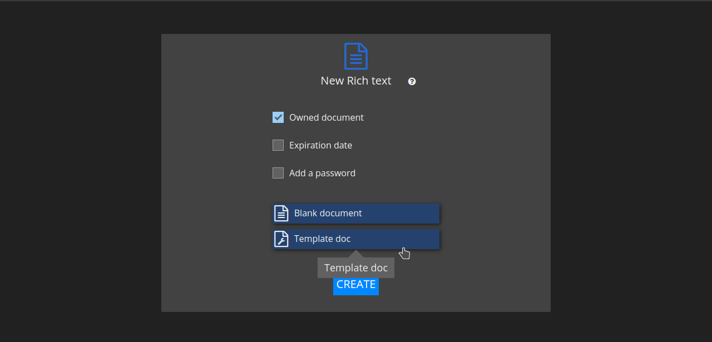

2. dans un document existant, allez dans **Fichier** -> **Importer un modèle**. Gardez à l'esprit que **cette option remplace le contenu** du document par le modèle.

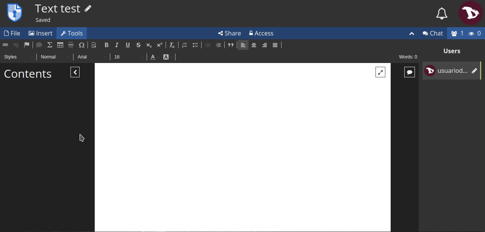
