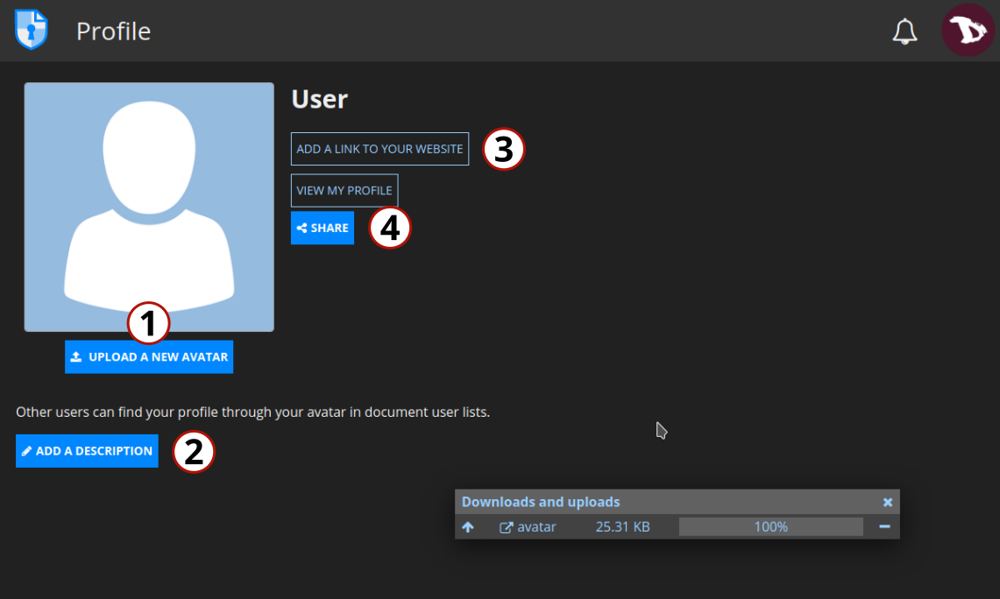
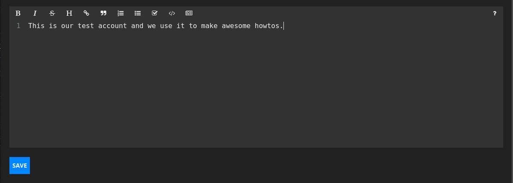
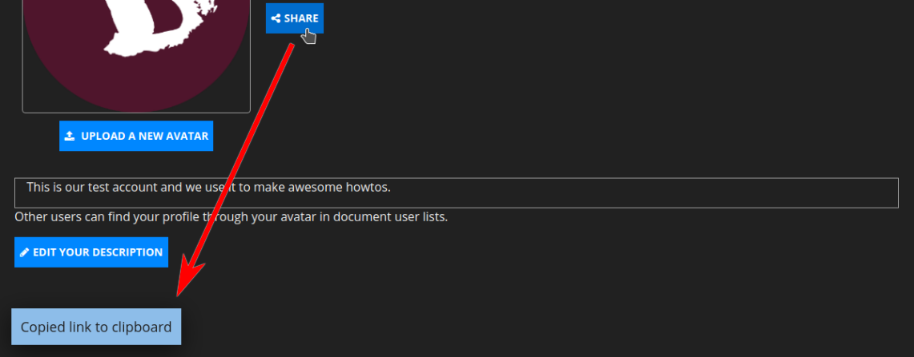

# Profile
Registered users have a **Profile** option enabled where they can customize:

1. The **avatar**, by uploading an image.

2. Add a description.

3. Add a link to a website.

4. Share the profile via a link.

