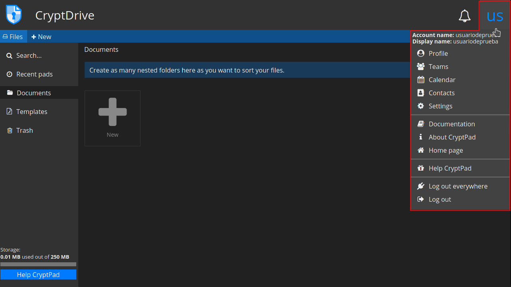

# Registered user configurations
Registered users have additional functionalities enabled:

- Storage space for documents is personal, permanent and can host multimedia files.
- File management options:
  * add a password, an expiry date, or an access list.
  * organize documents in folders, shared folders, or with tags and templates.
- Create and work with Teams.
- Profile customization
- Contacts list to share documents and chat with.
- Notifications for interactions between contacts.

To access your configurations, click on the user menu at the top right (the first time you log in it will show the first 2 letters of your display name).

In the user menu you will find the following options:

- [Profile](../profile)
- [Teams](../teams)
- [Calendar & Contacts](../calendar-contacts)
- [Settings](../settings)
