# Teams
**Teams** are shared spaces between a group of users. A team has its own **CryptDrive**, chat, and a list of members with roles and permissions. Let's see how it works.

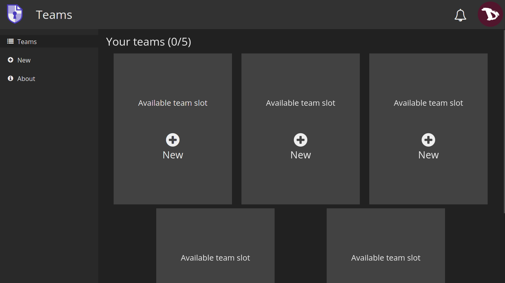

## Create a Team
To create a Team go to the user menu
1. select **Teams**,
2. then **New**
3. and finally rename it as you want/need.

## Team Drive

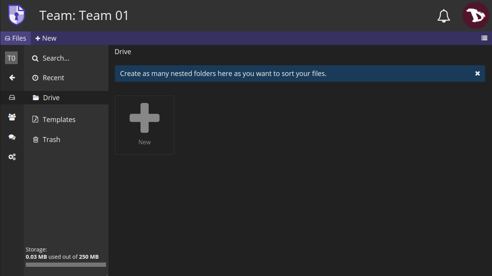

The team drive is the storage space shared between members of the team and it works just like the personal **CryptDrive**.

## Team Members
Team members management is done from the **Members** tab.
1. Select a Team,
2. move the mouse to the left
3. and select **Members**

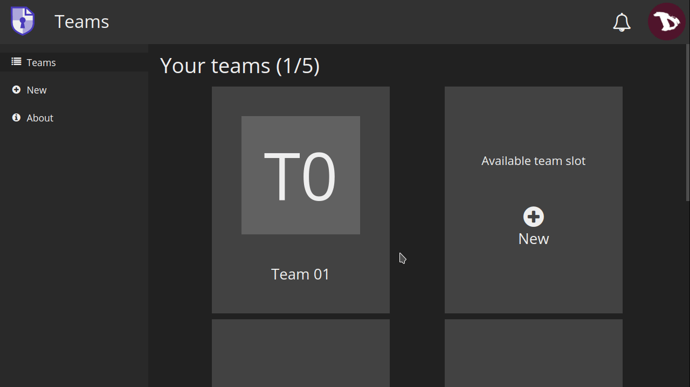

### Invite members

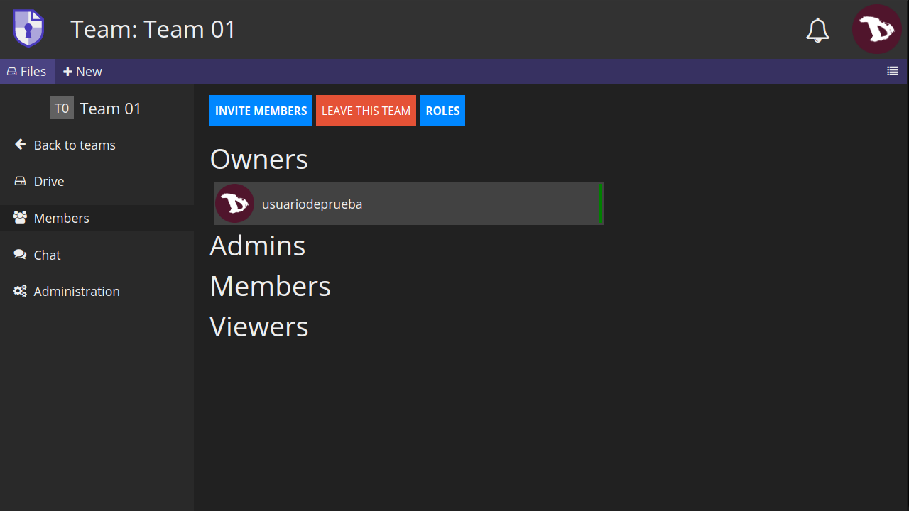

You can
1. invite someone who is already in your **Contacts** (see **Calendar & Contacts** to learn how to add a contact)

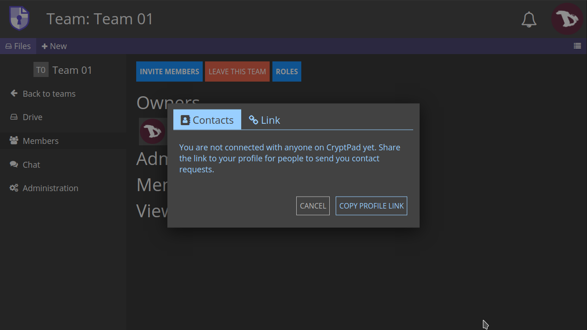

2.  or by sending an invitation.

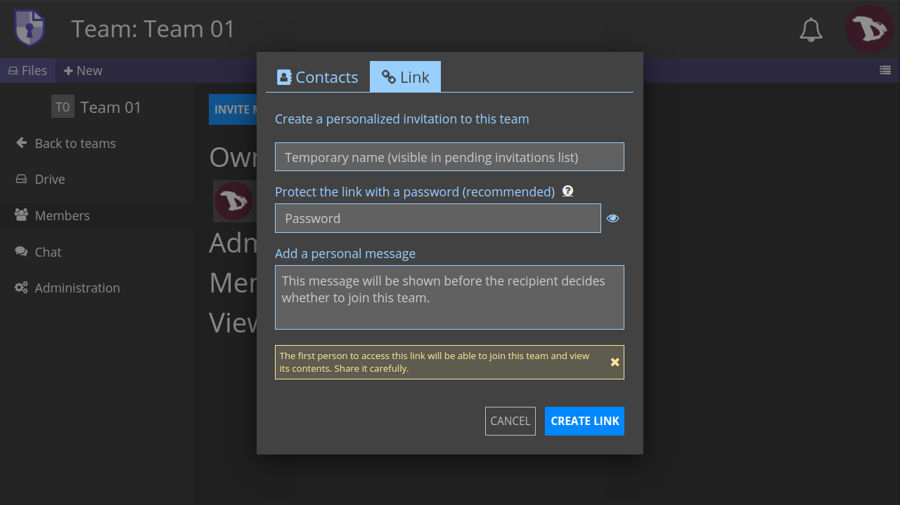

* **Temporary name**: The name used to identify the invitation link in your pending invitations list.

* **Password**: Add a password to protect the link (this is optional, but it is highly recommended to do it).

* **Personal message**: You can write a message that the recipient will see before they decide to accept the invitation to join the team.

Once you are done, click on **CREATE LINK**

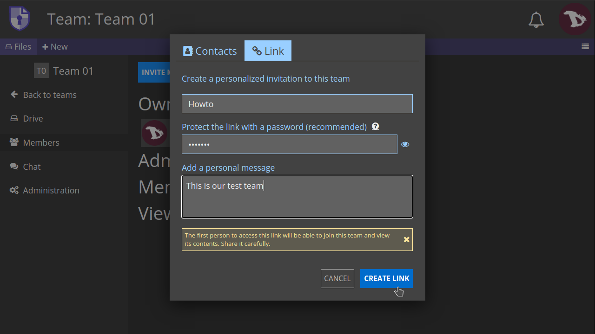

You will see a **Copied link to clipboard** message and the **pending invitation list**

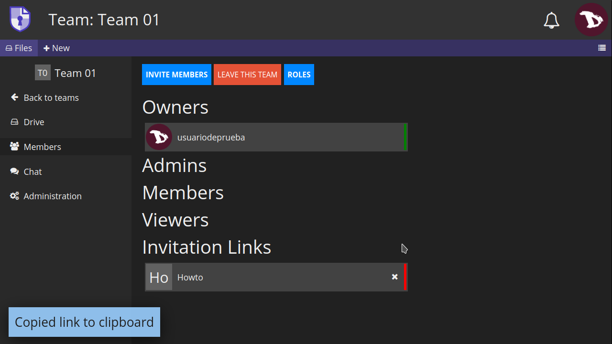

!! The **first person** to get the *invitation link* will be able to join the Team and access its content, so double check before you share it.

Once the invitation is accepted you will see the new member in your **Members** roster.

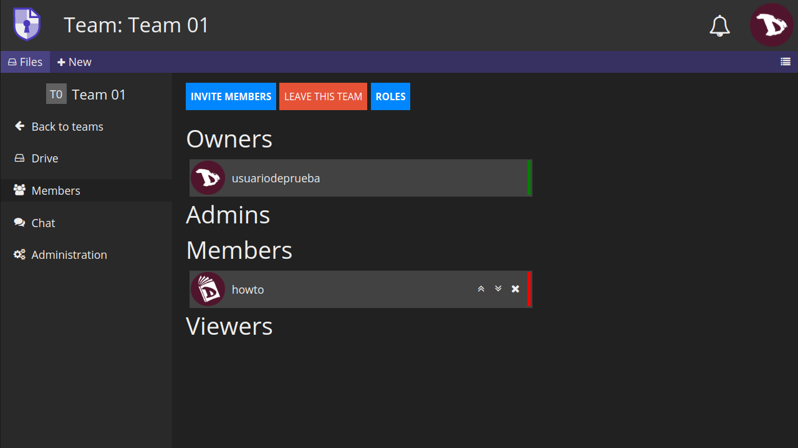

## Members administration
Each member has a role that can be changed in the team roster. Admins and Owners of a team can manage members of equal or lower role by clicking on the icons at the right of a member name.

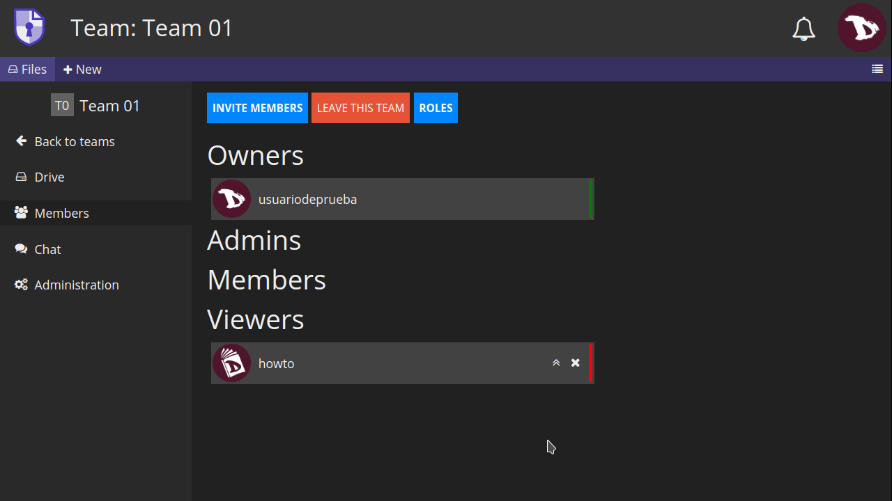

The options are:

* **Promote** members to a higher role,
* **Demote** them to a lower role or
* **Kick** them from the team.

Each **role** has its own set of **permissions**

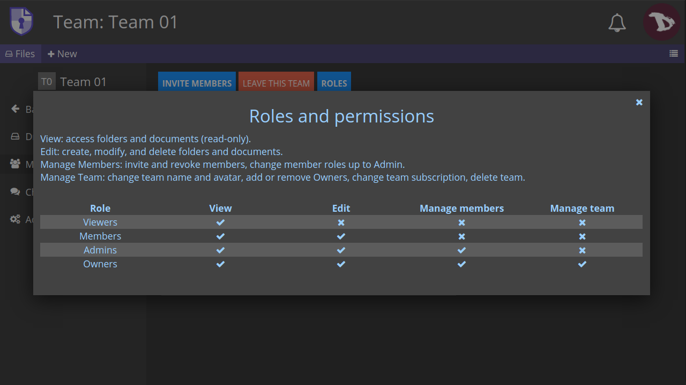

- **View**: members can access folders and pads in read-only mode.
- **Edit**: members can create, modify, and delete folders and pads.
- **Manage Members**: members can invite, revoke and change other members roles.
- **Manage Team**: members can change team name and avatar, add or remove Owners, change team subscription and delete teams.

## Team Chat

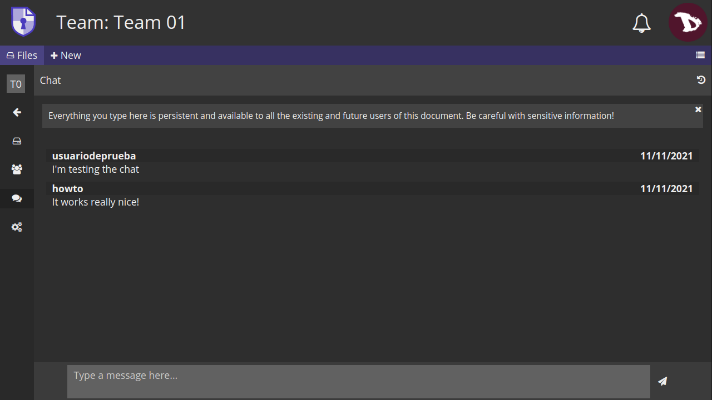

You can use the chat to communicate with all team members.

## Team administration
Team owners can access and manage some global aspects of the teams.

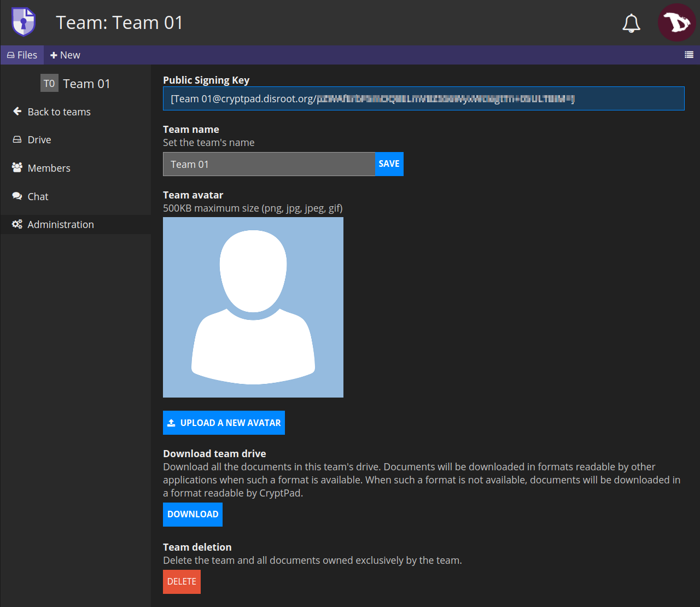

- **Public signing key**: It is used to identify a team on instances that offer subscriptions.

- **Team name**: Here you can change the name of a team.

- **Team avatar**: Add or modify a team avatar.

- **Download team drive**: You can save the content of all documents in the team drive. *When possible, this is done in a format that is readable by other software. Some applications produce files that are only readable by CryptPad*.

- **Team deletion**: This option will permanently delete a team  and all of its documents.
