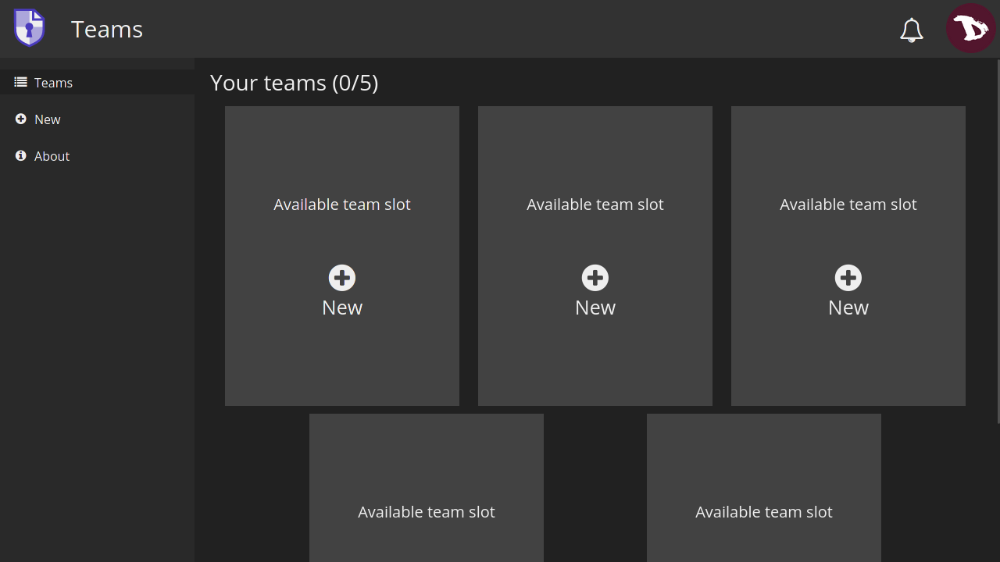
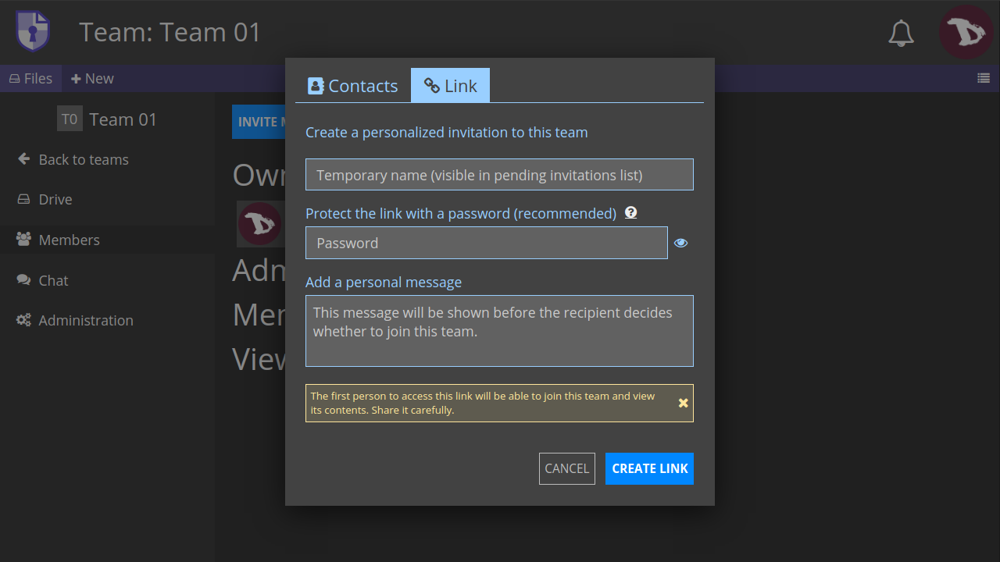
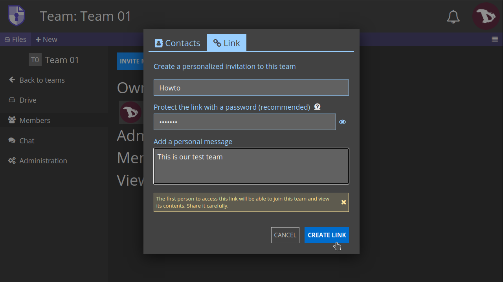
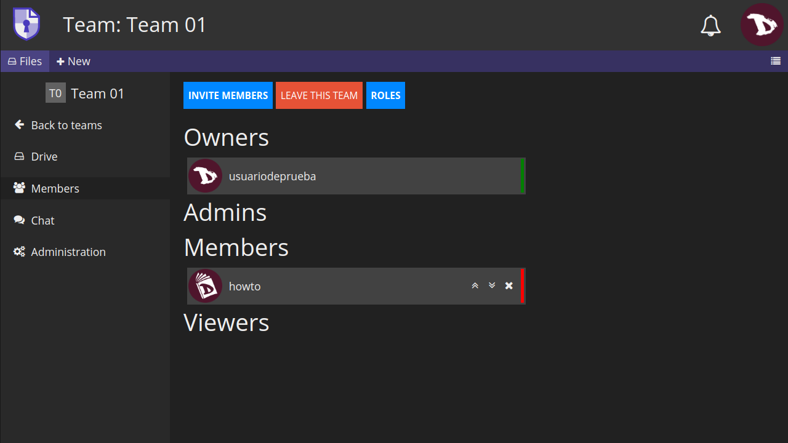
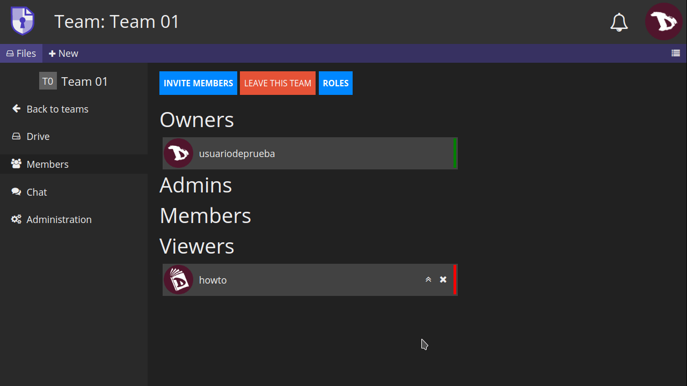

# Équipes
**Les équipes** sont des espaces partagés entre un groupe d'utilisateurs. Une équipe a son propre **CryptDrive**, son chat, et une liste de membres avec des rôles et des permissions. Voyons comment cela fonctionne.

## Créer une équipe
Pour créer une équipe, allez dans le menu utilisateur
1. sélectionnez **Équipes**,
2. puis **Nouveau**
3. et enfin renommez-la comme vous le voulez/en avez besoin.

## Le "disque" d'équipe

Le disque d'équipe est l'espace de stockage partagé entre les membres de l'équipe et il fonctionne exactement comme le **CryptDrive** personnel.

## Membres de l'équipe
La gestion des membres de l'équipe se fait à partir de l'onglet **Membres**.
1. Sélectionnez une équipe,
2. et ensuite **Membres** dans les onglets de gauche.

### Inviter des membres

Vous pouvez
1. inviter une personne qui figure déjà dans vos **Contacts** (voir [**Contacts**](../contacts) pour savoir comment ajouter un contact)

2. ou en envoyant une invitation.

* **Nom temporaire** : Le nom utilisé pour identifier le lien d'invitation dans votre liste d'invitations en attente.

**Mot de passe** : Ajoutez un mot de passe pour protéger le lien (ceci est facultatif, mais il est fortement recommandé de le faire).

**Message personnel** : Vous pouvez écrire un message que le destinataire verra avant de décider d'accepter l'invitation à rejoindre l'équipe.

Une fois que vous avez terminé, cliquez sur **CREER UN LIEN**.

Vous verrez un message **Lien copié dans le presse-papiers** et la **liste d'invitations en attente**.

! ! La **première personne** à recevoir le *lien d'invitation* pourra rejoindre l'équipe et accéder à son contenu, donc vérifiez bien avant de le partager.

Une fois l'invitation acceptée, vous verrez le nouveau membre dans votre liste de **membres**.

## Administration des membres
Chaque membre a un rôle qui peut être modifié dans la liste des membres de l'équipe. Les administrateurs et les propriétaires d'une équipe peuvent gérer les membres ayant un rôle égal ou inférieur en cliquant sur les icônes situées à droite du nom d'un membre.

Les options sont :

* **Promouvoir** les membres à un rôle supérieur,
* **Démotion** à un rôle inférieur ou
* **Les virer** de l'équipe.

Chaque **rôle** a son propre ensemble de **permissions**.

- **Visualisation** : les membres peuvent accéder aux dossiers et aux blocs en mode lecture seule.
- **Édition** : les membres peuvent créer, modifier et supprimer des dossiers et des blocs.
- **Gérer les membres** : les membres peuvent inviter, révoquer et modifier les rôles des autres membres.
- **Gérer l'équipe** : les membres peuvent changer le nom et l'avatar de l'équipe, ajouter ou supprimer des propriétaires, changer l'abonnement de l'équipe et supprimer des équipes.

## Chat d'équipe

Vous pouvez utiliser le chat pour communiquer avec tous les membres de l'équipe.

## Administration de l'équipe
Les propriétaires d'équipe peuvent accéder et gérer certains aspects globaux des équipes.

- **Clé de signature publique** : Elle est utilisée pour identifier une équipe sur les instances qui offrent des abonnements.

- **Nom de l'équipe** : Ici vous pouvez changer le nom d'une équipe.

- **Avatar de l'équipe** : Ajouter ou modifier un avatar d'équipe.

- **Télécharger le lecteur de l'équipe** : Vous pouvez enregistrer le contenu de tous les documents dans le lecteur d'équipe. *Lorsque cela est possible, cela se fait dans un format lisible par d'autres logiciels. Certaines applications produisent des fichiers qui ne sont lisibles que par CryptPad*.

- **Suppression de l'équipe** : Cette option permet de supprimer définitivement une équipe et tous ses documents.
