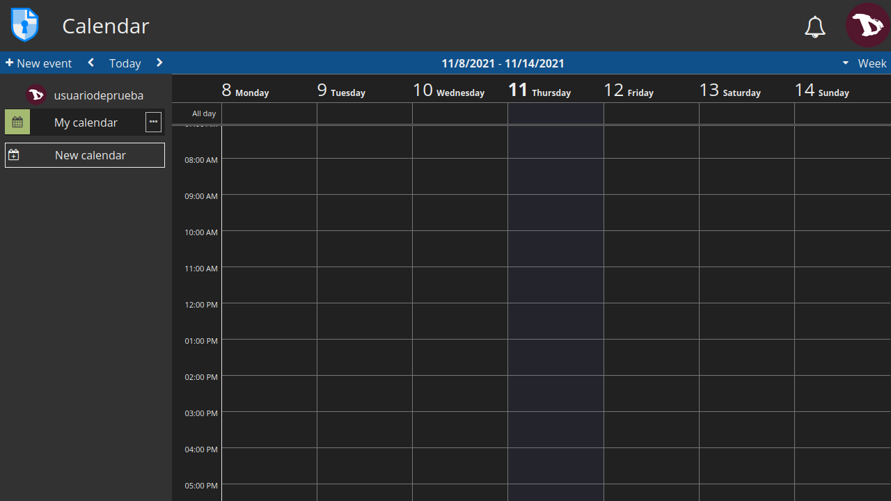
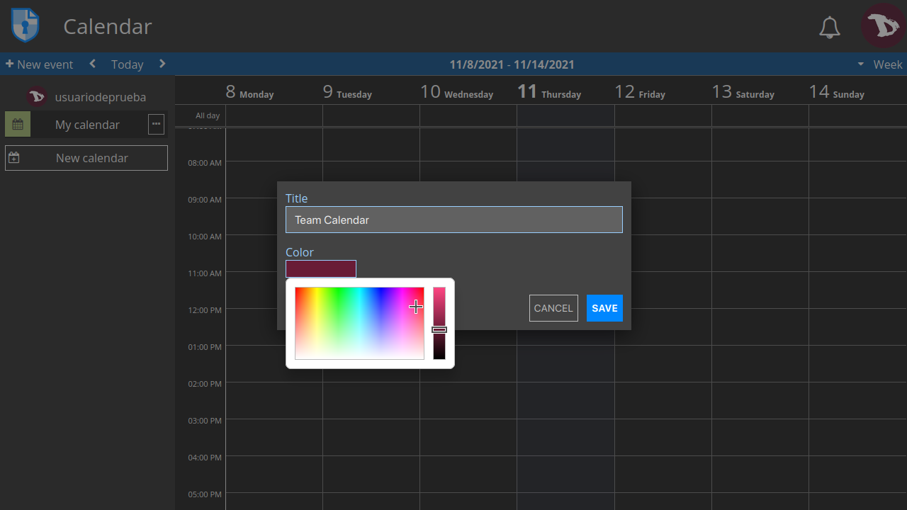
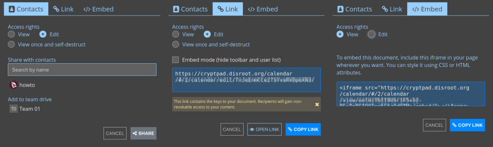
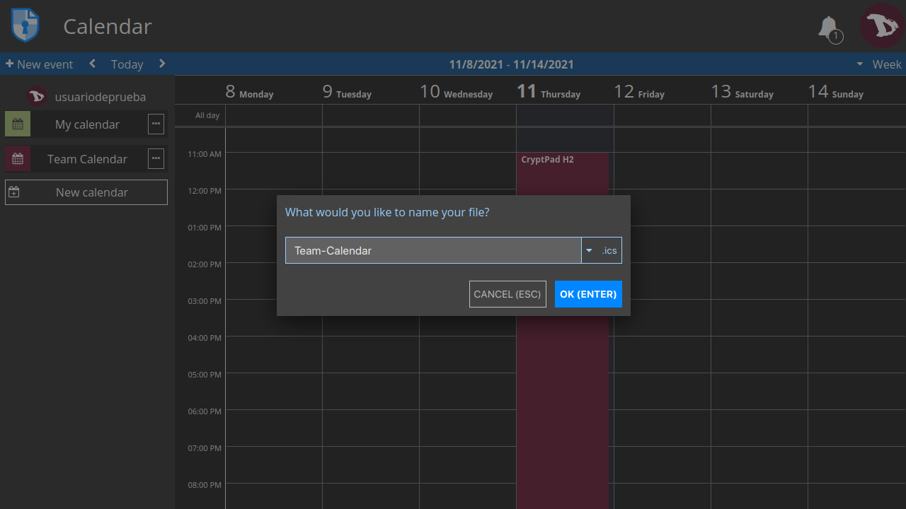
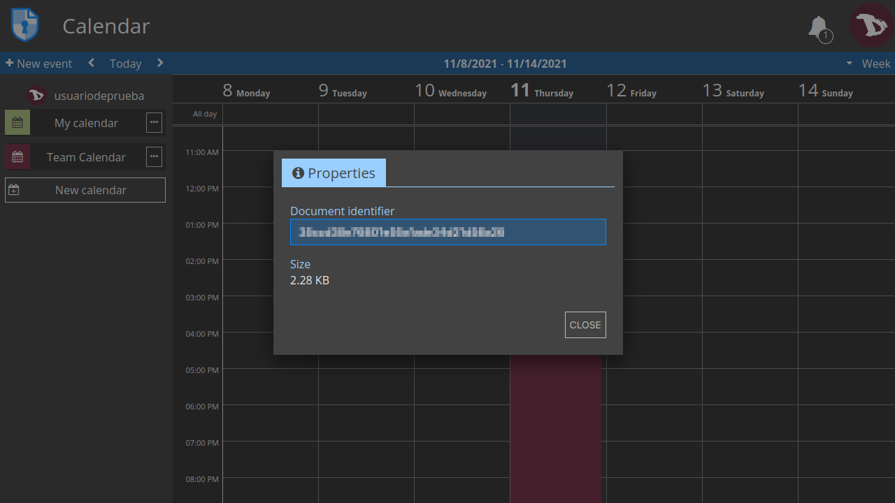
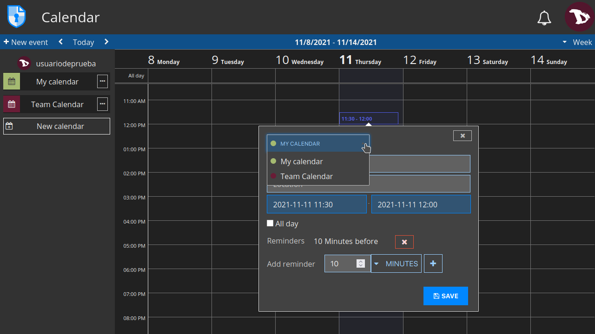

# Calendar

CryptPad Calendar is quite easy to use. Let's see how it works.

## Calendar toolbar

- **+ New event**: add an event at the current time and date.
- **< >**: move to the previous/next period depending on the view.
- **Today**: center the view on the current day.
- **View menu**: toggle to **Day**, **Week** or **Month** view.

## Create a calendar
To create a new calendar, just click on **New calendar** and a dialog box will prompt where you can add a title and a color to identify it. Then click on **SAVE**.

## Edit a calendar
By clicking on the **···** at the right of a calendar name you will access to its options.

  

### Edit
Change the title and color of the calendar

  

### Share
There are three ways to share a calendar:
- with **Contacts**: 
    when sharing directly with contacts, the calendar link never leaves the encrypted environment of CryptPad. Recommended to prevent data leaks.
- via a **Link**: 
    this option provides a link that can be shared through the medium of your choice. This method can present security risks. To add a level of security, it is recommended to add a password to the calendar before sharing the link.
- or **embedding** it: 
    this allow you to display a calendar on a web page.

In any of the three cases, access rights can be set to allow the recipient to edit the calendar or to only view it.

### Access
Set the ways the calendar can be accessed.

- **Access**
  * **Destroy**: Delete the document permanently.

- **List**
  * The **access list** restricts access to a document. Once active, users who are not on the list are not able to access the document, even if they have it stored in their CryptDrive. 
  **To enable the access list**, check **Enable access list**. The owners of the document are on the list by default and cannot be removed from it. 
  **To add contacts or teams** to the list, select them from the contacts list on the right and add them with the arrow button. 
  **To remove a user or team** from the list use the **x** button next to their name.

  

- **Owners**
  * Manage the ownership of the document. Owners of a document have permissions to **enable an access list**, **enable a password**, **add or remove other owners**, and to **destroy the document**. 
  To **add** or **remove** users as owners proceed the same way as with the contacts list.

!! If a document is created without owners, no one has permissions to manage its ownership. It cannot be permanently destroyed by anyone, but can be removed from the CryptDrive and will be destroyed automatically after 90 days of inactivity.

### Import/Export
You can import or export a calendar to the standard `.ics` format.

### Properties
Shows the document identifier and size.

### Remove

## Add events

To add an event, just click on the the date and time you want. You can modify the duration by dragging the bottom down and edit its options either by clicking on it to open the detailed view or dragging it to a new date/time.

