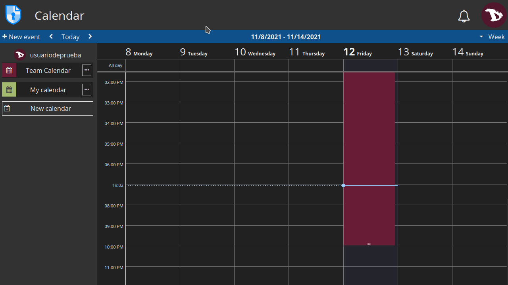

# Calendrier

CryptPad Calendar est assez facile à utiliser. Voyons comment il fonctionne.

## Barre d'outils du calendrier

- **+ Nouvel événement** : ajouter un événement à l'heure et à la date actuelles.
- **< >** : passer à la période précédente/suivante selon la vue.
- **Today** : centre la vue sur le jour actuel.
- **Menu de la vue** : basculer vers la vue **Jour**, **Semaine** ou **Mois**.

## Créer un calendrier
Pour créer un nouveau calendrier, il suffit de cliquer sur **Nouveau calendrier** et une boîte de dialogue s'ouvre dans laquelle vous pouvez ajouter un titre et une couleur pour l'identifier. Cliquez ensuite sur **Sauvegarder**..

## Modifier un calendrier
En cliquant sur le **---** à droite du nom d'un calendrier, vous accédez à ses options.

  

### Editer
Modifier le titre et la couleur du calendrier

  

### Partager
Il existe trois façons de partager un calendrier :
- avec les **Contacts**: 
    lors du partage direct avec les contacts, le lien du calendrier ne quitte jamais l'environnement crypté de CryptPad. Recommended to prevent data leaks.
- Via un **Lien**: 
    cette option fournit un lien qui peut être partagé par le moyen de votre choix. Cette méthode peut présenter des risques de sécurité. To add a level of security, it is recommended to add a password to the calendar before sharing the link.
- ou **l'intégrer** : 
    ceci vous permet d'afficher un calendrier sur une page web.

Dans chacun de ces trois cas, des droits d'accès peuvent être définis pour permettre au destinataire de modifier le calendrier ou de le visualiser uniquement.

### Accès
Définissez les modes d'accès au calendrier.

- **Accès**
  * **Détruire** : Delete the document permanently.

- **Liste**
  * La **liste d'accès** restreint l'accès à un document. Une fois active, les utilisateurs qui ne sont pas sur la liste ne peuvent pas accéder au document, même s'ils l'ont stocké dans leur CryptDrive. 
  **Pour activer la liste d'accès**, cochez **Activer la liste d'accès**. Les propriétaires du document figurent par défaut sur la liste et ne peuvent en être retirés. 
  **Pour ajouter des contacts ou des équipes** à la liste, sélectionnez-les dans la liste des contacts à droite et ajoutez-les avec le bouton flèche. 
  **Pour supprimer un utilisateur ou une équipe** de la liste, utilisez le bouton **x** à côté de son nom.

  

- **Propriétaires**
  * Gérer la propriété du document. Les propriétaires d'un document ont des autorisations pour **activer une liste d'accès**, **activer un mot de passe**, **ajouter ou supprimer d'autres propriétaires**, et pour **détruire le document**. 
  Pour **ajouter** ou **supprimer** des utilisateurs en tant que propriétaires, procédez de la même manière qu'avec la liste des contacts.

!! Si un document est créé sans propriétaire, personne n'a le droit de gérer sa propriété. Il ne peut pas être détruit définitivement par qui que ce soit, mais il peut être retiré du CryptDrive et sera détruit automatiquement après 90 jours d'inactivité.

### Importation/Exportation
Vous pouvez importer ou exporter un calendrier au format standard `.ics`.

### Propriétés
Indique l'identifiant et la taille du document.

### Enlever

## Ajouter des événements

Pour ajouter un événement, il suffit de cliquer sur la date et l'heure souhaitées. Vous pouvez modifier la durée en faisant glisser le bas vers le bas et modifier ses options soit en cliquant dessus pour ouvrir la vue détaillée, soit en le faisant glisser vers une nouvelle date/heure.

