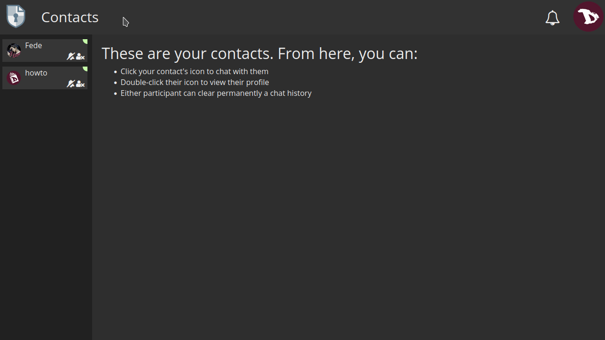

# Contacts
Using CryptPad contacts makes collaboration more secure and simple.

## Add a contact
There are two ways to add a contact:

1. **By sharing your profile**
  - Go to the user menu -> **Profile** and then click on the **SHARE** button.
  - Once copied, you can send it through the communication mean of your choice (a secure one preferably) by pasting the address.

2. **By sending a contact request**
 - Go to the profile page of the user you want to add to your Contacts and click on the **SEND A CONTACT REQUEST** button.

## Manage contacts
To access your contacts, go to the user menu -> **Contacts**. All of them are listed at the left.

For each contact, you can:
  - **Mute** their messages and notifications.
  - **Remove** them.
  - Check if they are online.

## Chat with contacts
To chat with someone on your Contact list, just click on their username and the chat will open in the main window.

You can also **load** or **delete** the chat history (if any) with the options at the right of the main window chat.
