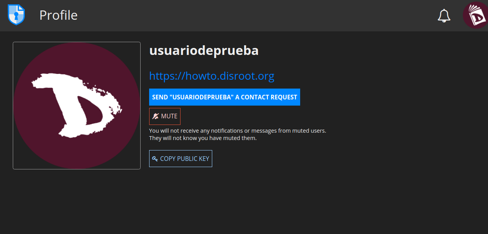

# Contacts
L'utilisation des contacts CryptPad rend la collaboration plus sûre et plus simple.

## Ajouter un contact
Il y a deux façons d'ajouter un contact :

1. **En partageant votre profil**
  - Allez dans le menu utilisateur -> **Profil** et cliquez ensuite sur le bouton **PARTAGER**.
  - Une fois copié, vous pouvez l'envoyer par le moyen de communication de votre choix (sécurisé de préférence) en collant l'adresse.

2. **En envoyant une demande de contact**
 - Allez sur la page de profil de l'utilisateur que vous voulez ajouter à vos contacts et cliquez sur le bouton **Envoyer une demande de contact**.

## Gérer les contacts
Pour accéder à vos contacts, allez dans le menu utilisateur -> **Contacts**. Ils sont tous listés à gauche.

Pour chaque contact, vous pouvez :
  - **Mettre en sourdine** leurs messages et notifications.
  - **Les supprimer**.
  - Vérifier s'ils sont en ligne.

## Chat avec les contacts
Pour chatter avec une personne de votre liste de contacts, cliquez simplement sur son nom d'utilisateur et le chat s'ouvrira dans la fenêtre principale.

Vous pouvez également **charger** ou **supprimer** l'historique du chat (s'il y en a un) avec les options situées à droite de la fenêtre principale du chat.
