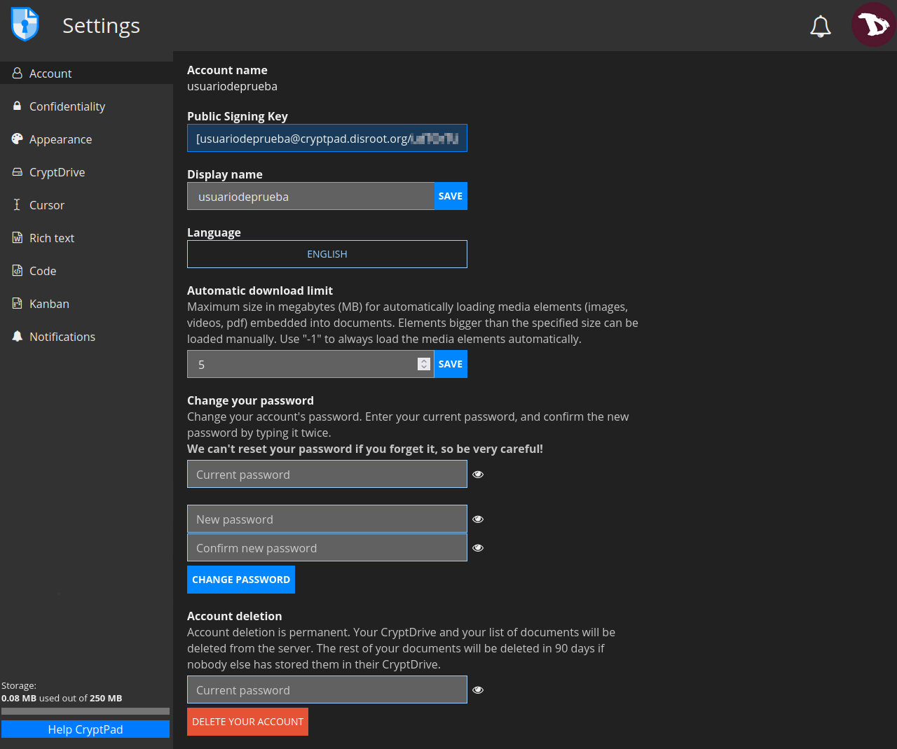
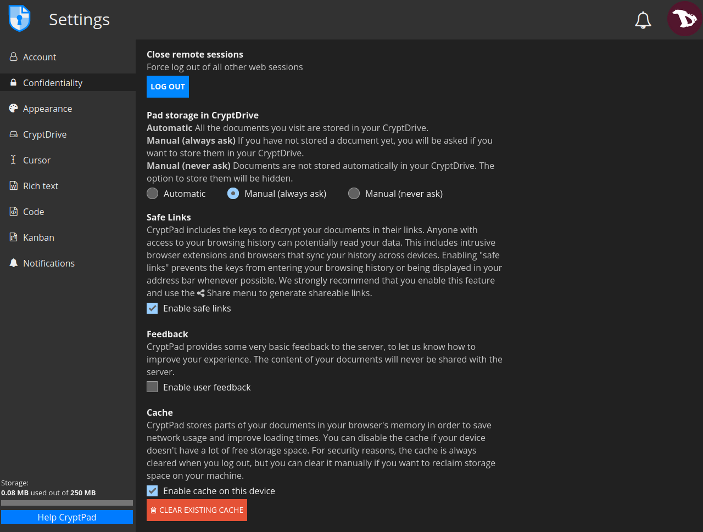
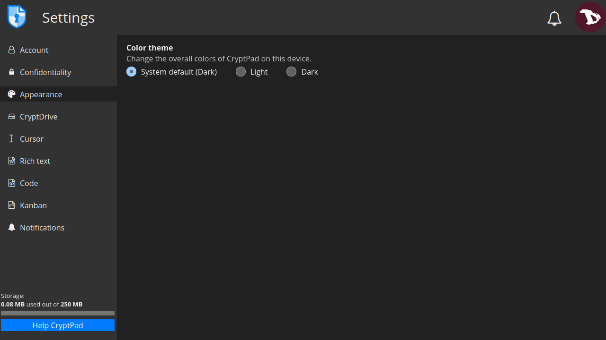
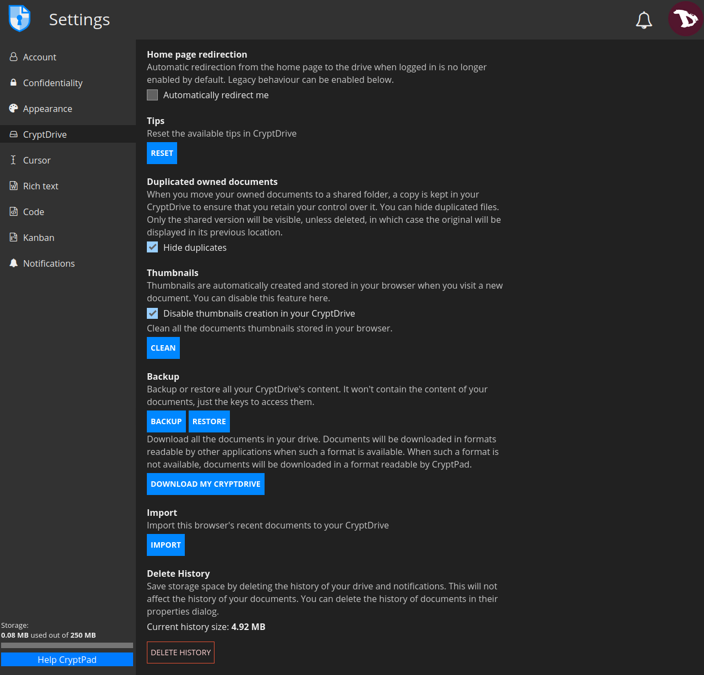
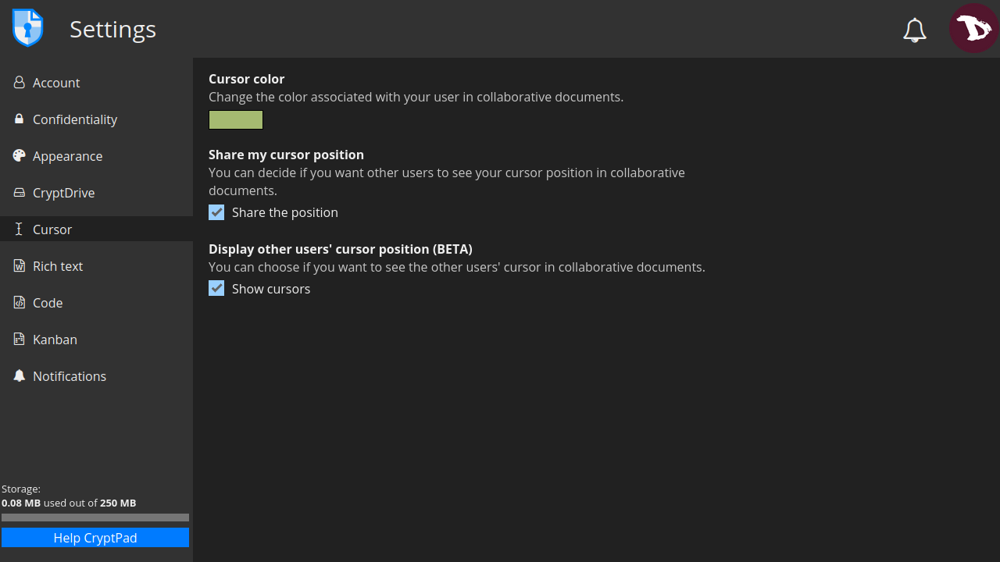
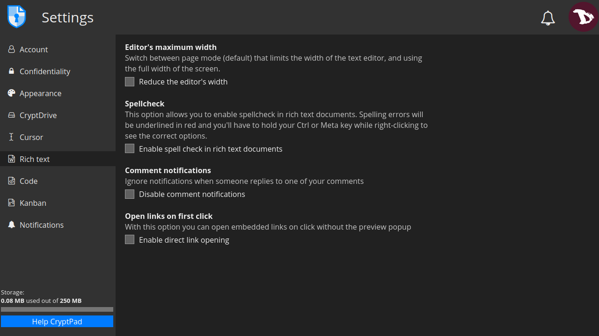
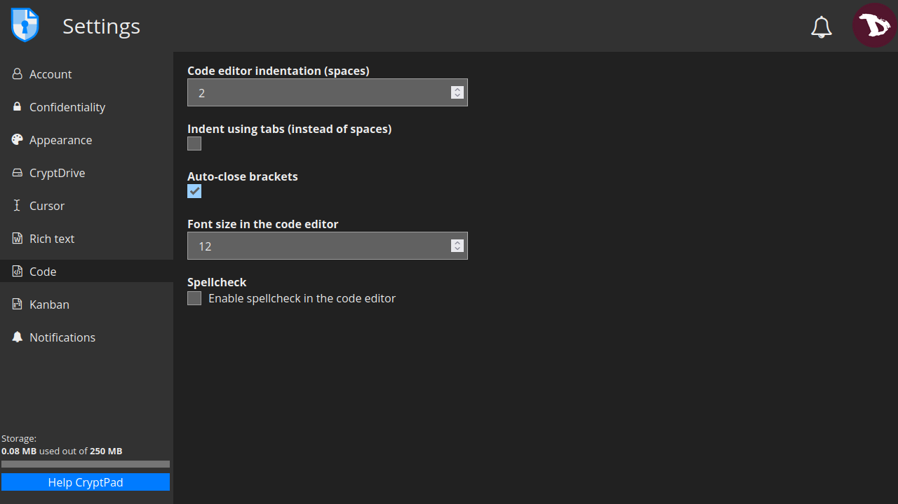
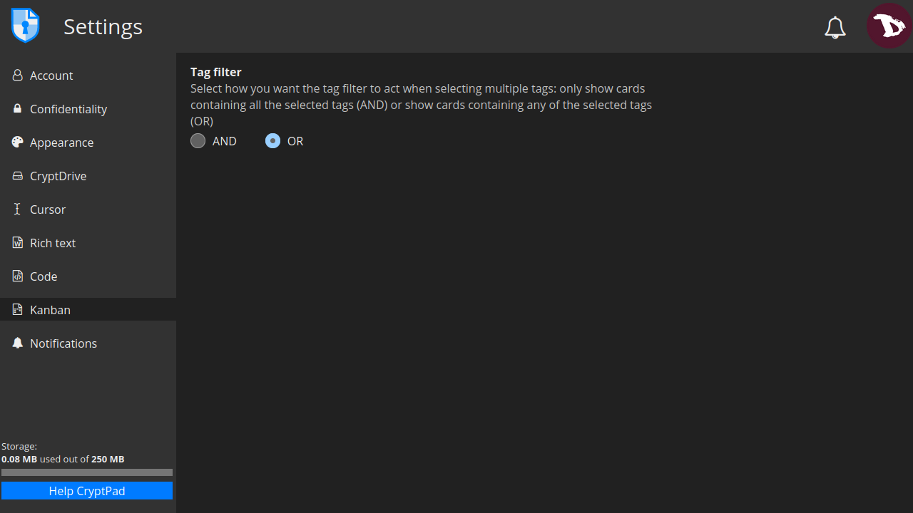
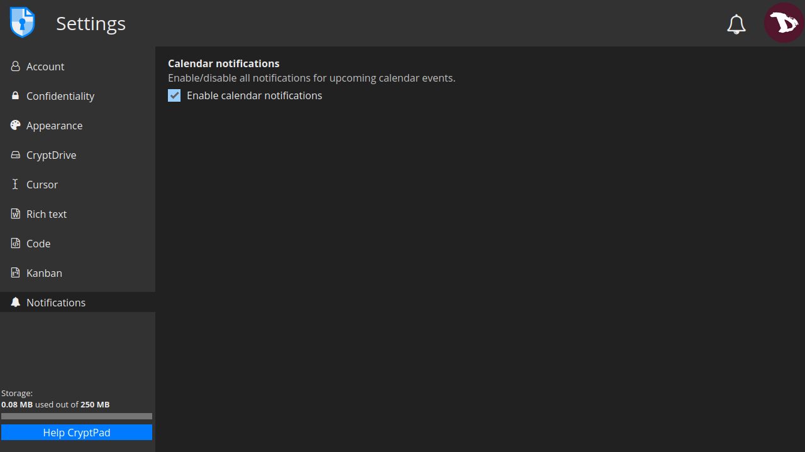

# Settings
To access the account settings go to the user menu -> **Settings**

# Account settings

- **Account name**: it is the username chosen at registration and it cannot be changed.

- **Public Signing Key**: it is used by CryptPad instances that offer subscriptions. **This is the only data about your account that is available to the administrators of the service**.

- **Display Name**: it is the name displayed to other users. To change it enter a new name and click on **SAVE**.

- **Language**: the language of the CryptPad interface. To change it, select a new one from the drop-down menu.

- **Automatic Download limit**: the maximum size in megabytes (MB) for automatically loading media elements (images, videos, pdf) embedded into documents. Elements bigger than the specified size can be loaded manually. A value "-1" will always load the media elements automatically.

- **Change your password**: here you can change your account password. To do so, enter your current password and then write the new one twice to confirm it.  **Remember that we cannot reset your password in case you loose/forget it**.

- **Account deletion**: this option will permanently delete your account and all of its documents. To proceed, enter your password, click on **DELETE YOUR ACCOUNT** and confirm.

# Confidentiality settings

- **Close remote sessions**: it allows you to log out of all sessions except the one from which this option is activated.

- **Pad storage in CryptDrive**: manage how documents you visit are stored in your drive.
  - **Automatic**: all the pads you visit are stored in your drive.
  - **Manual (always ask)**: every time you access a pad that has not been saved, CryptPad will ask if you want to store them in your drive.
  - **Manual (never ask)**: pads you access are not stored automatically in your drive and the option to do it will be hidden.

- **Safe links**: when this setting is active, the link in your browser’s address bar does not provide access to the document unless the recipient already has it in their drives. This setting is active by default and it is highly recommended to keep it that way and to use the **Share** menu to copy links to documents.

!! CryptPad includes the keys to decrypt your documents in their links. Anyone with access to your browsing history can potentially read your data. This includes intrusive browser extensions and browsers that sync your history across devices. Situations where your browser is visible by others, such as screen-sharing or screenshots, are also potentially risky in terms of leaking access to your documents. Enabling “safe links” prevents the keys from entering your browsing history or being displayed in your address bar whenever possible.

- **Feedback**: CryptPad can send anonymised usage feedback to the server in order to improve the user experience. The content of documents is never shared. This option is disabled by default.

- **Cache**: it is used to save network usage and improve loading times, storing parts of your documents in your browser's memory. Although it is always cleared when you log out (for security reasons), you can disable the cache if your device does not have enough free storage space or you can manually clear it if you want/need to reclaim storage space on your machine.

# Appearance

- **Color theme**: here you can set the CryptPad theme. By default it is set to follows the operating system and/or browser setting, but it can also be manually set to light or dark.

# CryptDrive settings

- **Home page redirection**: Automatic redirection from the home page to the drive when logged in is no longer enabled by default.

- **Tips**: are CryptPad "Help" messages. Click on **RESET** to display them again if they have been dismissed.

- **Duplicated owned documents**: every time you move pads you own to a shared folder, a copy is kept in your drive to ensure that you retain your control over it. This option allows you to hide duplicated files, making the shared version the only one visible, unless deleted, in which case the original will be displayed in its previous location.

- **Thumbnails**: CryptPad automatically creates thumbnails and store them in the browser when you access a document. By default this option is turned off because it can slow down the browser on less powerful computers. You can also delete all existing thumbnails by clicking on the **CLEAR** button.

- **Backup**: you can **BACKUP** or **RESTORE** all your drive's content. This option only saves the access to your documents (not their content actually) so you can restore them in another session. 
You can also **DOWNLOAD** all your drive documents (with their content). When possible, this is done in a format that is readable by other software. Although some applications may generate files that are only readable by CryptPad.

- **Import**: you can import pads that have been created as a guest user prior to logging in.

- **Delete History**: to save storage space, you can delete the drive history and notifications. This will not affect the documents history.

# Cursor settings

- **Cursor color**: you can change the color of your cursor. This is used to identify your user when working on collaborative documents.

- **Share my cursor position**: you can choose to display or hide the position of your cursor to other users when working on collaborative documents.

- **Display other users’ cursor position (BETA)**: you can also choose if you want to see other users’ cursors position.

# Rich text settings
These are the user settings for the **Rich Text** application.

- **Editor’s maximum width**: switch between page mode (default) that limits the width of the text editor, and using the full width of the screen.

- **Spellcheck**: enable spellcheck in Rich Text documents. Spelling errors are underlined in red. To see the suggested correct options, hold the `Ctrl` or `Meta` key while right-clicking on the word to correct.

- **Comment notifications**: you can disable notifications when another user replies to one of your comments by checking this option.

- **Open links on first click**: when this option is enabled you can open embedded links on click without the preview popup.

# Code
Here you can modify the user settings for the **Code / Markdown** application.

- **Code editor indentation (spaces)**: the number of spaces for each level of indentation.

- **Indent using tabs (instead of spaces)**: check this option to insert tabs rather than spaces with the `Tab` key.

- **Auto-close brackets**: when enable, CryptPad automatically insert a closing character `)` when brackets are opened with `(` (this also works with `[`, `'`, `"`).

- **Font size in the code editor**: set the size of text in the code editor.

- **Spellcheck**: enable spellcheck in the code editor. Spelling errors are underlined in red. To see the suggested correct options, hold the `Ctrl` or `Meta` key while right-clicking on the word to correct.

# Kanban settings

- **Tag filter**: select how you want the tag filter to act when selecting multiple tags: only show cards containing all the selected tags (AND) or show cards containing any of the selected tags (OR).

# Notifications settings

- **Calendar notifications**: Enable/disable all notifications for upcoming calendar events.
