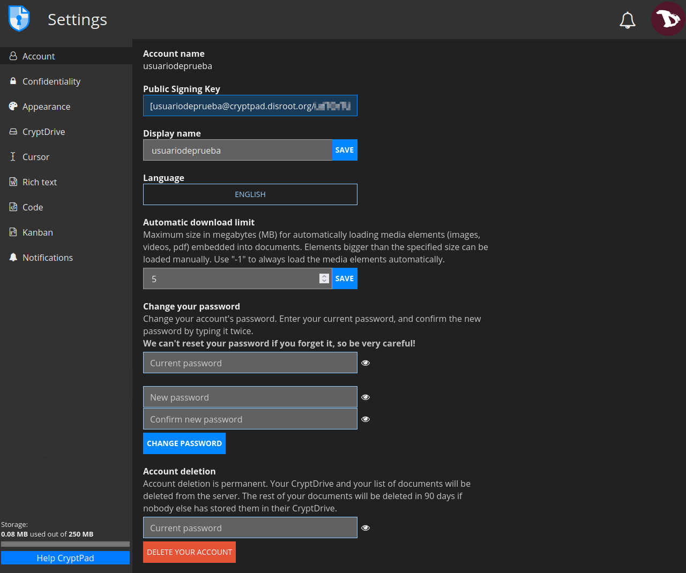
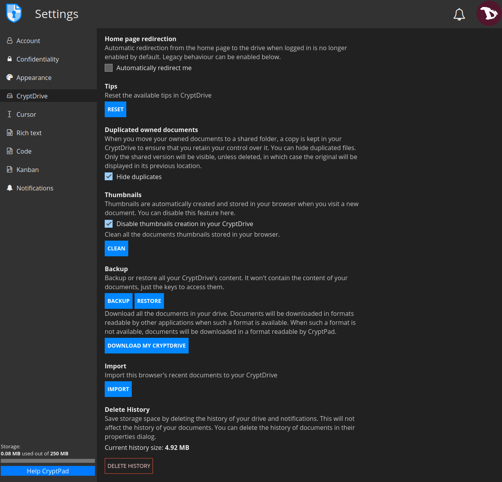
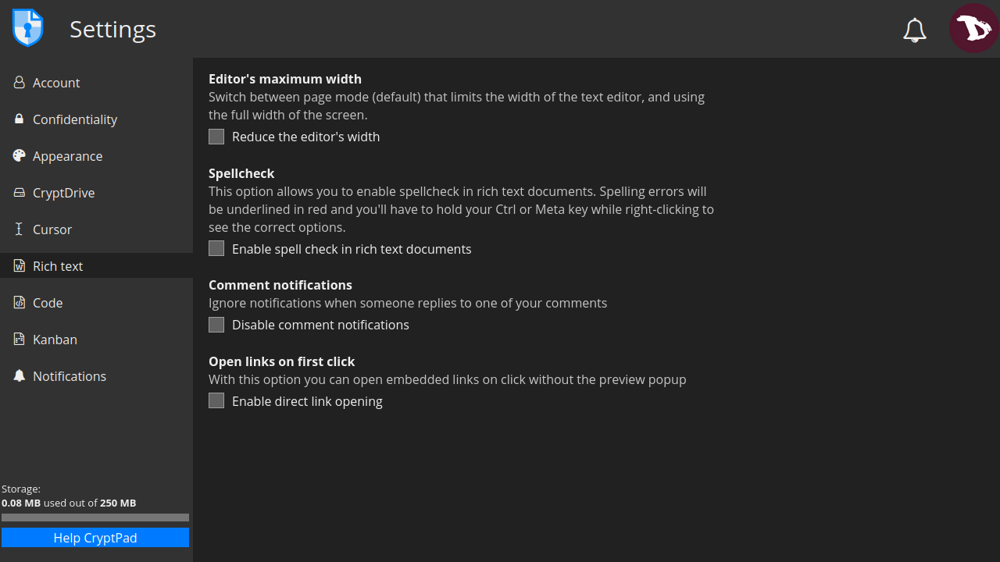
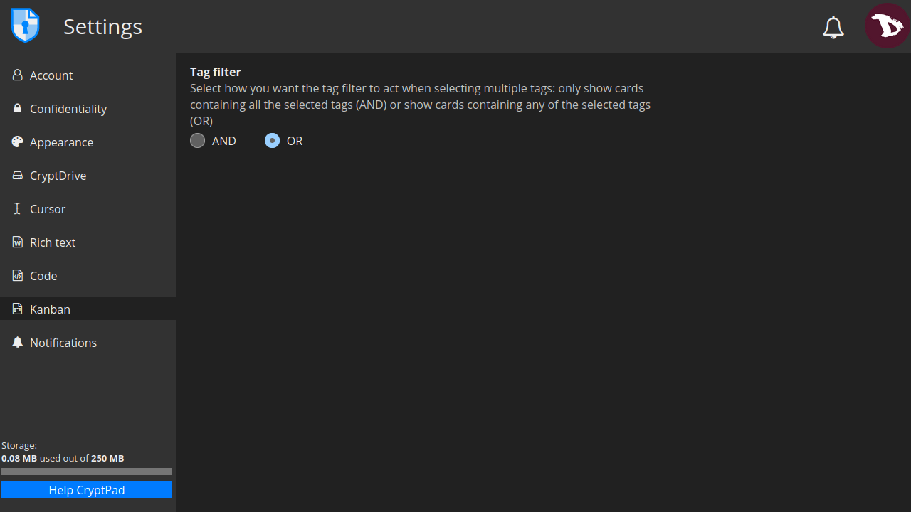

# Paramètres
Pour accéder aux paramètres du compte, allez dans le menu utilisateur -> **Paramètres**.

# Paramètres du compte

- **Nom du compte** : c'est le nom d'utilisateur choisi lors de l'inscription et il ne peut pas être changé.

- **Clé de signature publique** : elle est utilisée par les instances CryptPad qui proposent des abonnements. **Ce sont les seules données sur votre compte qui sont disponibles pour les administrateurs du service**.

- **Nom d'affichage** : c'est le nom affiché aux autres utilisateurs. Pour le modifier, entrez un nouveau nom et cliquez sur **SAVE**.

- **Langue** : c'est la langue de l'interface du CryptPad. Pour la changer, sélectionnez-en une nouvelle dans le menu déroulant.

- **Limite de téléchargement automatique** : la taille maximale en mégaoctets (Mo) pour le chargement automatique des éléments multimédia (images, vidéos, pdf) intégrés dans les documents. Les éléments plus grands que la taille spécifiée peuvent être chargés manuellement. A value "-1" will always load the media elements automatically.

- **Changez votre mot de passe** : ici vous pouvez changer le mot de passe de votre compte. Pour cela, saisissez votre mot de passe actuel puis écrivez le nouveau deux fois pour le confirmer.  **N'oubliez pas que nous ne pouvons pas réinitialiser votre mot de passe au cas où vous le perdriez/oublieriez**.

- **Suppression du compte** : cette option permet de supprimer définitivement votre compte et tous ses documents. Pour cela, saisissez votre mot de passe, cliquez sur **Supprimer votre compte** et confirmez.

# Paramètres de confidentialité

- **Fermer les sessions à distance** : il vous permet de vous déconnecter de toutes les sessions sauf celle à partir de laquelle cette option est activée.

- **Stockage des pads dans CryptDrive** : gérez la façon dont les documents que vous visitez sont stockés dans votre lecteur.
  - Automatique** : tous les coussins que vous visitez sont stockés dans votre disque.
  - Manuel (toujours demandé)** : chaque fois que vous accédez à un pad qui n'a pas été enregistré, CryptPad vous demandera si vous voulez le stocker dans votre lecteur.
  - Manuel (jamais demandé)** : les blocs auxquels vous accédez ne sont pas stockés automatiquement sur votre disque dur et l'option pour le faire sera cachée.

- **Liens sécurisés** : lorsque ce paramètre est actif, le lien dans la barre d'adresse de votre navigateur ne permet pas d'accéder au document, sauf si le destinataire l'a déjà dans son lecteur. Ce paramètre est actif par défaut et il est fortement recommandé de le conserver ainsi et d'utiliser le menu **Partager** pour copier les liens vers les documents.

! ! CryptPad inclut les clés pour décrypter vos documents dans leurs liens. Toute personne ayant accès à votre historique de navigation peut potentiellement lire vos données. Cela inclut les extensions de navigateur intrusives et les navigateurs qui synchronisent votre historique sur plusieurs appareils. Les situations où votre navigateur est visible par d'autres personnes, comme le partage d'écran ou les captures d'écran, sont également potentiellement risquées en termes de fuite d'accès à vos documents. L'activation des "liens sûrs" empêche, dans la mesure du possible, les clés d'entrer dans votre historique de navigation ou de s'afficher dans votre barre d'adresse.

- **Réaction** : CryptPad peut envoyer un retour d'utilisation anonyme au serveur afin d'améliorer l'expérience utilisateur. Le contenu des documents n'est jamais partagé. Cette option est désactivée par défaut.

- **Cache** : il est utilisé pour économiser l'utilisation du réseau et améliorer les temps de chargement, en stockant des parties de vos documents dans la mémoire de votre navigateur. Bien qu'il soit toujours effacé lorsque vous vous déconnectez (pour des raisons de sécurité), vous pouvez désactiver le cache si votre appareil ne dispose pas d'un espace de stockage libre suffisant ou vous pouvez l'effacer manuellement si vous souhaitez/devez récupérer de l'espace de stockage sur votre machine.

# Apparition

- **Thème de couleurs** : vous pouvez définir ici le thème du CryptPad. Par défaut, il suit les paramètres du système d'exploitation et/ou du navigateur, mais il peut également être réglé manuellement sur clair ou foncé.

# Paramètres de CryptDrive

- **Redirection de la page d'accueil** : Automatic redirection from the home page to the drive when logged in is no longer enabled by default.

- **Conseils** : sont des messages d'"aide" de CryptPad. Cliquez sur **RESET** pour les afficher à nouveau s'ils ont été rejetés.

- **Documents propriétaires dupliqués** : chaque fois que vous déplacez des coussinets qui vous appartiennent vers un dossier partagé, une copie est conservée dans votre lecteur pour vous assurer que vous en gardez le contrôle. Cette option vous permet de masquer les fichiers dupliqués, faisant de la version partagée la seule visible, à moins qu'elle ne soit supprimée, auquel cas l'original sera affiché à son emplacement précédent.

- **Miniatures** : Cryptpad crée automatiquement des vignettes et les stocke dans le navigateur lorsque vous accédez à un document. Par défaut, cette option est désactivée car elle peut ralentir le navigateur sur les ordinateurs moins puissants. Vous pouvez également supprimer toutes les vignettes existantes en cliquant sur le bouton **Effacer**.

- **Sauvegarde** : vous pouvez **Sauvegarder** ou **Rétablir** tout le contenu de votre disque. Cette option ne sauvegarde que l'accès à vos documents (pas leur contenu à proprement parler) afin que vous puissiez les restaurer dans une autre session. 
Vous pouvez également **Télécharger** tous les documents de votre lecteur (avec leur contenu). Lorsque cela est possible, cela est fait dans un format lisible par d'autres logiciels. Bien que certaines applications puissent générer des fichiers qui ne sont lisibles que par CryptPad.

- **Importer** : vous pouvez importer des pads qui ont été créés en tant qu'utilisateur invité avant de vous connecter.

- **Supprimer l'historique** : pour économiser de l'espace de stockage, vous pouvez supprimer l'historique du lecteur et les notifications. Cela n'affectera pas l'historique des documents.

# Paramètres du curseur

- **Couleur du curseur** : vous pouvez modifier la couleur de votre curseur. Celle-ci est utilisée pour identifier votre utilisateur lorsque vous travaillez sur des documents collaboratifs.

- **Partager la position de mon curseur** : vous pouvez choisir d'afficher ou de cacher la position de votre curseur aux autres utilisateurs lorsque vous travaillez sur des documents collaboratifs.

- **Afficher la position du curseur des autres utilisateurs (BETA)** : vous pouvez également choisir de voir la position du curseur des autres utilisateurs.

# Paramètres du texte riche
Il s'agit des paramètres utilisateur pour l'application **Texte enrichi**.

- **Largeur maximale de l'éditeur** : basculez entre le mode page (par défaut) qui limite la largeur de l'éditeur de texte, et l'utilisation de la pleine largeur de l'écran.

- **Vérification orthographique** : activez la vérification orthographique dans les documents Rich Text. Les fautes d'orthographe sont soulignées en rouge. Pour voir les options correctes suggérées, maintenez la touche `Ctrl` ou `Meta` tout en faisant un clic droit sur le mot à corriger.

- **Notifications de commentaires** : vous pouvez désactiver les notifications lorsqu'un autre utilisateur répond à l'un de vos commentaires en cochant cette option.

- **Ouvrir les liens au premier clic** : lorsque cette option est activée, vous pouvez ouvrir les liens intégrés au premier clic sans la fenêtre d'aperçu.

# Code
Ici vous pouvez modifier les paramètres de l'utilisateur pour l'application **Code / Markdown**.

- **Indentation de l'éditeur de code (espaces)** : le nombre d'espaces pour chaque niveau d'indentation.

- **Indenter en utilisant des tabulations (au lieu d'espaces)** : cochez cette option pour insérer des tabulations plutôt que des espaces avec la touche `Tab`.

- **Fermeture automatique des parenthèses** : lorsque cette option est activée, CryptPad insère automatiquement un caractère de fermeture `)` lorsque les parenthèses sont ouvertes avec `(` (cela fonctionne également avec `[`, `'`, `"`).

- **Taille de la police dans l'éditeur de code** : définissez la taille du texte dans l'éditeur de code.

- **Vérification orthographique** : activer la vérification orthographique dans l'éditeur de code. Les fautes d'orthographe sont soulignées en rouge. Pour voir les options correctes suggérées, maintenez la touche `Ctrl` ou `Meta` tout en faisant un clic droit sur le mot à corriger.

# Paramètres de Kanban

- **Filtre de balises** : choisissez comment vous voulez que le filtre de balises agisse lorsque vous sélectionnez plusieurs balises : afficher uniquement les cartes contenant toutes les balises sélectionnées (ET) ou afficher les cartes contenant n'importe laquelle des balises sélectionnées (OU).

# Paramètres des notifications

- **Notifications de l'agenda** : Activez/désactivez toutes les notifications pour les événements de calendrier à venir.
