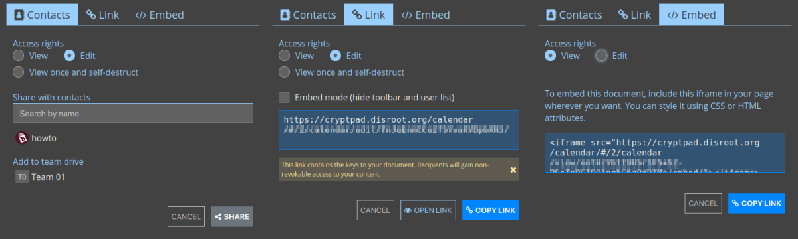
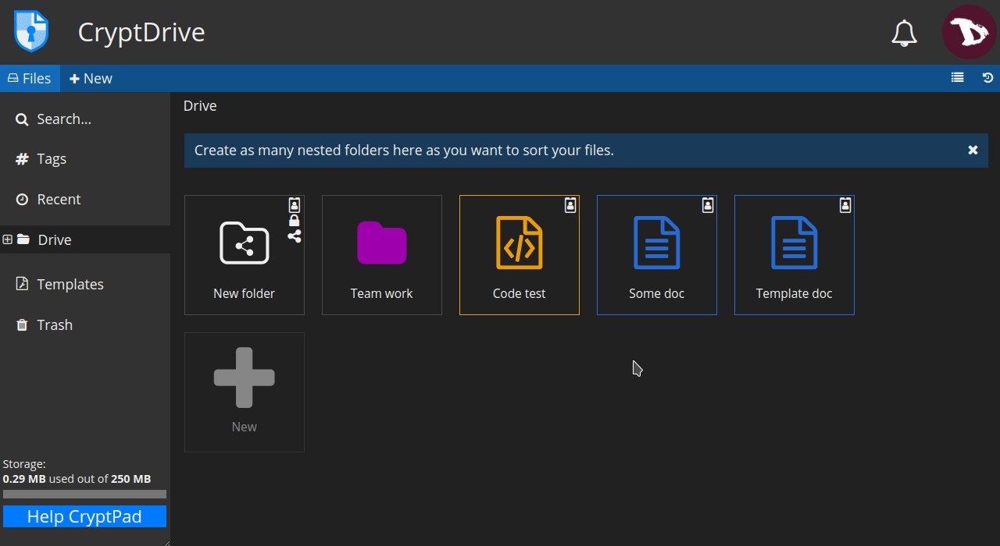

# Share
There are three ways to share documents and calendars:
- with **Contacts**: when sharing directly with contacts, the document link never leaves the encrypted environment of CryptPad. Recommended to prevent data leaks.
- via a **Link**: this option provides a link that can be shared through the medium of your choice. This method can present security risks. To add a level of security, it is recommended to add a password to the document before sharing the link.
- or **embedding** it: this allow you to display a pad or a calendar on a web page.

In any of the three cases, access rights can be set to allow the recipient to **Edit** the documents or to only **View** it.

To share a file from the drive, just richt-click on a file and then **Share**.

You can also share a pad from the

# Access
Set the ways documents and calendars can be accessed.

- **Access**
  * **Destroy**: Delete the document permanently.

- **List**
  * The **access list** restricts access to a document. Once active, users who are not on the list are not able to access the document, even if they have it stored in their CryptDrive. 
  **To enable the access list**, check **Enable access list**. The owners of the document are on the list by default and cannot be removed from it. 
  **To add contacts or teams** to the list, select them from the contacts list on the right and add them with the arrow button. 
  **To remove a user or team** from the list use the **x** button next to their name.

  

- **Owners**
  * Manage the ownership of the document. Owners of a document have permissions to **enable an access list**, **enable a password**, **add or remove other owners**, and to **destroy the document**. 
  To **add** or **remove** users as owners proceed the same way as with the contacts list.

!! If a document is created without owners, no one has permissions to manage its ownership. It cannot be permanently destroyed by anyone, but can be removed from the CryptDrive and will be destroyed automatically after 90 days of inactivity.
