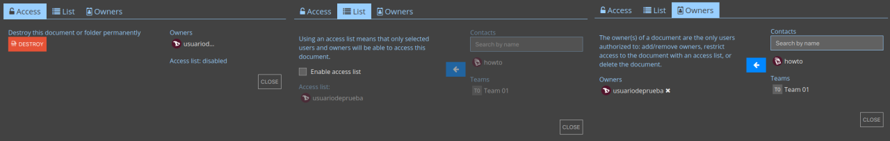
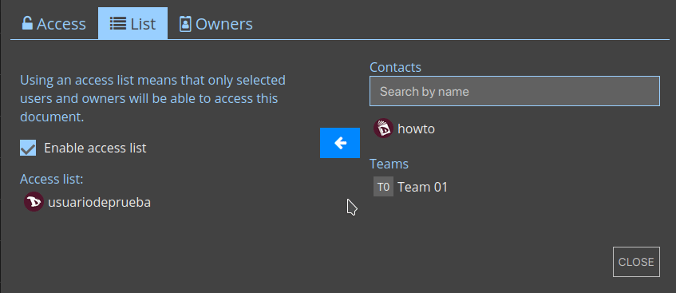

# Partager
Il existe trois façons de partager des documents et des calendriers :
- avec **Contacts** : lors du partage direct avec les contacts, le lien du document ne quitte jamais l'environnement crypté de CryptPad. Recommandé pour éviter les fuites de données.
- via un **Lien** : cette option fournit un lien qui peut être partagé par le moyen de votre choix. Cette méthode peut présenter des risques de sécurité. Pour ajouter un niveau de sécurité, il est recommandé d'ajouter un mot de passe au document avant de partager le lien.
- ou l'**intégration** : cela permet d'afficher un bloc-notes ou un calendrier sur une page web.

Dans chacun de ces trois cas, les droits d'accès peuvent être définis pour permettre au destinataire de **Modifier** les documents ou de seulement **Voir**.

Pour partager un fichier à partir du lecteur, il suffit de cliquer sur le fichier et de cliquer sur **Partager**.

Vous pouvez également partager un bloc-notes à partir du

# Accès
Définissez les modes d'accès aux documents et aux calendriers.

- **Accès**
  * **Détruire** : Supprimer définitivement le document.

- **Liste**
  * La **liste d'accès** restreint l'accès à un document. Une fois active, les utilisateurs qui ne sont pas sur la liste ne peuvent pas accéder au document, même s'ils l'ont stocké dans leur CryptDrive. 
  **Pour activer la liste d'accès**, cochez **Activer la liste d'accès**. Les propriétaires du document figurent par défaut sur la liste et ne peuvent en être retirés. 
  **Pour ajouter des contacts ou des équipes** à la liste, sélectionnez-les dans la liste des contacts à droite et ajoutez-les avec le bouton flèche. 
  **Pour supprimer un utilisateur ou une équipe** de la liste, utilisez le bouton **x** à côté de son nom.

- **Propriétaires**
  * Gérer la propriété du document. Les propriétaires d'un document ont les autorisations pour **activer une liste d'accès**, **activer un mot de passe**, **ajouter ou supprimer d'autres propriétaires**, et **détruire le document**. 
  Pour **ajouter** ou **supprimer** des utilisateurs en tant que propriétaires, procédez de la même manière qu'avec la liste des contacts.

!! Si un document est créé sans propriétaire, personne n'a le droit de gérer sa propriété. Il ne peut pas être détruit de façon permanente par quiconque, mais peut être retiré du CryptDrive et sera détruit automatiquement après 90 jours d'inactivité.
