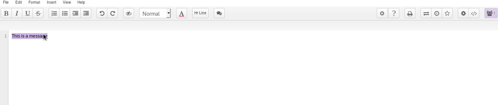
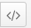

# Etherpad

**Etherpad** ist eine hilfreiche Anwendunge zur Echtzeit-Dokumentenbearbeitung durch mehrere Benutzer gleichzeitig. Du kannst sie direkt über Deinen Browser erreichen unter: [https://pad.disroot.org](https://pad.disroot.org). Du benötigst keinen Benutzeraccount, um **Etherpad** zu benutzen. Dennoch beinhaltet unsere Cloud ein sehr nützliches Plugin, das Dir hilft, die Übersicht über all Deine Pads zu behalten. Genau so, als wären sie "klassische" Dateien.

## Ein neues Pad erstellen

### Auf pad.disroot.org
Um ein Pad zu erstellen, kannst Du direkt zu [pad.disroot.org](https://pad.disroot.org) gehen.

1. Wenn Du auf diesen Button klickst, wird ein neues Pad mit einer Zufallsbezeichnung erstellt. Das Ganze wird ungefähr so aussehen: https://pad.disroot.org/p/AfV61cgLe_ax... Das ist der sicherste Weg, um ein Pad zu erstellen, denn es ist äußerst schwer, diesen Namen zu erraten. Somit kann auch niemand unauthorisiert Zugriff darauf nehmen.
2. Du kannst dem Pad natürlich auch einen Namen nach Deinem eigenen Wunsch geben, um es einfacher zu finden. Du hast in diesem Fall eine Adresse folgender Art: https://pad.disroot.org/p/der_name_den_ich_will. Dieser Weg ist allerdings etwas unsicherer. Ein anderer Nutzer könnte den gleichen Namen eingeben, den Du gewählt hast, und dann auf Dein Pad zugreifen.

### Über Deinen Cloud-Account (Ownpad plugin)

Du kannst auch ein Pad direkt über Deinen Cloud-Account erstellen. Dies funktioniert genauso wie die oben beschriebene Erstellung eines neuen Pads.

Melde Dich auf [cloud.disroot.org](https://cloud.disroot.org) an und gehe zur Datei-App. Klick auf das "+"-Zeichen und wähle aus, dass Du ein neues Pad erstellen willst. Gib dem neuen Pad einen Namen und drücke die *Enter*-Taste. Nun wird eine neue Datei mit der Erweiterung ".pad" erstellt. Du kannst diese Datei verschieben und teilen wie jede andere Datei in Deiner Cloud.

Um das neu erstellte Pad zu öffnen, musst Du einfach nur auf seinen Namen klicken. Die Anwendung wird Dein Pad öffnen, indem sie https://pad.disroot.org innerhalb der Cloud-Schnittstelle nutzt. Du kannst nun ganz einfach an Deinem Dokument arbeiten und, wenn Du fertig bist oder Pause machen willst, das rote Zeichen in der oberen rechten Ecke anklicken, um es zu schließen.

## Benutzeroberfläche

1. Hier schreiben die Beteiligten. Sobald jemand etwas am Dokument ändert, werden die Änderungen automatisch gespeichert. Alle Benutzer können zur selben Zeit schreiben! Zur Unterscheidung der Beiträge wird das, was jeder einzelne Beteiligte schreibt, in unterschiedlichen Farben dargestellt.
Wenn Du etwas löschst, wird diese Änderung auch sofort gespeichert. Sei also vorsichtig!
2. Es stehen die üblichen Formatierungsoptionen zur Verfügung: fett, kursiv, etc.
3. Es gibt zwei Möglichkeiten, Listen bzw. Aufzählungen zu erstellen.
4. Diese Buttons verschieben den Text, z.B. um Absätze zu erstellen.
5. Dieser Button erlaubt es Dir, alle Farben aus dem Pad zu entfernen. Wie bereits oben beschrieben wird jedem AUtor eine eigene Farbe zugewiesen, um die Änderungen jedes Einzelnen unterscheiden zu können. Wenn Ihr mit der Arbeit fertig seid, werdet Ihr diese Farben sicherlich entfernen wollen.
6. Dieser Button gibt Dir die Möglichkeit, einem Text einen Stil zuzuordnen, z.B. "Titel 1".
7. Mit diesem Button kannst Du die Textfarbe ändern. Wenn Du darauf klickst, erscheint eine Liste, aus der Du die gewünschte Farbe auswählen kannst.

## Optionen
### Deinen Namen hinzufügen
Um deutlich zu machen, wer was schreibt, ist es sinnvoll Deinen Namen anzugeben.

1. Klicke auf dieses Zeichen
2. Gibt hier Deinen Namen an. Es muss nicht Dein echter oder vollständiger Name sein, wenn DU das nicht willst.

Du kannst auch die Dir zugeordnete Farbe ändern, indem Du auf das Farbquadrat klickst.

### Kommentieren
Du kannst einen Kommentar zu einem Text hinzufügen.

1. Markiere das Wort oder den Textbereich, den Du kommentieren möchtest.
2. Klicke auf dieses Zeichen: 
3. Füge Deinen Kommentar hinzu und bestätige Deine Eingabe.

Du kannst sogar Änderungsvorschläge machen:

1. Markiere das Wort oder den Textbereich, für den Du einen Änderungsvorschlag hast.
2. Klicke auf dieses Zeichen: 
3. Füge Deinen Kommentar hinzu.
4. Wähle **Include suggested change** aus.
5. Schreibe Deinen Änderungsvorschlag in die **To:**-Box. Aus unbekannten Gründen funktioniert hier die Steuerung mit der Maus nicht immer. Möglicherweise musst Du die Tabulatortaste nutzen, um in diese Textbox zu gelangen.
6. Klicke auf **Comment**.

Um einen solchen Änderungsvorschlag anzunehmen und die Änderungen anzuwenden, wähle den Kommentar aus und klicke auf **Accept Change**.

Hinweis: Die Kommentarfunktion funktioniert momentan noch nicht ganz so, wie sie soll. Wir arbeiten daran...

### Revision und Verlauf
Es besteht die Möglichkeit, den aktuellen Stand Deines Pad aufzuzeichnen. Das nennen wir *Revision*. Diese Funktion ist sehr komfortabel, denn mit ihrer Hilfe kannst Du zu einer früheren Deines Pad zurückkehren. So kannst Du Deine Nerven schonen, wenn zum Beispiel jemand aus Versehen alles gelöscht hat!
Klicke einfach auf den Stern:

Der andere Button erlaubt es Dir, den kompletten Verlauf anzuschauen, inklusive angelegten Revisionen und Autorennamen. Für ein besseres Verständnis, sieh es Dir an:

Hier siehst Du die Möglichkeiten, die diese Funktion bietet:

1. Nutze diese Buttons, um durch Deinen Pad-Verlauf zu navigieren
2. Verschiebe diesen Balken, um durch DeinenPad-Verlauf zu navigieren.
3. Hier siehst Du das Datum der jeweiligen Änderung.
4. Hier siehst Du die verschiedenen Autoren.
5. Hier siehst Du die ENtwicklung des Textes.
6. Die Sterne stellen die verschiedenen Revisionen dar, die angelegt wurden. In diesem Fall gibt es nur eine Revision und daher auch nur einen Stern.
7. Klicke hier um zu Deinem Pad zurückzukehren, ohne etwas zu ändern.
8. Wenn Du auf einen Stern klickst und dann auf diesen Button, wird Dein Pad auf diese Revision zurückgesetzt.

## Ein Pad teilen
### Direkt von pad.disroot.org
Um Dein Pad mit jemandem zu teilen, musst Du ihm einfach nur den gültigen Link zu Deinem Pad mitteilen. Du kannst hierfür einfach Dein Pad im Browser öffnen und den Mauszeiger über seinen Namen bewegen. Es erscheint nun der gültige Link zu Deinem Pad, den Du kopieren und jedem mitteilen kannst, den Du an dem Pad beteiligen möchtest.

Du kannst es auch folgendermaßen machen:

1. Klicke auf diesen Button  {.inline}
2. **Link**: Dies ist der Link zu Deinem Pad. Kopiere und sende ihn an die Personen, die Du ausgewählt hast.
3. **Read only**: Du kannst Dir auch einen *Nur lesen*-Link generieren lassen, damit andere Leute den Inhalt Deines Pad sehen, aber nichts ändern können. Wähle diese Option aus, um einen Link zu Deinem Nur-Lesen-Pad zu erhalten.

### Von Deinem Nextcloud-Account
Das Teilen von Pads mit anderen **Disroot**-Nutzern funktioniert genau so wie das Teilen von normalen Dateien. Klicke auf *Sharing* und wähle aus, mit wem Du die Datei bzw. das Pad teilen möchtest.

Hinweis: Da es sich hier nicht um normale Dateien handelt, wird das teilen eines öffentlichen Links nicht so gut funktionieren. Um also Dein Pad mit jemandem außerhalb von **Disroot** zu teilen, solltest Du die vorhergehende Methode benutzen.

## Export/Import
Du kannst jede beliebige Textdatei direkt in Dein Pad importieren.

1. Klicke auf diesen Button.
2. **Browse...**: Suche nach Deiner Datei. In diesem Bild möchte der Benutzer eine Datei namens *test.md* importieren.
3. **Import now**: Klicke hier um die Datei in das Pad zu importieren.

Hinweis: HTML kann derzeit noch nicht importiert werden.

Anders herum kannst Du auch den Inhalt Deines Pad in eine Dokumentendatei auf Deinem Rechner exportieren.

1. Klicke auf diesen Button.
2. Wähle das gewünschte Dateiformat der Zieldatei.

Hinweis: Der Export in Etherpad funktioniert derzeit leider nicht. Wir arbeiten daran...

## Ein Pad löschen
Es ist nicht möglich, ein Pad zu löschen. Einmal erstellt, bleiben sie online. Tatsächlich könnte sich jeder, der die URL errät oder herausfindet, das Pad anschauen. Deswegen generiert das Plugin der **Disroot**-Cloud Links mit zufallsgenerierten Zeichenfolgen anstatt des Namens den Du beim Erstellen der Datei definierst. Auf diese Weise können die Links zu den Pads unmöglich erraten werden, was die Pads vor Zugriffen (außer von Dir den durch Dich einbezogenen Nutzern) schützt.

# Etherpad
Wenn Du mehr über die genutzte Software wissen möchtest, schau Dir die [Etherpad](https://etherpad.org/)-Website an.
