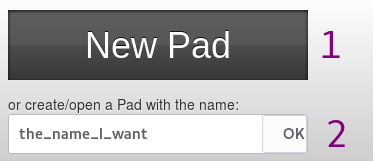
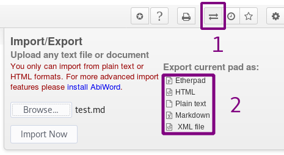

Etherpad est une application collaborative d'édition de texte en temps réel multi-utilisateurs. Vous pouvez y accéder directement depuis votre navigateur à l'adresse suivante : https://pad.disroot.org.  Aucun compte utilisateur n'est nécessaire pour l'utiliser. Cependant notre cloud est livré avec un plugin très pratique qui vous aide à garder la trace de tous vos pads, comme s'ils étaient un de vos fichiers.

# Créer un nouveau pad

## Depuis pad.disroot.org
Pour créer un pad, vous pouvez aller sur [pad.disroot.org](https://pad.disroot.org).

1. En cliquant sur ce bouton, vous créerez un pad avec des noms de caractères aléatoires. Il ressemblera à ceci: https://pad.disroot.org/p/AfV61cgLe_ax... Il s'agit de la manière la plus sûre de créer un pad car il est très difficile de deviner le nom.
2. Donner à votre pad le nom que vous voulez vous permet de le retrouver facilement car vous obtiendrez une adresse comme celle-ci: https://pad.disroot.org/p/le_nom_voulu. Mais c'est un moyen un peu moins sûr de créer un pad, car quelqu'un pourrait entrer le même nom que vous avez choisi et voir votre pad.

## Depuis votre compte Cloud (plugin Ownpad)

Vous pouvez également créer un pad directement depuis votre compte Cloud et cela fonctionne de la même manière que la création d'un nouveau fichier.

Connectez-vous à [cloud.disroot.org](https://cloud.disroot.org) et allez dans l'application fichiers. Cliquez sur l'icône *+* et choisissez de créer un bloc. Donnez-lui un nom et appuyez sur la touche *Entrée* de votre clavier. Un nouveau fichier portant l'extension *.pad* sera créé. Vous pouvez déplacer et partager ce fichier comme n'importe quel autre fichier que vous avez sur votre compte Cloud.

Pour ouvrir le bloc nouvellement créé, il suffit de cliquer sur son nom. L'application ouvrira votre bloc en utilisant https://pad.disroot.org dans l'interface du Cloud. Vous pouvez maintenant travailler facilement sur votre document et une fois que vous avez terminé, utilisez l'icône rouge dans le coin supérieur droit pour le fermer.

# Interface utilisateur

1. C'est ici que les participants écrivent. Dès que quelqu'un écrit quelque chose, cela est automatiquement enregistré. Tous les utilisateurs peuvent écrire en même temps ! Ce qui différenciera ce qu'écrit chaque rédacteur, c'est que chacun d'entre eux est doté d'une couleur différente.
Si vous supprimez quelque chose, c'est également sauvegardé. Soyez donc prudent.
2. Ce sont les options de formatage habituelles : gras, italique, etc.
3. Ces deux options vous permettent de créer des listes.
4. Ces boutons permettent de décaler le texte, c'est-à-dire de créer des paragraphes.
5. Ce bouton permet de supprimer toutes les couleurs du pavé. En effet, comme expliqué plus haut, chaque auteur aura une couleur afin de différencier clairement ce que chacun écrit. Il peut être intéressant, à la fin du travail, de supprimer toutes ces couleurs.
6. Ce bouton permet d'attribuer un style à un texte, par exemple "Titre 1".
7. Ce bouton vous permet de changer la couleur du texte. Lorsque vous cliquez dessus, une autre icône apparaît avec une liste de couleurs parmi lesquelles vous pouvez choisir.

# Options
## Ajouter votre nom
Afin de savoir qui écrit quoi, il est utile de fournir votre nom.

1. Cliquez sur cette icône
2. Saisissez votre nom ici. Il n'est pas nécessaire que ce soit ton vrai nom si tu ne le veux pas.

Tu peux aussi changer ta couleur en cliquant sur le carré de couleur.

## Commentaire
Vous pouvez ajouter un commentaire sur le texte :

1. Sélectionnez les mots que vous souhaitez commenter.
2. Cliquez sur cette icône : 
3. Ajoutez votre commentaire et validez.

Vous pouvez même suggérer une modification du texte :

1. Sélectionnez le mot que vous voulez suggérer de modifier.
2. Cliquez sur cette icône : 
3. Ajoutez votre commentaire.
4. Cochez la case **Inclure la modification suggérée**.
5. Suggérez votre modification dans la case **À : **. Pour une raison quelconque, cela ne fonctionne pas toujours avec votre souris, vous devrez donc utiliser la touche de tabulation de votre clavier pour y accéder.
6. Cliquez sur **Commentaire**.

Pour accepter la modification, allez sur le commentaire et cliquez sur **Accepter la modification**.

Note : cette fonction de commentaire est un peu boguée...

## Révision et historique
Il existe la possibilité d'enregistrer un état de votre pad à un moment donné. Cela s'appelle une *révision*. C'est très pratique, car cela signifie que vous pouvez revenir à une version antérieure de votre pad, idéal lorsque quelqu'un d'autre efface tout par erreur !
Il suffit de cliquer sur l'étoile :

L'autre bouton vous permet de voir l'ensemble de l'historique, y compris les révisions effectuées et les noms des auteurs. Pour mieux comprendre, regardez ce qu'il vous permet de faire :

Voici les possibilités :

1. Utilisez ces boutons pour naviguer dans l'historique de votre pad.
2. Déplacez cette barre avec votre souris pour naviguer dans l'historique du pad.
3. Vous pouvez voir ici les dates des modifications effectuées.
4. Voici les différents auteurs.
5. Voici l'évolution des textes.
6. Les étoiles représentent les différentes révisions que vous avez faites. Ici, il n'y a qu'une seule révision car il n'y a qu'une seule étoile.
7. Cliquez ici pour revenir à votre bloc, sans rien changer.
8. Si vous cliquez sur une étoile, puis sur ce bouton, votre bloc sera restauré à cette révision, à cette date.

# Partager un pad
## Directement à partir de pad.disroot.org
Pour partager avec quelqu'un, il suffit de partager le lien actuel vers le pad. Vous pouvez le faire en ouvrant votre pad dans le navigateur et en passant la souris au-dessus de son nom. Vous verrez alors apparaître le lien vers le bloc, que vous pouvez copier et envoyer à la personne avec laquelle vous souhaitez partager le bloc.

Vous pouvez également procéder de cette manière :

1. Cliquez sur ce bouton  {.inline}
2. **Lien** : Ici tu as le lien vers ton pad. Copie-le et envoie-le à qui tu veux !
3. **Lecture seule** : Tu peux aussi obtenir un lien *Lecture seule* pour que les gens puissent voir le contenu de ton bloc mais ne puissent pas le modifier. Il suffit de cocher cette case pour obtenir le lien vers votre pad en lecture seule.

## Depuis votre compte Nextcloud
Le partage de pads avec d'autres utilisateurs **Disroot** est le même que le partage de fichiers normaux. Cliquez sur l'icône *partage* et choisissez avec qui vous voulez partager le fichier.

Remarque : l'utilisation d'un lien public ne fonctionnera pas aussi facilement car il ne s'agit pas de fichiers normaux. Donc pour partager avec quelqu'un en dehors du nuage **Disroot**, vous devez utiliser la méthode précédente.

# Exportation/Importation
Vous pouvez importer n'importe quel fichier texte directement dans votre pad.

1. Cliquez sur ce bouton.
2. **Browse** : recherchez votre fichier. Ici, l'utilisateur est sur le point d'importer un fichier nommé *test.md*.
3. **Importer maintenant** : cliquez ici pour importer le fichier dans le pad.

Note : HTML ne peut pas être importé pour le moment.

Vous pouvez également exporter le contenu de votre pad dans un fichier document sur votre ordinateur.

1. Cliquez sur ce bouton.
2. Choisissez l'un de ces formats de fichier.

Note : L'exportation d'Etherpad ne fonctionne pas pour le moment.

# Supprimer un pad
Il est impossible de supprimer un pad. Une fois créés, ils restent en ligne. En fait, quiconque peut deviner l'url peut le rechercher. C'est pourquoi le plugin de **Disroot** cloud crée des liens vers vos pads en utilisant des chaînes aléatoires au lieu du nom que vous spécifiez lors de la création du fichier. De cette façon, les liens vers les pads sont impossibles à deviner, ce qui les rend sûrs pour tout le monde, sauf pour vous et les utilisateurs avec lesquels vous partagez les pads.

# Etherpad
Pour en savoir plus sur le logiciel utilisé, consultez le site [Etherpad](https://etherpad.org/)
