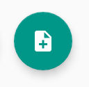
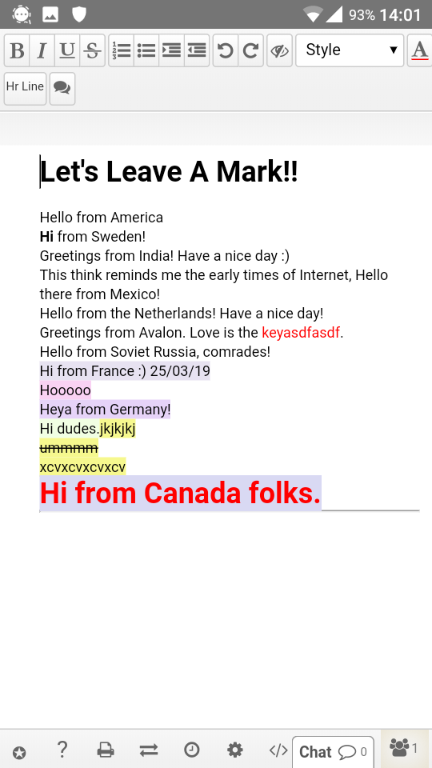

# Padland

Padland ist ein Werkzeug für Android, um basierend auf der Etherpad-Technologie gemeinschaftliche Dokumente zu erstellen, zu verwalten, zu teilen, zu lesen und präsent zu behalten.

## Hol Dir Padland
Lade Padland bei [**f-droid**](https://f-droid.org/de/packages/com.mikifus.padland/) herunter und installiere es auf Deinem Gerät.

## Wähle den Disroot-Padserver
Wenn Du Padland installiert hast, starte die App. Beim ersten Öffnen siehst Du eine Anzeige, die ungefähr so aussehen sollte: 

Durch Anwählen des Zahnrad-Zeichens in der oberen rechten Ecke kommst Du in die **Einstellungen**. Wähle dort **Server list**.

Zu diesem Zeitpunkt sollte die Liste leer sein. Um einen Server hinzuzufügen, wähle den **+**-Button in der unteren rechten Ecke aus.

Nun kannst Du den Pad-Server Deiner Wahl hinzufügen. Um den **Disroot**-Server auszuwählen, gibst Du als Server URL folgendes ein: 
 

Wähle dann **OK**. **Disroot** befindet sich nun in Deiner Serverliste.

## Ein Pad erstellen oder hinzufügen
Wähle den "Neues Pad"-Button um ein Pad zu erstellen oder hinzuzufügen 

Du siehst nun folgendes: 

- **Pad name (URL)**: Gib den Pad-Namen ein, wenn Du ihn kennst. Wenn die Pad-Adresse, die Du hinzufügen möchtest, *https://pad.disroot.org/p/test* lautet, gib hier einfach *test* ein.
- **Pad Alias**: Du kannst ein Alias bestimmen, wenn der Pad-Name keinen Sinn für Dich hat. Wenn z.B. die Pad-Adresse *https://pad.disroot.org/p/1r4o_f6-Rzc* lautet, könntest *Einkaufsliste* als Alias setzen!
- **Wähle einen Server**: Du kannst jeden Server auswählen. Wenn Du **Disroot** auf Deine Serverliste gesetzt hast, kannst Du jetzt auch **Disroot** auswählen.
- Wähle **Erstellen oder Anzeigen**, wenn Du soweit bist. Wenn es das Pad gibt, wirst Du dort hingeführt. Wenn es nicht existiert, wird es erstellt.

So sieht ein Dokument auf **Padland** aus:

## Verzeichnis hinzufügen
Du kannst Verzeichnisse erstellen, um Deine Pads zu organisieren:

1. Wähle den "**+**"-Button an, um ein Verzeichnis zu erstellen.
2. **Standard-Nutzername**: Gib hier einen Namen für das Verzeichnis an.
3. Vergiss nicht, mit **OK** zu bestätigen!

## Öffne, teile und lösche ein Pad
Wähle in Deiner Pad-Liste einfach das Pad aus, das Du öffnen möchtest. 

Du solltest dann in etwa folgendes sehen:

1. **ZEIGE PAD**: Wähle diese Option, um das Pad in **Padland** zu öffnen.
2. **Teilen**: Wähle diese Option, um das Pad zu teilen, zum Beispiel per Email. Es wird nur der Link zu dem Pad versendet, nicht der Inhalt.
3. **Papierkorb**: Wähle diese Option, um Dein Pad bei **Padland** zu entfernen. Der Pad wird nicht vom Server gelöscht.

## Pad-Name, -Adresse und -Verzeichnis ändern

1. Wenn Du die Konfiguration Deines Pads ändern möchtest, drücke länger auf den Pad-Namen.
2. Gehe zu den drei Punkten in der oberen rechten Ecke.

3. Wähle **Edit**.

Du solltest nun in der Lage sein, die Eigenschaften Deines Pad zu ändern: 
 
Hier kannst Du den Pad-Namen (**Pad Alias**), seine URL (**Pad Name**) und sein Verzeichnis (**Select group**) ändern.
