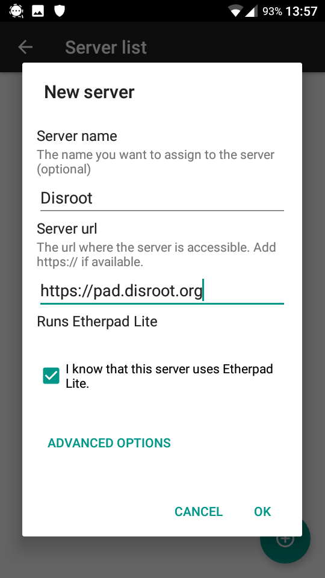
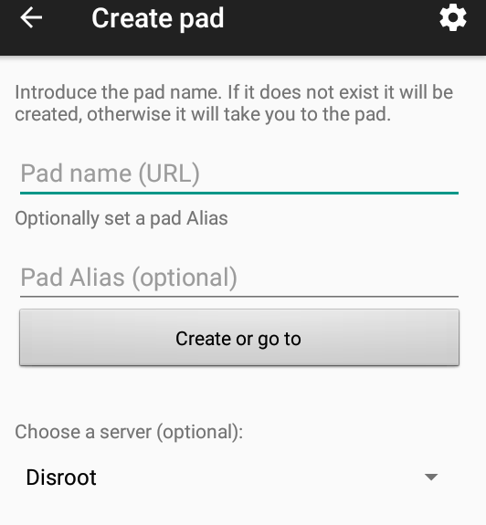
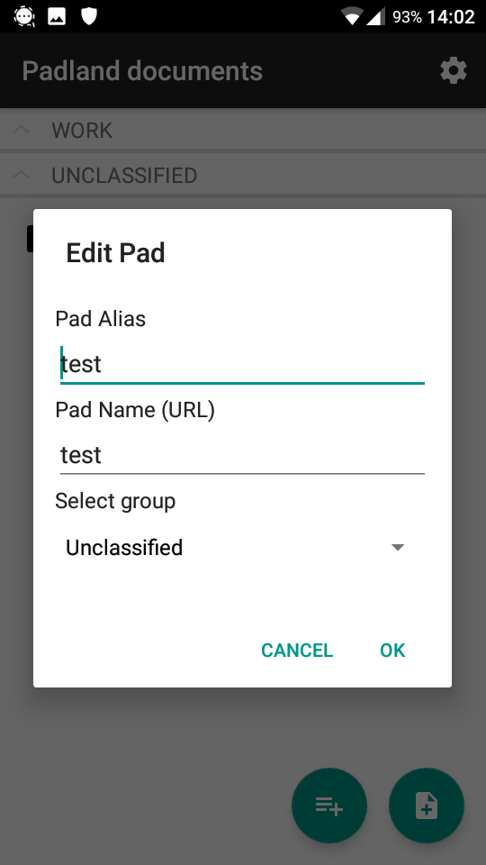

Padland est un outil pour créer, gérer, partager, mémoriser et lire des documents collaboratifs basé sur la technologie Etherpad d'Android.

# Obtenir padland
Téléchargez-le depuis [**f-droid**](https://f-droid.org/) et installez-le sur votre appareil.

# Configurer le serveur de pad de Disroot
Une fois que vous l'avez installé, procédez à son démarrage. La première fois que vous l'ouvrirez, vous verrez un écran comme celui-ci: 

En cliquant sur l'icône de la roue dans le coin supérieur droit, vous pouvez accéder aux **réglages**. Choisissez ensuite **Liste des serveurs**.

La liste sera vide à ce stade. Pour ajouter un serveur, cliquez sur le bouton **+** dans le coin inférieur droit.

Ensuite, vous pouvez ajouter le serveur de pad de votre choix. Pour choisir **Disroot**, il suffit de remplir l'url du serveur comme ceci : 
 

Puis cliquez sur **OK**. **Disroot** est maintenant dans votre liste de serveurs.

# Créer ou ajouter un pad
Cliquez sur le bouton "nouveau pad" pour créer ou ajouter un pad. 

Vous verrez ceci: 

- **Nom du pad (URL)** : définissez le nom du pad si vous le connaissez. Par exemple, si l'adresse du pad que vous voulez ajouter est *https://pad.disroot.org/p/test* ajoutez *test* ici.
- **Alias du Pad**: vous pouvez utiliser un alias si l'adresse/le nom du pad n'a pas beaucoup de sens pour vous. Par exemple, si l'adresse du pad est *https://pad.disroot.org/p/1r4o_f6-Rzc* vous pouvez définir *Liste_de_course* comme alias!
- **Choisir un serveur** : vous pouvez choisir n'importe quel serveur. Si vous avez défini **Disroot** dans votre liste de serveurs comme expliqué ci-dessus, alors vous pouvez choisir **Disroot** maintenant.
- Cliquez sur **Créer ou aller à** lorsque vous avez terminé. Si le pad existe, vous y accéderez. Si ce n'est pas le cas, il sera créé.

Voici à quoi ressemble le document à partir de **Padland** :

# Ajouter un dossier
Vous pouvez facilement créer des dossiers afin de garder vos blocs-notes organisés.

1. Cliquez sur le bouton "**+**" pour ajouter un dossier.
2. **Nom d'utilisateur par défaut** : choisissez un nom de dossier.
3. N'oubliez pas de valider !

# Ouvrir, partager et supprimer un pad
Dans la liste de vos pads, cliquez simplement sur le pad que vous souhaitez ouvrir.br>

Vous verrez une page comme celle-ci :

1. **Voir le pad** : en cliquant dessus, votre pad sera ouvert dans **Padland**.
2. **Partager** : cliquez ici pour partager votre bloc, par exemple par e-mail. L'adresse de votre bloc sera envoyée, mais pas le contenu de votre bloc.
3. **Corbeille** : cliquez ici pour supprimer votre bloc de **Padland**. Il ne sera pas supprimé du serveur.

# Changez le nom, l'adresse et le dossier du pad.

1. Si vous souhaitez modifier la configuration de votre pad, il suffit d'appuyer longuement sur le nom du pad.
2. Cliquez ensuite sur l'icône *crayon*.

Vous devriez être en mesure de la modifier : 
 
Vous pouvez y modifier le nom du pad (**Alias du pad**), son adresse (**Nom du pad**) et aussi **Sélectionner un groupe** pour déplacer votre pad dans un dossier.
